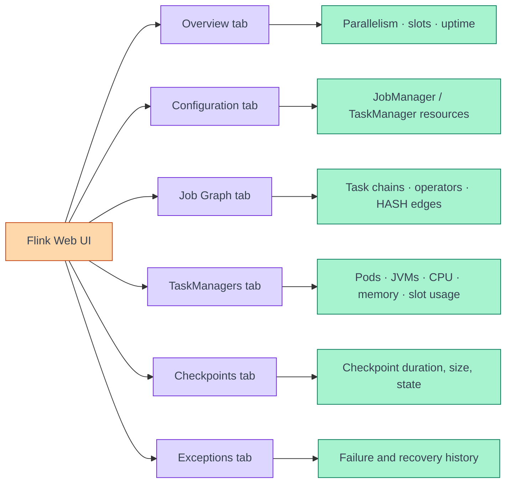
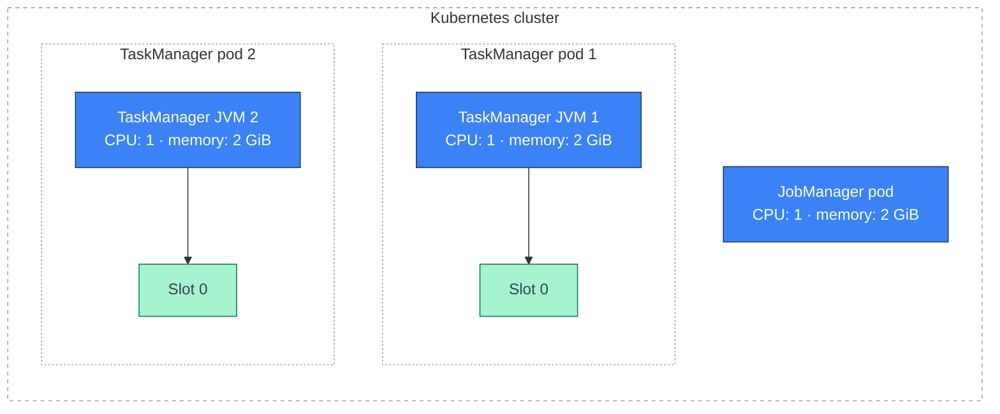
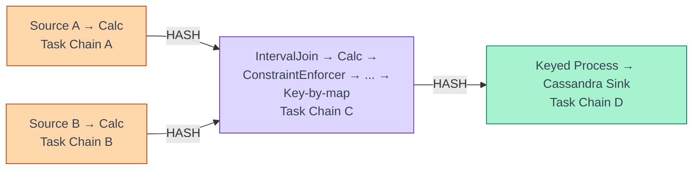
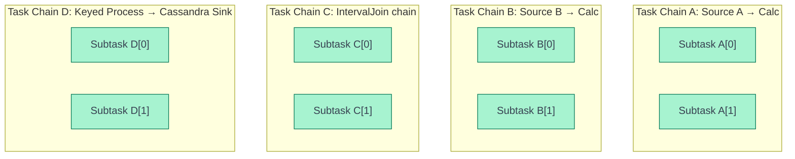
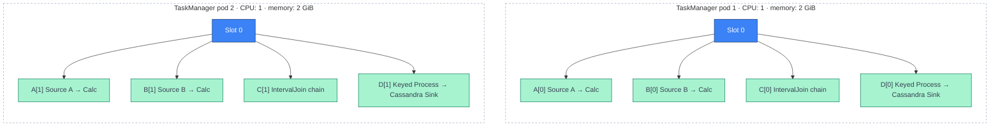
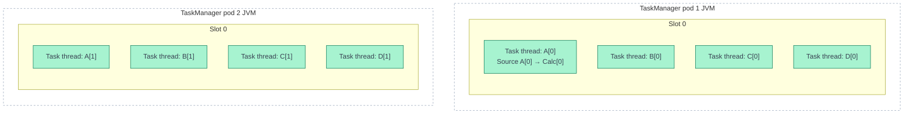
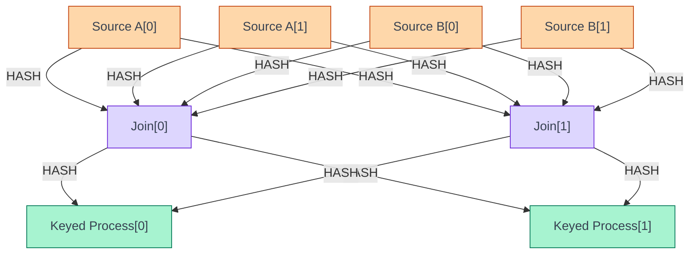
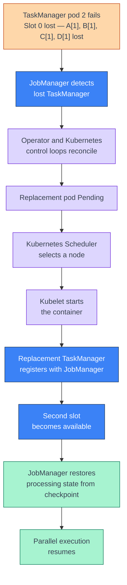
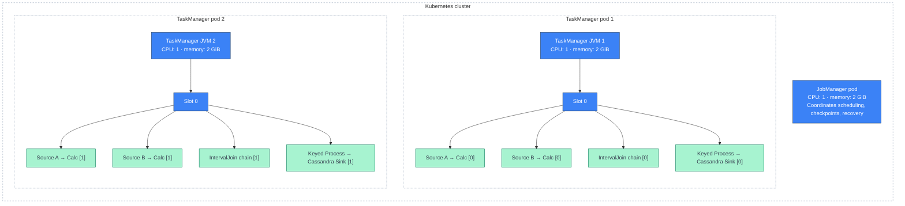

[← Architecture Overview](architecture.md)

# Example Flink Deployment and Task Allocation Walkthrough

**This page is the hands-on companion to [Architecture](architecture.md).** Every
concept explained there — control loops, slots, parallelism, chaining, slot
sharing, `keyBy` redistribution, CPU/memory sharing, failure recovery — is
walked through here against one real deployment, confirmed tab by tab in the
Flink Web UI. Where a concept needs a picture, this page draws it as a Mermaid
diagram instead of a screenshot, so it renders consistently and stays easy to
diff.

!!! abstract "How to use this page"
    Read [Architecture](architecture.md) first for the concepts. Use this page
    to see where each concept surfaces in the **Flink Web UI**, using an example
    job as the running example.

---

## Flink Web UI Tab → Concept Map

The Flink Web UI is the Dispatcher's job — see
[JobManager](architecture.md#jobmanager) — serving one page per concept below.
Everything in this hands-on walkthrough was read off one of these tabs.



| Web UI tab | Confirms which concept in [Architecture](architecture.md) |
|---|---|
| **Overview** | [Slot arithmetic](architecture.md#slot-arithmetic), configured parallelism |
| **Configuration** | [The `FlinkDeployment` resource](architecture.md#the-flinkdeployment-resource) — resolved JobManager/TaskManager resources |
| **Job Graph** | [The job graph: operators, parallelism and subtasks](architecture.md#the-job-graph-operators-parallelism-and-subtasks), operator chaining |
| **TaskManagers** | [TaskManagers and task slots](architecture.md#taskmanagers-and-task-slots) — one pod, one JVM |
| **Checkpoints** | Checkpointing referenced under [Failure and recovery](architecture.md#failure-and-recovery) |
| **Exceptions** | [Failure and recovery](architecture.md#failure-and-recovery) |

---

## Application Configuration

```yaml
example-streaming-job:
  enabled: true
  tag: "1.0.0"
  parallelism: 2

  jobManager:
    resource:
      memory: "2g"
      cpu: 1

  taskManager:
    resource:
      memory: "2g"
      cpu: 1
```

This is the same shape of input as the `FlinkDeployment` resource in
[Architecture](architecture.md#the-flinkdeployment-resource) — a values file
that renders down to `jobManager.resource`, `taskManager.resource` and
`job.parallelism`. The application configuration defines job parallelism and
resources for the JobManager and each TaskManager.

The running deployment was verified through the **Flink Web UI**.

---

## Confirmed Runtime Configuration

Read from the **Overview** and **Configuration** tabs:

```text
Application enabled:             true
Application image tag:           1.0.0
Job parallelism:                 2

JobManager replicas:             1
JobManager CPU:                  1
JobManager memory:               2 GiB

TaskManager replicas:            2
CPU per TaskManager:             1
Memory per TaskManager:          2 GiB
Slots per TaskManager:           1
Total available slots:           2
```

This is [slot arithmetic](architecture.md#slot-arithmetic) applied to this
job:

```text
Total slots
    =
TaskManager replicas × Slots per TaskManager

    =
2 × 1

    =
2 slots
```

```text
Total TaskManager CPU
    =
2 TaskManagers × 1 CPU
    =
2 CPUs
```

```text
Total TaskManager memory
    =
2 TaskManagers × 2 GiB
    =
4 GiB
```

```text
Total CPU (excluding Operator and other cluster components)
    =
1 JobManager CPU + 2 TaskManager CPUs
    =
3 CPUs
```

```text
Total memory
    =
2 GiB JobManager memory + 4 GiB TaskManager memory
    =
6 GiB
```

---

## Physical Kubernetes Deployment

The **TaskManagers** tab confirms
[one TaskManager pod = one TaskManager JVM](architecture.md#taskmanagers-and-task-slots)
directly — one row per pod, one JVM heap/metaspace panel per row:



The relationship is:

```text
2 TaskManager replicas
    =
2 TaskManager pods
    =
2 TaskManager JVM processes
```

```text
2 TaskManagers × 1 slot
    =
2 total slots
```

---

## Job Graph

The **Job Graph** tab renders the job as boxes and edges — this is
[the job graph: operators, parallelism and subtasks](architecture.md#the-job-graph-operators-parallelism-and-subtasks)
made visible. The example job contains four visible task
vertices (operator chains):

```text
Task Chain A:  Source A -> Calc
Task Chain B:  Source B -> Calc
Task Chain C:  IntervalJoin -> Calc -> ConstraintEnforcer -> TableToDataStream -> Key-by-map operator
Task Chain D:  Keyed Process -> Cassandra Sink
```



The `HASH` connections represent network redistribution between upstream and
downstream task chains — the same mechanism as
[`keyBy`, network shuffle and keyed state](architecture.md#keyby-network-shuffle-and-keyed-state)
in Architecture, here driven by the interval join key rather than a
`keyBy` call directly.

---

## Tasks and Operator Chains

Each blue box in the Flink Web UI's Job Graph tab represents a task vertex
containing one or more chained operators — exactly
[operator chaining](architecture.md#operator-chaining) from Architecture.

For example, `Source A -> Calc` contains two logical operators:

```text
Source operator
Calc operator
```

Flink chains them into one runtime task:

```text
One StreamTask
└── Source A -> Calc
```

Likewise, `Keyed Process -> Cassandra Sink` runs as:

```text
One StreamTask
└── Keyed Process -> Cassandra Sink
```

Operator chaining reduces serialization/deserialization, intermediate
buffering, thread handoffs, network communication and runtime overhead. The
`HASH` redistribution boundaries mark where chaining stops and a shuffle
begins, same as `keyBy` normally ending a chain in Architecture.

---

## Parallelism and Subtasks

The **Overview** tab confirms the configured job parallelism:

```text
Parallelism: 2
```

Per [parallelism](architecture.md#the-job-graph-operators-parallelism-and-subtasks),
each task chain has two parallel runtime instances — subtasks:



The complete job graph therefore represents:

```text
4 task chains × 2 subtasks
    =
8 runtime subtasks
```

However — as in Architecture —

```text
8 runtime subtasks
    does not mean
8 task slots are required
```

Subtasks from different task chains can share slots through Flink
[slot sharing](architecture.md#slot-sharing).

---

## Confirmed Slot Allocation

The **TaskManagers** and **Job Graph** tabs together confirm:

```text
TaskManager replicas:       2
Slots per TaskManager:      1
Total slots:                2
Job parallelism:            2
```

Assuming the task chains use Flink's compatible default slot-sharing group,
the likely allocation is:



The simplified mapping is:

```text
Subtask index 0 from each compatible task chain
    ->
TaskManager Pod 1, Slot 0
```

```text
Subtask index 1 from each compatible task chain
    ->
TaskManager Pod 2, Slot 0
```

---

## Why Eight Subtasks Fit Into Two Slots

One slot can host multiple subtasks — [slot sharing](architecture.md#slot-sharing)
— when:

1. The subtasks belong to different task vertices.
2. The task vertices belong to compatible slot-sharing groups.
3. The cluster has enough slots for the maximum operator parallelism.

For this job:

```text
Available slots:             2
Maximum visible parallelism: 2
```

```text
TaskManager 1, Slot 0:  A[0] + B[0] + C[0] + D[0]
TaskManager 2, Slot 0:  A[1] + B[1] + C[1] + D[1]
```

Subtasks from different task chains can share a slot. However, two parallel
subtasks from the same task chain cannot share one slot:

```text
A[0] and A[1]
    cannot share
the same task slot
```

Therefore, two instances of each task chain require at least two compatible
slots — the deployment provides exactly those two slots.

---

## Task, Subtask, and Slot Relationship

```text
Task chain
    =
One type of work represented by a blue box

Subtask
    =
One parallel runtime instance of a task chain

Task slot
    =
TaskManager scheduling capacity into which subtasks are placed
```

For example:

```text
Task chain:
Keyed Process -> Cassandra Sink

Parallelism:
2

Runtime subtasks:
├── Keyed Process -> Cassandra Sink [0]
└── Keyed Process -> Cassandra Sink [1]

Allocation:
├── Subtask [0] -> TaskManager 1, Slot 0
└── Subtask [1] -> TaskManager 2, Slot 0
```

---

## Thread Model

A task slot is not one task thread. Several subtasks from different task
chains can share one slot while executing through separate task threads —
this is
[what a slot is *not*](architecture.md#what-a-slot-is-not)
made concrete:



Within one chained task, multiple operators execute in the same task thread —
for example, `Task thread for A[0]` runs `Source A[0] -> Calc[0]`. The
important distinction, unchanged from Architecture:

```text
Operator chaining
    =
Multiple operators execute inside one task and task thread

Slot sharing
    =
Multiple subtasks from different task chains share one slot
```

---

## CPU Sharing

Each TaskManager has:

```text
CPU:     1
Slots:   1
```

All subtasks assigned to a TaskManager share its one CPU — this is
[Kubernetes CPU versus Flink slots](architecture.md#kubernetes-cpu-versus-flink-slots)
with a concrete workload attached:

```text
TaskManager Pod 1
├── Available CPU: 1
└── Shared by:
    ├── Source A subtask
    ├── Source B subtask
    ├── Interval join subtask
    ├── Keyed-processing subtask
    ├── Cassandra sink activity
    ├── Network processing
    └── Checkpoint processing
```

The configuration does not mean that each subtask receives one CPU:

```text
1 CPU per TaskManager
    shared by
all subtasks running in that TaskManager
```

Each TaskManager may perform Kafka source polling, deserialization, data
calculations, network serialization, hash redistribution, interval join
processing, keyed-state processing, timer processing, Cassandra writes and
checkpoint processing — all on that one CPU. The deployment has sufficient
slot capacity, but CPU sufficiency must be validated through runtime metrics
(see [Metrics to Monitor](#metrics-to-monitor)).

---

## Memory Sharing

Each TaskManager has:

```text
TaskManager process memory: 2 GiB
```

The complete 2 GiB is not available only to the business operators — it
splits the same way as any Flink TaskManager process memory:

```text
2 GiB TaskManager process memory
├── JVM overhead
├── Flink framework memory
├── Task heap memory
├── Task off-heap memory
├── Managed memory
└── Network memory
```

All subtasks running in the TaskManager share the usable memory. Important
consumers in this job may include interval-join state, keyed state, timer
state, network shuffle buffers, serialization buffers, checkpoint-related
buffers, Cassandra sink buffers and JVM object allocation. The exact
distribution depends on the effective Flink memory configuration and state
backend.

---

## Data Redistribution

The job graph contains `HASH` exchanges — the same
[network shuffle](architecture.md#keyby-network-shuffle-and-keyed-state)
mechanism as `keyBy`, here driven by the join/grouping key.



A record produced by one TaskManager may be transferred to the other
TaskManager according to the hash partitioning result. For the
Interval-Join-to-Keyed-Process edge, all records with the same processing
key are sent to the same keyed-process subtask:

```text
One group of keys     -> Keyed Process[0]
Another group of keys -> Keyed Process[1]
```

This provides consistent keyed-state ownership, exactly as described in
[`keyBy`, network shuffle and keyed state](architecture.md#keyby-network-shuffle-and-keyed-state).

---

## Scheduling Capacity Versus Performance Capacity

The deployment has enough scheduling capacity:

```text
Maximum visible parallelism: 2
Available task slots:        2
```

```text
Scheduling requirement = Satisfied
```

However, scheduling capacity and performance capacity are different:

```text
Scheduling question: Can Flink place the parallel subtasks?
Answer: Yes, assuming compatible slot sharing.

Performance question: Can each TaskManager process the assigned
workload fast enough with one CPU and 2 GiB?
Answer: This must be determined through runtime monitoring.
```

The configuration can be structurally valid while still being too small for
the required throughput or latency — the same warning as
[No slot gets a dedicated core](architecture.md#kubernetes-cpu-versus-flink-slots)
in Architecture.

---

## Metrics to Monitor

### CPU

Monitor TaskManager CPU utilization, Kubernetes CPU throttling, Flink task
busy time, and container CPU usage versus request and limit. Consistently
high CPU utilization may indicate that one CPU per TaskManager is
insufficient.

### Backpressure

Monitor backpressured time, busy time, idle time and backpressure
propagation across vertices:

```text
Cassandra Sink -> Keyed Process -> Interval Join -> Kafka Sources
```

### Kafka

Monitor Kafka consumer lag, records consumed per second, partition
assignment and source idle time — see
[Kafka partitions and source parallelism](architecture.md#kafka-partitions-and-source-parallelism)
for why idle source subtasks can be expected behavior rather than a bug.

### Checkpoints

Monitor checkpoint duration, checkpoint alignment time, checkpoint size,
failed checkpoints and time between completed checkpoints, visible on the
**Checkpoints** tab.

### State and Memory

Monitor TaskManager heap utilization, garbage-collection activity,
managed-memory utilization, network-memory utilization, state backend
metrics, join-state size, keyed-state size and timer count.

### Cassandra Sink

Monitor Cassandra write latency, write failures, retry rate, timeouts, sink
throughput, and buffered or pending requests.

---

## Failure Scenario

Before failure:

```text
TaskManagers:       2
Slots:              2
Job parallelism:    2
```

If one TaskManager fails:

```text
Remaining TaskManagers:    1
Remaining slots:           1
Required parallelism:      2
```

One subtask instance from every task chain loses its execution location.
For example, if TaskManager 2 fails:

```text
Lost subtasks:
A[1]
B[1]
C[1]
D[1]
```

The remaining TaskManager cannot host both parallel instances of the same
task chain in its one slot. The job cannot return to full parallelism until
the second TaskManager and second slot become available again. This mirrors
[Failure and recovery](architecture.md#failure-and-recovery) in Architecture
— Kubernetes restores the pod, Flink restores the job:



---

## Final Allocation Diagram



---

## Key Conclusions

1. The deployment has two confirmed TaskManager replicas.
2. Two TaskManager replicas produce two TaskManager pods and two TaskManager JVM processes.
3. Each TaskManager has one confirmed task slot.
4. The deployment therefore has two total task slots.
5. The job has parallelism `2`.
6. Each task chain has two parallel runtime subtasks.
7. The four visible task chains represent eight runtime subtasks.
8. Eight subtasks can fit into two slots through slot sharing.
9. Subtask index `0` from compatible task chains can share the first slot.
10. Subtask index `1` from compatible task chains can share the second slot.
11. Two parallel subtasks from the same task chain cannot share one slot.
12. Each TaskManager's assigned subtasks share one CPU.
13. Each TaskManager's assigned subtasks share the usable portions of 2 GiB process memory.
14. The two slots satisfy the scheduling requirement for parallelism `2`.
15. Sufficient slots do not guarantee sufficient CPU, memory, or processing throughput.
16. If one TaskManager fails, the job temporarily loses half its slots and cannot maintain full parallelism until a replacement TaskManager is ready.

---

## Short Mental Model

```text
2 TaskManager replicas
    =
2 TaskManager pods
    =
2 TaskManager JVMs
```

```text
2 TaskManagers × 1 slot
    =
2 total slots
```

```text
4 task chains × 2 subtasks
    =
8 runtime subtasks
    fit into
2 slots via slot sharing
```

```text
8 subtasks in 2 slots
    ≠
8 threads doing unrelated work

    =
each slot's task threads share one TaskManager's CPU and memory
```

---

## References

- [Architecture](architecture.md) — the conceptual model this page confirms against the running deployment.
- [Flink Web UI documentation](https://nightlies.apache.org/flink/flink-docs-stable/docs/ops/rest_api/) — REST API backing the Web UI tabs referenced above.
- [Monitoring Back Pressure](https://nightlies.apache.org/flink/flink-docs-stable/docs/ops/monitoring/back_pressure/) — reading the backpressure indicators used in [Metrics to Monitor](#metrics-to-monitor).
