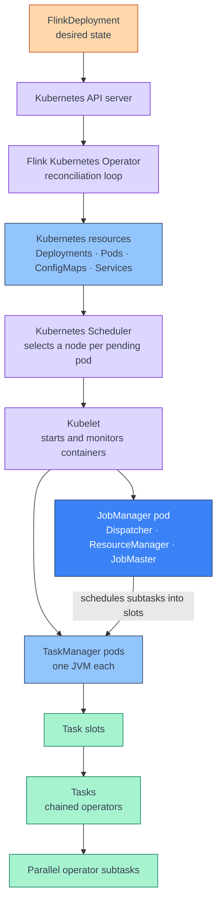
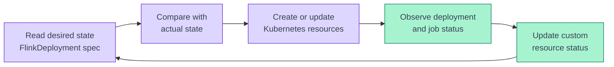
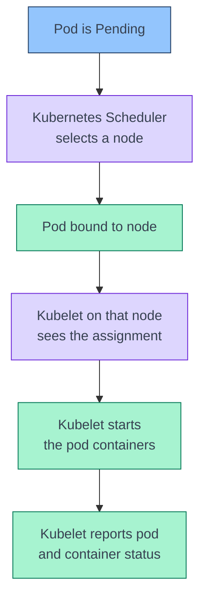
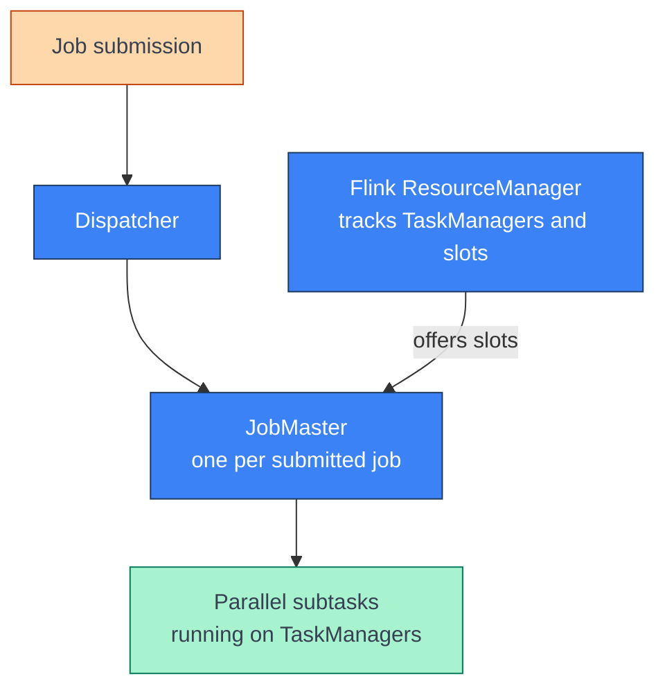
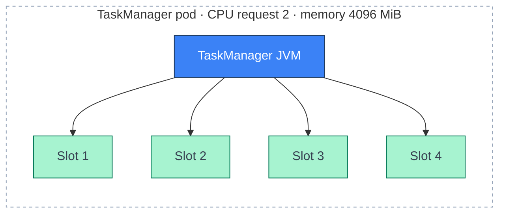
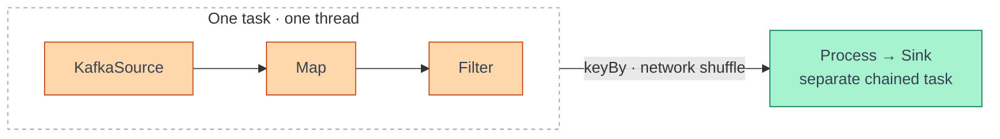
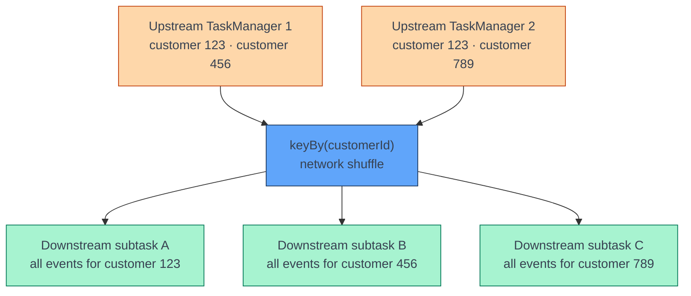
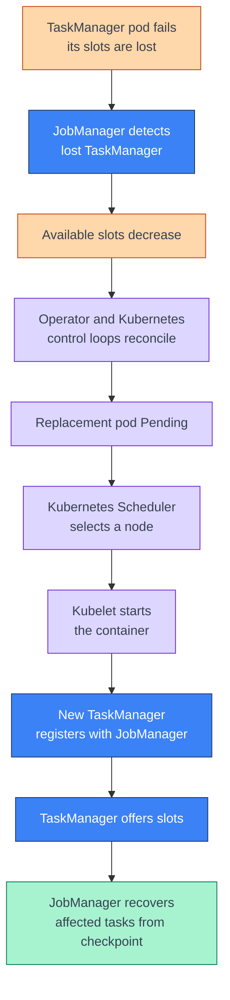

[← Streaming](../index.md)

# Architecture Overview

**A Flink job on Kubernetes is governed by two schedulers that know nothing
about each other.** The Kubernetes Scheduler places *pods* on *nodes*; the Flink
JobManager places *subtasks* into *slots*. Confusing the two is the root of most
misreadings of a Flink deployment — why four slots do not mean four JVMs, why
parallelism `6` does not mean six pods, and why increasing TaskManager replicas
does not speed a job up on its own. This page draws that boundary and then works
down through it, from the `FlinkDeployment` resource to an individual keyed
subtask.

!!! abstract "What you should know after reading this page"
    1. Which component does what — the **Operator** reconciles deployments, the
       **Kubernetes Scheduler** places pods, the **Kubelet** starts containers,
       the **JobManager** schedules subtasks, and **TaskManagers** do the actual
       processing.
    2. That one **TaskManager pod is one JVM**, and that task slots live *inside*
       that JVM rather than adding processes of their own.
    3. How to compute **total slots** from replicas and slots-per-TaskManager,
       and what a slot is **not**.
    4. What **parallelism** actually counts — operator instances, not pods, JVMs
       or threads-for-life.
    5. How **operator chaining** and **slot sharing** differ, and why a `keyBy`
       normally ends a chain.
    6. Why **Kafka partition count caps** useful source parallelism, and what
       happens to the surplus subtasks.
    7. Why `keyBy` forces a **network shuffle**, and that its real purpose is
       **keyed-state ownership**, not redistribution.
    8. How **Kubernetes CPU relates to slots** — pod-level allocation shared by
       task threads, not a dedicated slice per slot.
    9. What happens on **TaskManager failure**, and where the Kubernetes recovery
       loop hands off to the Flink one.

---

## The two control loops

Everything on this page follows from one division of labour. Kubernetes recovers
and places *infrastructure*; Flink schedules and recovers *job execution*.



| Component | Decides | Does **not** know about |
|---|---|---|
| **Flink Kubernetes Operator** | That Flink resources should exist, and that desired state matches actual state. | Kafka processing logic; which node anything runs on. |
| **Kubernetes Scheduler** | *Where* a pending pod runs — which node. | Flink operators, slots, parallelism, checkpoints, keyed state, partition assignments. |
| **Kubelet** | Starting and monitoring containers on its own node. | Anything cluster-wide or Flink-internal. |
| **Flink JobManager** | *Where* Flink subtasks execute — which slot. | Node capacity, taints, affinity. |
| **Flink TaskManager** | Nothing — it executes what it is given. | — |

!!! info "Why this split matters operationally"
    A job that will not start has two distinct failure classes. If pods are
    `Pending`, it is a **Kubernetes Scheduler** problem — CPU/memory requests,
    node capacity, affinity or taints. If pods are `Running` but the job is not,
    it is a **Flink** problem — usually not enough registered slots for the
    configured parallelism. The symptom looks identical from the outside;
    the fix is in entirely different places.

---

## The FlinkDeployment resource

The Operator is driven by a `FlinkDeployment` custom resource describing desired
state:

```yaml
apiVersion: flink.apache.org/v1beta1
kind: FlinkDeployment

metadata:
  name: online-feature-job

spec:
  jobManager:
    resource:
      cpu: 1
      memory: "2048m"

  taskManager:
    replicas: 2
    resource:
      cpu: 2
      memory: "4096m"

  flinkConfiguration:
    taskmanager.numberOfTaskSlots: "3"

  job:
    parallelism: 6
```

| Field | Controls | Belongs to |
|---|---|---|
| `jobManager.resource` | CPU and memory requested for the JobManager pod. | Kubernetes |
| `taskManager.replicas` | Number of TaskManager pods — and therefore JVMs. | Kubernetes |
| `taskManager.resource` | CPU and memory requested **per TaskManager pod**. | Kubernetes |
| `taskmanager.numberOfTaskSlots` | Scheduling slots **inside each** TaskManager JVM. | Flink |
| `job.parallelism` | Parallel instances of an operator using this parallelism. | Flink |

The first three are Kubernetes concerns the Scheduler acts on. The last two are
Flink concerns the JobManager acts on. They interact only through capacity:
Flink cannot schedule a job whose parallelism exceeds the slots its registered
TaskManagers offer.

---

## Flink Kubernetes Operator

The Operator watches `FlinkDeployment` resources and runs a reconciliation loop
over them:



Its responsibilities are lifecycle management: observing the resource, creating
and updating the Flink deployment, reconciling desired against actual state,
handling job deployment changes and upgrades, and reporting status back onto the
custom resource.

!!! warning "The Operator does not process data"
    It is easy to read "Flink Kubernetes Operator" as something that participates
    in the pipeline. It does not. The Operator manages the **deployment
    lifecycle**; TaskManagers do the **data processing**. The word *operator*
    also means something entirely different inside a Flink job — see
    [The job graph](#the-job-graph-operators-parallelism-and-subtasks).

---

## Kubernetes Scheduler and Kubelet

Once the Operator has created the pods, placement is ordinary Kubernetes:



The Scheduler weighs CPU and memory requests, available node capacity, node
selectors, affinity and anti-affinity, taints and tolerations, and topology
constraints. None of these are Flink concepts — the Scheduler is placing a
container that happens to contain a TaskManager.

---

## JobManager

The JobManager is the control plane of a Flink application. It coordinates
distributed execution but performs little record processing itself. Three
logical components live inside it:

| Component | Scope | Responsibilities |
|---|---|---|
| **Dispatcher** | Per cluster | Provides the job submission interface, receives submitted jobs, starts a JobMaster per job, serves the Flink Web UI. |
| **Flink ResourceManager** | Per cluster | Tracks registered TaskManagers and available task slots, allocates slots to jobs. |
| **JobMaster** | **Per job** | Tracks execution, schedules parallel subtasks, monitors tasks, coordinates checkpoints, reacts to failures, coordinates recovery. |



!!! note "Two things called ResourceManager"
    The **Flink ResourceManager** manages TaskManagers and Flink task slots. It
    has nothing to do with the Kubernetes Scheduler, which places pods onto
    nodes. They operate on different objects at different layers and never
    consult each other.

---

## TaskManagers and task slots

TaskManagers are the worker processes. They execute tasks, run operator logic,
exchange records with other TaskManagers, maintain buffers, hold local working
state, participate in checkpointing, and report status to the JobManager.

The mental model that matters on Kubernetes is one line:

> **One TaskManager pod = one TaskManager JVM process.**

Slots do not add processes. They are scheduling capacity *inside* that JVM:



### Slot arithmetic

Given:

```yaml
taskManager:
  replicas: 3

flinkConfiguration:
  taskmanager.numberOfTaskSlots: "4"
```

| Quantity | Formula | Result |
|---|---|---|
| TaskManager pods | `replicas` | 3 |
| TaskManager JVM processes | `replicas` | 3 |
| Slots per TaskManager | `numberOfTaskSlots` | 4 |
| **Total slots** | `replicas × numberOfTaskSlots` | **12** |

Note what is *not* on that list: the number of JVMs is `3`, not `3 × 4`.

### What a slot is not

- [ ] A Kubernetes pod
- [ ] A JVM process
- [ ] A Kubernetes node
- [ ] A dedicated CPU core
- [ ] Necessarily one operator
- [ ] Necessarily one thread for the whole job lifetime

A slot is **Flink scheduling capacity within a TaskManager** — nothing more.

---

## The job graph: operators, parallelism and subtasks

An *operator* is a step in the pipeline — `map()`, `filter()`, `flatMap()`,
`keyBy()`, `window()`, `process()`, `sinkTo()`. A typical job:

```java
KafkaSource
    .map(parse)
    .filter(valid)
    .keyBy(event -> event.customerId)
    .process(calculateFeature)
    .sinkTo(Cassandra);
```

**Parallelism** is how many instances of an operator run concurrently. With
`job.parallelism: 6`, an operator using that parallelism has six *subtasks* —
`Subtask 0` through `Subtask 5`.

Parallelism `6` does **not** mean six pods, six JVMs, six operators, or exactly
six threads for the job. It means one thing:

> An operator using that parallelism has six parallel instances.

A three-operator pipeline at parallelism 6 therefore has 18 subtasks — but it
does **not** need 18 slots, because of chaining and slot sharing.

### Operator chaining

Compatible consecutive operators are fused into a single task running in a
single thread, avoiding serialization, buffering and thread handoffs between
them:



A redistributing operation such as `keyBy` normally ends a chain, because
records must cross to a different subtask chosen by key.

### Slot sharing

Chaining and slot sharing are related but distinct:

| | Unit combined | Result |
|---|---|---|
| **Operator chaining** | Multiple *operators* | One Flink task, one task thread |
| **Slot sharing** | Multiple *tasks* from the same job | Scheduled into one slot |

Slot sharing is why one slot can hold a whole parallel pipeline:

```text
Slot 0
└── Source[0] → Map[0] → Filter[0] → Process[0] → Sink[0]
```

This is also why total slots needed usually tracks the *highest operator
parallelism* rather than the sum of all subtasks across the graph.

---

## Kafka partitions and source parallelism

Source parallelism is capped in practice by the topic. Assume four Kafka
partitions and source parallelism `6`:

| | Count |
|---|---|
| Source subtasks created | 6 |
| Subtasks actively consuming a partition | 4 |
| Idle source subtasks | 2 |

Flink still creates six subtasks — the surplus two simply have no partition
assigned and sit idle. The relationship to remember:

```text
Maximum useful active source parallelism  ≤  Number of Kafka partitions
```

!!! warning "Raising source parallelism past the partition count buys nothing"
    It adds subtasks that consume no data while still occupying scheduling
    capacity. If a Kafka source is the bottleneck, the lever is **partition
    count on the topic**, not parallelism in the job.

---

## `keyBy`, network shuffle and keyed state

Before `keyBy`, records for the same customer can sit in any upstream subtask.
`keyBy(event -> event.customerId)` repartitions by key so that every record for
a given key reaches the same downstream subtask:



The shuffle is genuine network traffic, because the target subtask may be in
another slot, another TaskManager, another pod or on another node.

### Why the shuffle is worth paying for

Redistribution is the mechanism; **keyed-state ownership** is the purpose. One
downstream subtask owns all state for a given key:

```text
customerId = 123
├── transactionCount
├── totalTransactionAmount
├── latestDevice
├── latestTransactionTime
├── recentTransactions
└── calculatedFraudFeatures
```

That single-owner guarantee is what makes real-time feature calculation, fraud
detection, transaction aggregation, session processing, event correlation and
stateful alerting possible:

```text
Same key  →  same downstream keyed subtask  →  consistent state ownership
```

---

## Kubernetes CPU versus Flink slots

Assume three TaskManagers, two CPUs each, four slots each:

| Quantity | Value |
|---|---|
| TaskManager pods / JVMs | 3 |
| CPU request per TaskManager | 2 |
| Slots per TaskManager | 4 |
| Total requested TaskManager CPU | 6 |
| Total slots | 12 |

The four slots in a pod **share that pod's two CPUs**. `2 ÷ 4 = 0.5 CPU per
slot` is a capacity-planning average and nothing more — Kubernetes allocates CPU
to the *pod*, Flink schedules tasks into *slots*, and the task threads compete
for whatever the pod has.

!!! danger "No slot gets a dedicated core"
    There is no CPU pinning or per-slot isolation. Sizing slots as if each one
    owned a core is the most common capacity-planning error in a Flink
    deployment, and it surfaces as contention rather than as an error.

### CPU-heavy versus I/O-heavy workloads

With two CPUs and four slots running CPU-heavy pipelines — JSON parsing,
serialization, heavy state access — four active pipelines contend for two
requested CPUs. Symptoms: lower throughput, higher latency, rising Kafka
consumer lag, backpressure, longer checkpoint durations, slower serialization
and state processing, and CPU throttling once limits are hit.

| Workload | Practical starting point | Why |
|---|---|---|
| **CPU-heavy** | Slots ≈ TaskManager CPU count (e.g. 2 CPUs, 2 slots) | Task threads are runnable almost all the time, so extra slots only add contention. |
| **I/O-heavy** | More slots than CPUs (e.g. 2 CPUs, 4 slots) | Threads spend much of their time waiting on Kafka, Cassandra, Iceberg, object storage or external services. |

Neither is a Flink rule — both are starting points. Settle the real number from
measurements: CPU usage, backpressure, consumer lag, checkpoint duration,
records per second, and task busy/idle time.

### Scaling TaskManagers

Doubling replicas from 3 to 6, with slots and parallelism unchanged:

| | Before | After |
|---|---|---|
| TaskManager pods / JVMs | 3 | 6 |
| Total slots | 12 | 24 |
| Total requested TaskManager CPU | 6 | 12 |
| Job parallelism | 12 | **12** |

Scaling increases *capacity*. It does **not** change an explicitly configured
job parallelism, so the extra 12 slots may simply go unused depending on the job
graph, per-operator parallelism and slot-sharing configuration. Adding
TaskManagers without raising parallelism buys headroom and cost, not throughput.

---

## Failure and recovery

Two control loops run in sequence when a TaskManager pod dies — Kubernetes
restores the infrastructure, then Flink restores the job.



With two TaskManagers of three slots each, losing one pod removes
`1 × 3 = 3` of the 6 slots, and the tasks running in them are lost with it.

| Component | Role in recovery |
|---|---|
| **Flink Kubernetes Operator** | Reconciles the desired Flink deployment state. |
| **Kubernetes Scheduler** | Selects a node for the replacement pod. |
| **Kubelet** | Starts the replacement container. |
| **TaskManager** | Registers with the JobManager and offers its slots. |
| **JobManager** | Recovers and reschedules affected tasks, restoring state from checkpoint. |

> **Kubernetes recovers infrastructure resources. Flink recovers job execution
> and processing state.**

---

## Quick reference

| Term | Meaning |
|---|---|
| `FlinkDeployment` | Desired Flink deployment state, as a custom resource. |
| **Flink Kubernetes Operator** | Observes and reconciles `FlinkDeployment`. |
| **Kubernetes Scheduler** | Selects nodes for pending pods. |
| **Kubelet** | Starts containers on the selected node. |
| **JobManager** | Coordinates jobs, subtasks, checkpoints and recovery. |
| **TaskManager** | Executes tasks and operator logic. One pod, one JVM. |
| **Task slot** | Flink scheduling capacity inside a TaskManager. |
| **Operator** | One logical processing transformation in the job graph. |
| **Subtask** | One parallel instance of an operator. |
| **Parallelism** | Number of parallel operator instances. |
| **Operator chaining** | Multiple operators fused into one task/thread. |
| **Slot sharing** | Multiple tasks of one job sharing a slot. |
| `keyBy` | Routes identical keys to the same downstream subtask. |
| **Kafka partition** | Caps useful active source parallelism. |

### Rules that survive every configuration

1. One TaskManager pod normally contains one TaskManager JVM.
2. Four task slots do not mean four JVM processes.
3. Slots are Flink scheduling units, not dedicated CPU cores.
4. Parallelism counts operator instances.
5. Kafka partition count limits active source consumption.
6. `keyBy` sends the same key to the same downstream keyed subtask.
7. The Kubernetes Scheduler places pods; the JobManager places subtasks.
8. Increasing TaskManager replicas increases capacity, not configured parallelism.
9. Kubernetes recovers infrastructure; Flink recovers execution and state.

---

## Self-check

Answer these from memory before expanding them. They map to the outcomes listed
at the top of the page.

??? question "1. You apply a `FlinkDeployment` with `kubectl apply`. Which component observes it, and which one decides where the pods run?"
    The **Flink Kubernetes Operator** observes the `FlinkDeployment` resource,
    reconciles desired against actual state and manages the deployment
    lifecycle. It does **not** choose nodes. The **Kubernetes Scheduler** selects
    a node for each pending pod, the **Kubelet** on that node starts the
    containers, and only then does the **JobManager** begin its own job — tracking
    TaskManagers and slots, scheduling subtasks, and coordinating checkpoints and
    recovery. Three different components, three different decisions.

??? question "2. A deployment sets `replicas: 2` and `taskmanager.numberOfTaskSlots: \"3\"`. How many JVM processes are running, and how many slots exist?"
    **Two JVM processes** and **six slots**. One TaskManager pod is one
    TaskManager JVM, so replicas gives the process count directly. Slots are
    scheduling capacity *inside* each JVM, so total slots is
    `replicas × numberOfTaskSlots = 2 × 3 = 6`. The multiplication applies to
    slots only — it never applies to processes.

??? question "3. The same job sets `parallelism: 6`. Does that mean six pods?"
    No. Parallelism `6` means an operator using that parallelism has **six
    parallel subtask instances** — `Subtask 0` to `Subtask 5`. It does not mean
    six pods, six JVMs, six operators, or exactly six threads for the job's
    lifetime. Those six subtasks run in the six slots offered by the two
    TaskManager pods.

??? question "4. Can `KafkaSource → map → filter` run as one thread? What happens at the `keyBy` that follows?"
    Yes — those three are compatible consecutive operators, so **operator
    chaining** can fuse them into a single task executing in one thread, avoiding
    serialization, buffering and thread handoffs between them. The `keyBy`
    normally **ends the chain**, because records must be redistributed by key to
    a downstream subtask that may be in a different slot, TaskManager, pod or
    node — which requires a network shuffle.

??? question "5. Kafka has four partitions and source parallelism is six. How many source subtasks exist, and how many consume data?"
    **Six subtasks are created; four actively consume.** Flink builds the graph
    from the configured parallelism regardless of the topic, so all six subtasks
    exist — but there are only four partitions to assign, leaving **two idle**.
    Raising source parallelism above the partition count adds no consumption
    parallelism. To consume faster, add partitions to the topic.

??? question "6. Customer `123` appears in three different Kafka partitions. After `keyBy(customerId)`, where do those events go, and why does it matter?"
    All of them reach **the same downstream keyed subtask**. That is the point of
    `keyBy` — redistribution is the mechanism, but **keyed-state ownership** is
    the purpose. One subtask owns all state for that customer (transaction count,
    running totals, latest device, recent transactions, derived features), which
    is what makes stateful use cases such as real-time feature calculation and
    fraud detection correct. Split that state across subtasks and none of them
    sees the whole customer.

??? question "7. A TaskManager requests 2 CPUs and exposes 4 slots. Does each slot get 0.5 CPU?"
    No. Kubernetes allocates CPU at the **pod** level; the four slots' task
    threads **share** the pod's two CPUs. `2 ÷ 4 = 0.5` is a capacity-planning
    average, not dedicated isolation — there is no pinning and no per-slot
    guarantee. If all four slots run CPU-heavy pipelines they contend, showing up
    as reduced throughput, backpressure, rising consumer lag and longer
    checkpoints rather than as an explicit error. For CPU-heavy work, start with
    slots ≈ CPU count; more slots than CPUs makes sense when threads spend their
    time waiting on I/O.

??? question "8. TaskManager replicas go from 3 to 6 while `parallelism` stays at 12. What changes?"
    Pods, JVMs, slots and requested CPU all **double** — 6 pods, 6 JVMs, 24
    slots, 12 requested CPUs. Job parallelism stays at **12**, because it was set
    explicitly and nothing recomputes it. The extra 12 slots may go entirely
    unused depending on the job graph, per-operator parallelism and slot sharing.
    Scaling TaskManagers buys **capacity and cost**, not throughput, unless
    parallelism is raised to use it.

??? question "9. One of two TaskManagers dies. Walk through who does what until the job is processing again."
    Its slots go with it — with 3 slots per TaskManager, 3 of 6 slots and the
    tasks in them are lost. The **JobManager** detects the loss and available
    slots drop. The **Operator and Kubernetes control loops** reconcile, producing
    a replacement pod in `Pending`. The **Kubernetes Scheduler** picks a node; the
    **Kubelet** starts the container; the new **TaskManager** registers and offers
    its slots; and the **JobManager** recovers the affected tasks from the last
    checkpoint. Kubernetes restored the infrastructure, Flink restored the
    execution and state — in that order.

---
## References

### Apache Flink

- [Flink Architecture](https://nightlies.apache.org/flink/flink-docs-stable/docs/concepts/flink-architecture/) — JobManager, TaskManager, task slots and the process model.
- [Glossary](https://nightlies.apache.org/flink/flink-docs-stable/docs/concepts/glossary/) — precise definitions of operator, subtask, task and slot.
- [Stateful Stream Processing](https://nightlies.apache.org/flink/flink-docs-stable/docs/concepts/stateful-stream-processing/) — keyed state, key groups and how `keyBy` establishes state ownership.
- [Checkpointing](https://nightlies.apache.org/flink/flink-docs-stable/docs/dev/datastream/fault-tolerance/checkpointing/) — the mechanism behind task recovery.

### Flink Kubernetes Operator

- [Flink Kubernetes Operator documentation](https://nightlies.apache.org/flink/flink-kubernetes-operator-docs-stable/) — installation, upgrades and the reconciliation model.
- [Custom Resource reference](https://nightlies.apache.org/flink/flink-kubernetes-operator-docs-stable/docs/custom-resource/overview/) — the full `FlinkDeployment` spec.

### Kubernetes

- [kube-scheduler](https://kubernetes.io/docs/concepts/scheduling-eviction/kube-scheduler/) — how pending pods are placed onto nodes.
- [Managing resources for containers](https://kubernetes.io/docs/concepts/configuration/manage-resources-containers/) — CPU and memory requests and limits, and what throttling means.
