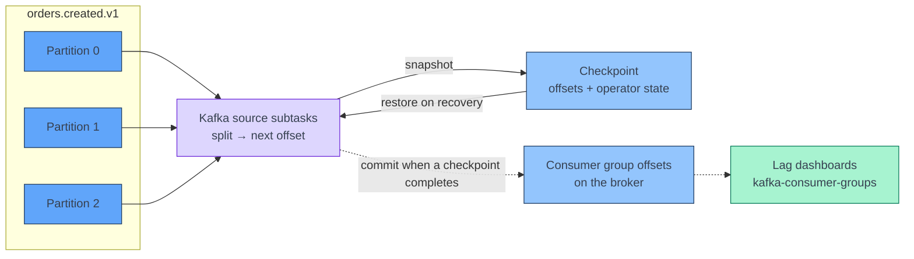

[← Apache Flink](../index.md)

# Kafka Source

**A Flink Kafka source stores its position in every partition in Flink
checkpoints and restores it from there, so the offsets Kafka holds for the
consumer group are only a copy.** That one fact explains how
startup modes behave, why a restarted job ignores the consumer group, and why
committed offsets are useful only for dashboards. This page covers both ways to
declare a Kafka source in PyFlink, where it starts reading, how it splits
partitions across subtasks, how it produces watermarks, and what happens when a
message cannot be decoded.

!!! abstract "What you should know after reading this page"
    1. The two ways to read Kafka: the DataStream **`KafkaSource` builder** and
       the Table/SQL **`'connector' = 'kafka'`** table, and when to use each.
    2. What each **startup mode** does, and why it applies only when a job
       starts **without state**.
    3. That **offsets live in checkpoints**, and that offsets committed to Kafka
       exist only for monitoring and lag tools.
    4. What the **consumer group id** is used for, and what it is not used for.
    5. How **partition discovery** picks up new partitions and topics.
    6. Why the source emits **per-partition watermarks**, and why one idle
       partition stops event time unless **idleness** is configured.
    7. How **key and value formats** and **metadata columns** turn a Kafka
       record into a table row.
    8. Why one undecodable message **fails the job**, and how the **raw-bytes
       and dead-letter** pattern avoids that.

---

## Two ways to declare a source

Both APIs use the same connector code underneath. They differ in how you
describe the record and who decodes it.

| | DataStream `KafkaSource` | Table/SQL `'connector' = 'kafka'` |
|---|---|---|
| Declared with | A Python builder | `CREATE TABLE … WITH (…)` |
| Record type | Whatever the deserialization schema returns, such as a string | A typed row, built from table columns |
| Decoding | A **deserialization schema** you choose | **`key.format`** and **`value.format`** |
| Watermarks | A `WatermarkStrategy` passed to `from_source` | A `WATERMARK FOR` clause on a column |
| Best for | Simple string or JSON values, custom per-record logic | Avro with Schema Registry, typed schemas, SQL pipelines |

In PyFlink the Table API declaration is usually the better entry point. It can
read `avro-confluent`, which the DataStream deserialization schemas cannot (see
[The PyFlink DataStream gap](../../kafka/avro-and-schema-registry.md#decoding-in-flink)).
You can still continue in the DataStream API with `to_data_stream`. See
[Table and DataStream API](table-and-datastream-api.md).

### DataStream

```python
from pyflink.common import SimpleStringSchema, WatermarkStrategy
from pyflink.datastream.connectors.kafka import (
    KafkaOffsetsInitializer, KafkaOffsetResetStrategy, KafkaSource)

source = (
    KafkaSource.builder()
    .set_bootstrap_servers("broker:9092")
    .set_topics("orders.created.v1")
    .set_group_id("orders-enrichment")
    .set_starting_offsets(
        KafkaOffsetsInitializer.committed_offsets(KafkaOffsetResetStrategy.EARLIEST))
    .set_value_only_deserializer(SimpleStringSchema())
    .build()
)

orders = env.from_source(source, WatermarkStrategy.no_watermarks(), "orders-source")
```

### Table / SQL

The SQL equivalent is shown in [Metadata columns](#metadata-columns). Run the
`CREATE TABLE` statement with `t_env.execute_sql(...)`. Any Kafka consumer
property can be passed through with the **`properties.`** prefix.

---

## Where reading starts

The **startup mode** chooses the first offset for each partition.

| Table option `scan.startup.mode` | DataStream `KafkaOffsetsInitializer` | Starts at |
|---|---|---|
| `earliest-offset` | `earliest()` | The oldest offset Kafka still retains. |
| `latest-offset` | `latest()` | The end of the partition, so only new records are read. |
| `group-offsets` | `committed_offsets(...)` | The offset the consumer group last committed. |
| `timestamp` | `timestamp(ms)` | The first record with a timestamp at or after the given epoch milliseconds (`scan.startup.timestamp-millis`). |
| `specific-offsets` | `offsets({...})` | Offsets you give per partition, such as `'partition:0,offset:42;partition:1,offset:300'` in `scan.startup.specific-offsets`. |

The two APIs have **different defaults**:

| API | Default when you set nothing |
|---|---|
| DataStream `KafkaSource` | `earliest()` |
| Table/SQL connector | `group-offsets` |

!!! warning "`group-offsets` needs a fallback"
    A new consumer group has no committed offsets. With `group-offsets`, the
    source then uses `properties.auto.offset.reset` (in the DataStream API, the
    reset strategy passed to `committed_offsets`). If none is set, the source
    fails with an undefined-offset error. Always set the fallback to `earliest`
    or `latest` on purpose.

### First start versus restore

The startup mode applies **only when the job starts without state**: a first
deployment, or a deployment that deliberately starts without a savepoint. When
the job is restored from a checkpoint or savepoint, every partition already in
state continues from its **stored offset**, and the startup mode is not used
for it.

| Situation | Where each partition starts |
|---|---|
| First start, no state | The startup mode. |
| Restart after a failure | The offset in the latest completed checkpoint. |
| Upgrade from a savepoint | The offset in the savepoint. |
| Start without a savepoint, with `group-offsets` | The group's committed offsets, which may be behind the last processed record. |
| Start without a savepoint, with `latest-offset` | The end of each partition. Records that arrived while the job was down are **skipped**. |

!!! danger "Changing the startup mode does not rewind a restored job"
    Switching `scan.startup.mode` to `earliest-offset` and redeploying from a
    savepoint does **not** replay the topic. The offsets in the savepoint win.
    To reprocess from the start, deploy **without** state, and accept that all
    keyed state starts empty as well.

---

## Offsets live in checkpoints

Each Kafka partition is a **split**. The source's state is the list of its
splits, with the **next offset** to read in each one. That state is written
into every checkpoint together with the state of every other operator. See
[State and Checkpoints](state-and-checkpoints.md) for how checkpoints are taken.



When a checkpoint **completes**, the source also commits the same offsets to
the consumer group on the broker. This is controlled by the source property
`commit.offsets.on.checkpoint`, which is on by default. The Flink
documentation is explicit that the source does **not** rely on committed
offsets for fault tolerance. They exist so that tools outside Flink can show
**consumer lag**.

Three things follow from this:

- **Committed offsets lag behind processing.** They move only when a checkpoint
  completes, so the lag a Kafka tool shows rises and falls with the checkpoint
  interval.
- **Without checkpointing, nothing is committed on checkpoint.** The source
  falls back to the Kafka client's periodic auto-commit, if it is enabled.
- **A restored job does not look at the broker.** Resetting the group's offsets
  with a Kafka CLI tool has no effect on a job that restores from state.

!!! info "Replays after a failure are expected"
    A checkpoint stores the offset reached at the moment of the snapshot.
    Records read after the snapshot and before the failure are read **again**
    after recovery. State is rolled back to the same point, so state stays
    consistent. Whether the output contains duplicates depends on the sink. See
    [Sinks and Delivery Guarantees](sinks-and-delivery-guarantees.md).

---

## Consumer group id

The **group id** names the consumer group the source commits offsets to.

| Used for | Not used for |
|---|---|
| The starting position in `group-offsets` / `committed_offsets` mode, on a start without state. | Splitting partitions between subtasks. Flink assigns partitions itself and does not use Kafka's group rebalancing. |
| Committing offsets, so lag tools show progress. | Recovery, which reads offsets from checkpoints. |

!!! tip "Give every job its own, stable group id"
    If the SQL connector has no `properties.group.id`, it generates
    `KafkaSource-{tableIdentifier}`. Two jobs that both declare a table called
    `orders` then commit to the same group, and the lag dashboard mixes them.
    Set one explicit group id per job and keep it the same across deployments,
    so lag history continues.

---

## Partitions, parallelism and discovery

Each partition is assigned to exactly one source subtask. A subtask can own
several partitions, and a subtask with no partition does nothing. Parallelism
above the partition count therefore adds no read throughput. The arithmetic is
in [Architecture: Kafka partitions and source parallelism](../architecture.md#kafka-partitions-and-source-parallelism).

**Partition discovery** checks the topic list again at an interval, so new
partitions, and new topics that match a topic pattern, are picked up without a
restart.

| API | Option | Default |
|---|---|---|
| DataStream | Source property `partition.discovery.interval.ms` | 5 minutes |
| Table/SQL | `scan.topic-partition-discovery.interval` | 5 minutes |

To turn discovery off in the DataStream API, set a non-positive interval. To
read every topic that matches a regular expression, use `set_topic_pattern(...)`
in the builder or `'topic-pattern'` in a table.

!!! note "New partitions start from the beginning"
    A partition found by discovery while the job runs is read from its
    **earliest** offset, not according to the startup mode. This avoids losing
    records that were written before the partition was noticed.

---

## Watermarks per partition

When you pass a `WatermarkStrategy` to `from_source`, or declare a
`WATERMARK FOR` column, the Kafka source tracks a watermark **per partition**
inside each subtask. The subtask emits the **minimum** across its partitions,
so a fast partition cannot push event time past records still arriving on a
slow one. Watermarks themselves are covered in
[Time and Watermarks](time-and-watermarks.md).

If you set no timestamp assigner, the DataStream source uses the **Kafka record
timestamp** as event time. In SQL, the same timestamp is available as the
`timestamp` metadata column.

```python
from pyflink.common import Duration, WatermarkStrategy

strategy = (
    WatermarkStrategy
    .for_bounded_out_of_orderness(Duration.of_seconds(5))
    .with_idleness(Duration.of_minutes(1))
)
orders = env.from_source(source, strategy, "orders-source")
```

!!! warning "One idle partition stops event time"
    Event time advances only as fast as the **slowest** partition. A partition
    that receives no records keeps its watermark where it is, so windows and
    timers downstream never fire, even though the other partitions are busy.
    The same happens with a subtask that has no partition at all. The Flink
    documentation advises idleness for that case too. Fix it by marking idle
    inputs as idle:

    - DataStream: `.with_idleness(...)` on the watermark strategy.
    - Table/SQL: `table.exec.source.idle-timeout`, for example `60s`.

    Idleness has a trade-off. Records that arrive late on a partition that was
    marked idle can be behind the watermark, and windows may drop them.

---

## Key, value and metadata

A Kafka record has a **key**, a **value**, **headers** and broker
**metadata**. The SQL connector maps each one to columns.

### Formats

| Format | Use when | Column shape |
|---|---|---|
| `raw` | You want the bytes or string unchanged. | Exactly one physical column, such as `BYTES` or `STRING`. |
| `json` | The value is JSON. | One column per field. |
| `avro-confluent` | The value is Confluent Avro with Schema Registry. | One column per field. See [Avro and Schema Registry](../../kafka/avro-and-schema-registry.md#decoding-in-flink). |

The key has its own format. `key.fields` lists which columns come from the
key, and `value.fields-include` (default `ALL`) chooses whether those columns
are also expected in the value. Set it to `EXCEPT_KEY` when they are not.
`key.fields-prefix` keeps key and value columns with the same name apart.

### Metadata columns

| Key | Type | Meaning |
|---|---|---|
| `topic` | `STRING NOT NULL` | Topic the record came from. |
| `partition` | `INT NOT NULL` | Partition number. |
| `offset` | `BIGINT NOT NULL` | Offset within the partition. |
| `timestamp` | `TIMESTAMP_LTZ(3) NOT NULL` | Kafka record timestamp. |
| `headers` | `MAP<STRING, BYTES> NOT NULL` | Record headers. |

```sql
CREATE TABLE orders (
  order_id     STRING,
  amount       DECIMAL(18, 2),
  `partition`  INT    METADATA VIRTUAL,
  `offset`     BIGINT METADATA VIRTUAL,
  kafka_ts     TIMESTAMP_LTZ(3) METADATA FROM 'timestamp',
  WATERMARK FOR kafka_ts AS kafka_ts - INTERVAL '5' SECOND
) WITH (
  'connector'                    = 'kafka',
  'topic'                        = 'orders.created.v1',
  'properties.bootstrap.servers' = 'broker:9092',
  'properties.group.id'          = 'orders-enrichment',
  'scan.startup.mode'            = 'group-offsets',
  'properties.auto.offset.reset' = 'earliest',
  'value.format'                 = 'avro-confluent',
  'value.avro-confluent.url'     = 'https://schema-registry:8081'
);
```

`partition` and `offset` are reserved words in Flink SQL, so they need
backticks. Mark a metadata column `VIRTUAL` when it must not be written back if
the table is also used as a sink.

---

## Bounded and unbounded reading

By default a Kafka source is **unbounded**: it never finishes. To read a fixed
range and then stop, for a backfill or a test, give it an **end position**.

| API | Option |
|---|---|
| DataStream | `.set_bounded(KafkaOffsetsInitializer.latest())` |
| Table/SQL | `'scan.bounded.mode'` = `latest-offset`, `group-offsets`, `timestamp` or `specific-offsets` |

The end position is taken **when the job starts**. With `latest-offset`, the
source reads up to the offsets that were latest at startup and then finishes.
Records produced after that are not read. A bounded source can run in batch
execution mode, and the job ends when every partition reaches its end offset.

---

## When a message cannot be decoded

The value format decodes every record inside the source. If one record cannot
be decoded, for example invalid JSON or an Avro schema ID the registry does not
know, the **task fails**. The job restarts from the last checkpoint and reads
the same offset again, so the job fails in a loop until the record is skipped
or the code is fixed.

JSON can skip bad records with `json.ignore-parse-errors`, but skipping hides
the problem, and `avro-confluent` has no such option.

The safer pattern is to **decode in code you control**:

1. Declare the source with `'value.format' = 'raw'` and one `BYTES` column,
   plus the `topic`, `partition` and `offset` metadata columns.
2. Decode in a function that catches failures and returns either a record or an
   error.
3. Send good records on through the pipeline, and send failures, with their
   topic, partition and offset, to a **dead-letter** topic or table.

How to decode the Confluent header by hand, and the common causes of failures,
are covered in [Avro and Schema Registry: When decoding fails](../../kafka/avro-and-schema-registry.md#when-decoding-fails).

---

## Self-check

Answer these from memory before expanding them. They map to the outcomes listed
at the top of the page.

??? question "1. A team ports a job from SQL to the DataStream API without setting starting offsets. On first deployment it reprocesses the whole topic. Why?"
    The defaults differ. The SQL connector defaults to `group-offsets`, while
    the DataStream `KafkaSource` defaults to `earliest()` if no offsets
    initializer is set. The new job started without state, so it used its
    default and read from the oldest retained offset. Set
    `committed_offsets(...)` with an explicit reset strategy to keep the old
    behaviour.

??? question "2. You change `scan.startup.mode` to `earliest-offset` and redeploy from a savepoint so you can backfill. Nothing is replayed. Why?"
    The startup mode applies only to partitions that are **not in state**.
    Restored from a savepoint, every partition continues from its stored offset.
    To replay, start the job **without** state, and note that keyed state then
    starts empty as well.

??? question "3. An engineer resets the consumer group's offsets with a Kafka CLI tool to make a failing job skip a bad record. The job restarts and fails on the same record. Why?"
    On recovery the source reads its offsets from the **checkpoint**, not from
    the broker. Committed offsets are only a copy for monitoring. The bad
    record is still at the checkpointed offset, so the job reads it again. The
    lasting fix is to decode raw bytes in code that catches failures and sends
    bad records to a dead-letter topic or table.

??? question "4. The lag dashboard shows lag going up and down in a saw-tooth pattern every few minutes, while throughput is steady. Is the job falling behind?"
    Probably not. Offsets are committed to Kafka only when a **checkpoint
    completes**, so committed offsets jump once per checkpoint interval and the
    reported lag rises between commits. Compare the period with the checkpoint
    interval before treating it as a throughput problem.

??? question "5. A topic has eight partitions and only seven receive traffic. Windows in the job never fire. What is wrong, and what is the fix?"
    The source emits the **minimum** watermark across its partitions. The
    empty partition never moves its watermark forward, so event time stops for
    the whole job and no window closes. Configure idleness with `with_idleness`
    on the watermark strategy, or set `table.exec.source.idle-timeout` in SQL.
    Records that arrive late on a partition marked idle may then be dropped.

??? question "6. Partitions are added to a topic while the job is running. Do you need to restart, and where do the new partitions start?"
    No restart is needed while **partition discovery** is enabled, which it is
    by default in Flink 1.20 with a 5-minute interval. Partitions found while the
    job runs are read from their **earliest** offset, so records written before
    discovery are not lost.

??? question "7. You need the topic, partition and offset of every record that fails to decode. How do you declare the source?"
    Use the Table/SQL connector with `'value.format' = 'raw'` and one `BYTES`
    column, plus `topic`, `partition` and `offset` declared as **metadata
    columns**. `partition` and `offset` need backticks. Decode the bytes in your
    own function, and write failures with those three columns to a dead-letter
    topic or table.

---

## References

### Apache Flink

- [Kafka DataStream connector](https://nightlies.apache.org/flink/flink-docs-release-1.20/docs/connectors/datastream/kafka/): `KafkaSource`, starting offsets, partition discovery, offset committing and idleness.
- [Kafka SQL connector](https://nightlies.apache.org/flink/flink-docs-release-1.20/docs/connectors/table/kafka/): table options, startup and bounded modes, key and value formats, metadata columns.
- [Raw format](https://nightlies.apache.org/flink/flink-docs-release-1.20/docs/connectors/table/formats/raw/): reading a value as unchanged bytes.
- [JSON format](https://nightlies.apache.org/flink/flink-docs-release-1.20/docs/connectors/table/formats/json/): JSON options, including `json.ignore-parse-errors`.
- [Generating watermarks](https://nightlies.apache.org/flink/flink-docs-release-1.20/docs/dev/datastream/event-time/generating_watermarks/): watermark strategies, idleness, and watermarks per partition.

### Related

- [Architecture](../architecture.md#kafka-partitions-and-source-parallelism): partitions and source parallelism.
- [Avro and Schema Registry](../../kafka/avro-and-schema-registry.md): wire format, `avro-confluent`, and what to do when decoding fails.
- [Table and DataStream API](table-and-datastream-api.md): moving between a Kafka table and a data stream.
- [Time and Watermarks](time-and-watermarks.md): event time, watermarks and idleness in depth.
- [State and Checkpoints](state-and-checkpoints.md): how checkpoints store source offsets alongside state.
- [Sinks and Delivery Guarantees](sinks-and-delivery-guarantees.md): what replays after recovery mean for output.
