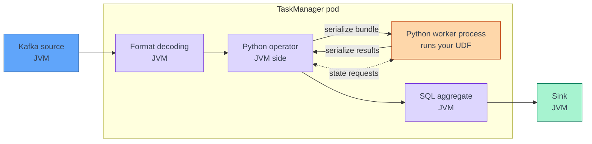

[← Apache Flink](../index.md)

# PyFlink Execution Model

**A PyFlink job is a JVM job; Python runs only where you wrote Python
functions.** The Python program you submit does not process records itself — it
describes a job graph, which is built and executed by the same Java runtime that
runs every other Flink job. Sources, sinks, formats, SQL operators and built-in
functions stay in the JVM. Only your Python UDFs and DataStream functions leave
it, and every record that crosses into Python pays for serialization on the way
in and on the way out. This page explains where that boundary sits, what it
costs, and which settings move the trade-off between latency and throughput.

!!! abstract "What you should know after reading this page"
    1. The difference between the **client side** (Python builds the job graph
       through Py4J) and the **runtime side** (Java operators execute it).
    2. That Python functions run in **Python worker processes** next to each
       TaskManager, exchanging data with a JVM operator.
    3. Which parts of a job **never touch Python** — connectors, formats, SQL
       operators, built-in functions — and which do.
    4. How **bundles** work, and how `python.fn-execution.bundle.size` and
       `python.fn-execution.bundle.time` trade latency against throughput.
    5. What **process mode** and **thread mode** are, and what thread mode does
       not support.
    6. When a **Pandas (vectorized) UDF** pays off over a row-at-a-time UDF.
    7. Why **typed output and state** beat `Types.PICKLED_BYTE_ARRAY()`, and how
       **Python operator chaining** avoids round trips.
    8. Where **Python logs** go, and which options choose the Python
       environment on the cluster.

---

## Two sides of a PyFlink job

A PyFlink job has two lives, and they happen in different places.

| Side | Where it runs | What Python does there |
|---|---|---|
| **Client** | The process that runs your `.py` entry point — your laptop, or the JobManager in application mode. | Calls the Table or DataStream API. Each call goes through **Py4J** to a JVM, which builds the real job graph. Python functions are serialized (pickled) into the operators that will run them. |
| **Runtime** | The TaskManagers. | Nothing, unless an operator holds a Python function. Those operators start **Python workers** and send records to them. |

Once the job graph is built, it is submitted exactly like a Java job. The
JobManager schedules it into slots, and the TaskManagers run it — see
[Architecture](../architecture.md) for slots, tasks and chaining.

```python
from pyflink.table import EnvironmentSettings, TableEnvironment

t_env = TableEnvironment.create(EnvironmentSettings.in_streaming_mode())

# Each call below is a Py4J call into the JVM. No record flows here.
t_env.execute_sql("CREATE TABLE orders (...) WITH ('connector' = 'kafka', ...)")
t_env.execute_sql("CREATE TABLE totals (...) WITH ('connector' = 'print')")

# The job graph is built in the JVM and submitted; Python returns.
t_env.execute_sql(
    "INSERT INTO totals SELECT customer_id, SUM(amount) FROM orders GROUP BY customer_id"
)
```

This job contains no Python function. At runtime it is **pure Java**: no Python
worker is ever started, and it performs exactly like the same SQL submitted from
the SQL client.

!!! info "Python on the client is not Python on the cluster"
    The client interpreter only has to import `pyflink` and build the graph. The
    interpreter on the TaskManagers has to import everything your UDFs import.
    They can be — and in production often are — different interpreters. See
    [The Python environment](#the-python-environment).

---

## Where Python runs at runtime

When an operator holds a Python function, the JVM operator does not call it
directly. It hands records to a **Python worker**, a separate process started on
the TaskManager's host, and reads the results back.



| Step | What happens |
|---|---|
| 1. Buffer | The JVM operator serializes each incoming record and buffers it into a **bundle**. |
| 2. Ship | The bundle is sent to the Python worker over a local channel (gRPC in process mode). |
| 3. Execute | The worker deserializes each record into Python objects, calls your function, and serializes the results. |
| 4. Return | The JVM operator deserializes the results and emits them downstream. |
| State | If the function uses state, the worker asks the JVM operator for it — the state itself lives in the JVM **state backend**, not in Python. |

!!! note "Memory for Python workers"
    Python workers live outside the JVM heap. By default
    (`python.fn-execution.memory.managed: true`) they size themselves from the
    slot's **managed memory**, which they share with RocksDB. If a job adds
    Python functions and starts running out of memory, managed memory is where to
    look, not the JVM heap.

### What touches Python and what does not

| Never touches Python | Runs in a Python worker |
|---|---|
| Connectors — Kafka source, JDBC, filesystem, print sinks | Python scalar UDFs (`@udf`) |
| Formats — `json`, `avro`, `avro-confluent` decoding | Python table functions (`@udtf`) |
| SQL operators — joins, windows, `GROUP BY`, `WHERE` | Python aggregate functions (`@udaf`, `AggregateFunction`) |
| Built-in functions — `UPPER`, `JSON_VALUE`, `DATE_FORMAT`, `CAST` | DataStream `map`, `flat_map`, `filter`, `key_by` with a Python key selector |
| Watermark generation declared in DDL | `ProcessFunction`, `KeyedProcessFunction`, window functions written in Python |

The left column is the reason Flink SQL in PyFlink is fast: a job written as
SQL plus built-ins is a Java job with a Python launcher. Decoding Avro from
Kafka, for example, happens entirely in the JVM — see
[Avro and Schema Registry](../../kafka/avro-and-schema-registry.md).

!!! warning "A Python `key_by` is a Python operator"
    `ds.key_by(lambda o: o["customer_id"])` runs the lambda in a Python worker for
    every record, just to compute the key. Every Python step between Java
    operators adds a JVM-to-Python round trip.

---

## The cost model: bundles

Crossing into Python one record at a time would be far too slow, so the JVM
operator buffers records into **bundles** and ships each bundle as one unit. A
bundle is processed when either limit is reached:

| Option | Default | Meaning |
|---|---|---|
| `python.fn-execution.bundle.size` | `1000` | Maximum number of elements in one bundle. |
| `python.fn-execution.bundle.time` | `1000` ms | Maximum time an element waits in a bundle before the bundle is processed. |

Both trade **latency against throughput**:

| Setting | Effect |
|---|---|
| Larger size, longer time | Fewer, larger transfers — higher throughput, more memory, higher latency. |
| Smaller size, shorter time | Records leave the buffer sooner — lower latency, more per-bundle overhead, lower throughput. |

On a busy topic the size limit fills first, and the time limit barely matters.
On a quiet topic the **time limit dominates**: with the default, a single order
can sit in the buffer for up to a second before your UDF sees it.

```python
t_env.get_config().set("python.fn-execution.bundle.time", "100")  # milliseconds
t_env.get_config().set("python.fn-execution.bundle.size", "500")
```

!!! tip "Set bundle time deliberately"
    For a latency-sensitive job — a feature that must be ready within a
    second of a payment — set `python.fn-execution.bundle.time` explicitly, for
    example to `100`, and measure. For a throughput job, the defaults are a
    reasonable starting point. Leaving it implicit means the latency budget is
    whatever the default happens to be.

!!! info "Bundles and checkpoints"
    A Python operator finishes its in-flight bundle before it takes part in a
    checkpoint, so buffered records are not lost. Very large bundles with slow
    UDFs therefore also make checkpoints slower. See
    [State and Checkpoints](state-and-checkpoints.md).

---

## Process mode and thread mode

`python.execution-mode` chooses how the Python worker runs:

| Mode | How | Trade-off |
|---|---|---|
| **`process`** (default) | Python functions run in a **separate Python process**; the JVM talks to it over gRPC. | Best **isolation**. Pays inter-process serialization and communication. |
| **`thread`** | Python functions run **inside the JVM process**, embedded through the PEMJA library. | Less serialization and communication overhead. Python code shares the JVM process, and several Python functions in one JVM contend for the **GIL**. |

```python
t_env.get_config().set("python.execution-mode", "thread")
```

The Flink docs put the decision this way: if performance is not your concern,
or the Python logic itself is the bottleneck, **process mode** is the better
choice. Thread mode pays off when the *crossing* is the bottleneck — many cheap
functions over many records.

!!! warning "Thread mode does not support everything (Flink 1.20)"
    According to the Flink 1.20 documentation, thread mode supports Python scalar
    UDFs and UDTFs in the Table API, but **not UDAFs or Pandas UDFs/UDAFs**. In the
    DataStream API it supports map, flat_map, filter, reduce, union, connect,
    process functions, window functions, side outputs and state, but **not**
    iterate, window CoGroup, window join, interval join or async I/O. It requires
    Python 3.8 or later. Where an operation is unsupported, Flink may fall back
    to process mode. Check the
    [Execution Mode](https://nightlies.apache.org/flink/flink-docs-release-1.20/docs/dev/python/python_execution_mode/)
    page before relying on it.

---

## General UDFs vs Pandas UDFs

A **general UDF** is called once per row with Python scalars. A **Pandas UDF**
(vectorized UDF) is called once per batch: Flink transfers the batch in the
**Apache Arrow** columnar format and your function receives `pandas.Series`.

```python
from pyflink.table import DataTypes
from pyflink.table.udf import udf

@udf(result_type=DataTypes.DOUBLE())
def with_tax(amount: float) -> float:              # called once per row
    return amount * 1.2

@udf(result_type=DataTypes.DOUBLE(), func_type="pandas")
def with_tax_vec(amount):                          # amount is a pandas.Series
    return amount * 1.2                            # returns a Series of equal length
```

| | General UDF | Pandas UDF |
|---|---|---|
| Call granularity | One Python call per row | One Python call per Arrow batch |
| Input type | Python scalars | `pandas.Series` |
| Batch size | — | `python.fn-execution.arrow.batch.size`, default `1000` |
| Pays off when | Logic is branchy, per-record, or calls non-vectorizable code | Logic is columnar arithmetic or NumPy/pandas/model inference over many rows |
| Thread mode | Supported | Not supported |

The Arrow batch size **should not exceed the bundle size**; if it does, Flink
uses the bundle size as the batch size. A Pandas UDF on a low-volume stream
gains little — batches stay small, and the per-call overhead it saves was small
to begin with.

!!! note "Pandas aggregate functions"
    Pandas UDAFs have no partial aggregation and hold all the data of a group or
    window in memory at once. They are supported for group-by aggregation,
    group-by window aggregation and bounded over-window aggregation.

---

## Python operator chaining

Flink chains operators to avoid serialization between them — see
[Architecture](../architecture.md). PyFlink adds its own layer:
**`python.operator-chaining.enabled`** (default `true`) fuses consecutive
non-shuffle Python operators so they run together in one Python worker.

```python
ds = (orders
      .map(parse, output_type=ORDER_TYPE)       # Python
      .filter(lambda o: o["amount"] > 0)        # Python, chained with map
      .map(enrich, output_type=ENRICHED_TYPE))  # Python, chained with filter
```

With chaining, those three steps make **one** JVM-to-Python round trip per
bundle, not three. A `key_by` or any other shuffle ends the chain, as does a
Java operator in between.

!!! tip "Keep Python steps together"
    Interleaving Java and Python operators — Python `map`, then SQL, then Python
    `map` — forces a fresh crossing each time. Group Python logic into adjacent
    steps, or into one function.

---

## Types and state in Python functions

Every record crossing the boundary is serialized with the declared type. When
you give no `output_type`, PyFlink falls back to **pickle**, and the type becomes
`Types.PICKLED_BYTE_ARRAY()`.

| | Typed (`Types.ROW_NAMED(...)`, `Types.STRING()`, ...) | Pickled |
|---|---|---|
| Serializer | Efficient Flink serializers | Python pickle |
| Readable by Java operators | Yes — can go to a Java sink or become a Table | No — opaque bytes to the JVM |
| Cost | Lower | Higher, per record and per state access |

```python
from pyflink.common import Types

ORDER_TYPE = Types.ROW_NAMED(
    ["order_id", "customer_id", "amount"],
    [Types.STRING(), Types.STRING(), Types.DOUBLE()],
)
parsed = raw.map(parse_order, output_type=ORDER_TYPE)  # typed, not pickled
```

State follows the same rule. A `ValueStateDescriptor("total", Types.DOUBLE())`
stores a typed double; `Types.PICKLED_BYTE_ARRAY()` stores pickled bytes, and
every read and write pickles or unpickles the whole object. The state still
lives in the JVM state backend and is checkpointed there; the worker keeps a
small cache of it (`python.state.cache-size`, default `1000`). For state
backends and checkpoints, see [State and Checkpoints](state-and-checkpoints.md).

!!! warning "Pickled state and schema evolution"
    Pickled state is a blob of Python bytes. Changing the class you pickled can
    make old state undecodable on restore, and Flink cannot help — it has no
    schema for it. Prefer typed state for anything that must survive upgrades.

---

## Practical rules

| Rule | Why |
|---|---|
| Push work into **SQL and built-in functions** first. | They never leave the JVM. |
| Keep Python functions **small and adjacent**. | Fewer crossings; chaining fuses adjacent ones. |
| Declare **`output_type`** and typed state. | Avoids pickle and keeps data readable by Java operators. |
| Set **`python.fn-execution.bundle.time`** for latency-sensitive jobs. | The default lets a record wait up to one second. |
| Use a **Pandas UDF** for columnar or model-inference work on busy streams. | One call per batch instead of per row. |
| Try **thread mode** only after measuring, and only for supported operations. | Less overhead, but less isolation and GIL contention. |

---

## Logs and the Python environment

**Logs.** `print` and `logging` inside a UDF write to the **TaskManager log**,
not to the terminal that submitted the job. Logging outside UDFs — while the
graph is built — goes to the client log. On a local cluster both are under
`$FLINK_HOME/log/`; on Kubernetes, read the TaskManager pod logs or the Flink
UI's *Logs* tab.

### The Python environment

The TaskManagers need an interpreter that has `pyflink` and your dependencies,
and they need your code.

| Option | Config key | What it sets |
|---|---|---|
| `-pyexec` / `--pyExecutable` | `python.executable` | Interpreter that runs the **Python workers** on the TaskManagers. |
| `-pyclientexec` / `--pyClientExecutable` | `python.client.executable` | Interpreter that runs the **client** program. |
| `-pyfs` / `--pyFiles` | `python.files` | Python files, packages or directories shipped to the workers. |

How these are used locally and in a Kubernetes deployment is covered in
[Development and Deployment](../development-and-deployment.md).

---

## Self-check

Answer these from memory before expanding them. They map to the outcomes listed
at the top of the page.

??? question "1. A job written entirely in Flink SQL, submitted from a `.py` file, shows no Python processes on the TaskManagers. Is something broken?"
    No. Python ran only on the **client**, to build the job graph through Py4J.
    The job contains no Python function, so at runtime it is a pure Java job and
    no **Python worker** is started.

??? question "2. On a quiet topic, a Python UDF job adds almost exactly one second of latency per record. Why, and what do you change?"
    The bundle is being flushed by its **time limit**. With little traffic,
    `python.fn-execution.bundle.size` never fills, so each record waits for
    `python.fn-execution.bundle.time`, which defaults to `1000` ms. Lower it —
    for example to `100` — and accept somewhat lower throughput.

??? question "3. You switch a job to `python.execution-mode: thread`, but one operator still runs in a separate Python process. What is going on?"
    That operator is probably one thread mode does not support in Flink 1.20 — a
    Python UDAF or a Pandas UDF in the Table API, or a window join, interval join
    or async I/O in the DataStream API. Flink may fall back to **process mode**
    for unsupported operations.

??? question "4. A Pandas UDF is no faster than the row-at-a-time version. Name two likely reasons."
    The stream is low-volume, so Arrow batches stay small and there is little
    per-call overhead to save. Or the function is not actually vectorized — it
    loops over the `pandas.Series` in Python, which does the same per-row work
    as a general UDF. Also check that `python.fn-execution.arrow.batch.size` is
    not capped by a small bundle size.

??? question "5. A DataStream `map` feeds a Java file sink, and the job fails because the sink cannot handle the records. What is missing?"
    The `output_type`. Without it, records are **pickled** into
    `Types.PICKLED_BYTE_ARRAY()`, which Java operators cannot read. Declare a
    typed output, such as `Types.ROW_NAMED(...)`.

??? question "6. A pipeline goes Python `map` → SQL `WHERE` → Python `map` → Python `filter`. How many JVM-to-Python crossings per bundle, and how would you reduce them?"
    Two. The second `map` and the `filter` are adjacent and fused by **Python
    operator chaining**; the SQL step in between forces a separate crossing for
    the first `map`. Moving the `WHERE` before the first Python step, or into a
    Python function, leaves one.

??? question "7. A `print()` inside a UDF shows nothing in the terminal that ran `flink run`. Where is the output?"
    In the **TaskManager log** — the UDF runs in a Python worker on the
    TaskManager. Only code outside UDFs, run while building the graph, logs on
    the client.

---

## References

### Apache Flink

- [Python Configuration](https://nightlies.apache.org/flink/flink-docs-release-1.20/docs/dev/python/python_config/) — bundle, Arrow, chaining, execution mode and environment options with their defaults.
- [Python Execution Mode](https://nightlies.apache.org/flink/flink-docs-release-1.20/docs/dev/python/python_execution_mode/) — process and thread mode, and what thread mode supports.
- [Vectorized User-defined Functions](https://nightlies.apache.org/flink/flink-docs-release-1.20/docs/dev/python/table/udfs/vectorized_python_udfs/) — Pandas UDFs and UDAFs, and their limits.
- [Data Types (DataStream)](https://nightlies.apache.org/flink/flink-docs-release-1.20/docs/dev/python/datastream/data_types/) — `output_type` and pickled fallback.
- [Dependency Management](https://nightlies.apache.org/flink/flink-docs-release-1.20/docs/dev/python/dependency_management/) — shipping Python files, archives and interpreters.
- [Debugging](https://nightlies.apache.org/flink/flink-docs-release-1.20/docs/dev/python/debugging/) — where client and UDF logs go.

### Related

- [Apache Flink overview](../index.md) — what each Flink page covers.
- [Architecture](../architecture.md) — slots, tasks and operator chaining in the JVM.
- [Development and Deployment](../development-and-deployment.md) — `-pyexec`, `-pyfs` and submitting PyFlink jobs.
- [Avro and Schema Registry](../../kafka/avro-and-schema-registry.md) — format decoding, which stays in the JVM.
- [Table and DataStream API](table-and-datastream-api.md) — choosing between the two APIs.
- [State and Checkpoints](state-and-checkpoints.md) — where Python function state is stored and checkpointed.
- [Sinks and Delivery Guarantees](sinks-and-delivery-guarantees.md) — the next page.
