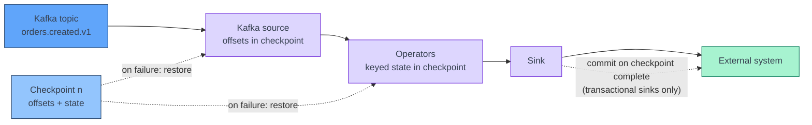
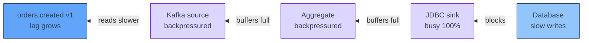

[← Apache Flink](../index.md)

# Sinks and Delivery Guarantees

**End-to-end exactly-once needs three things: a replayable source, Flink
checkpoints, and a sink that is either transactional or idempotent.**
Checkpoints alone only make Flink's *internal state* exactly-once. Whether the
outside world sees each record once depends on what the sink does when Flink
rewinds and replays after a failure. This page explains that replay, the two
ways a sink can absorb it, what each one costs, and how to pick a sink for a
given guarantee.

!!! abstract "What you should know after reading this page"
    1. Why end-to-end exactly-once needs a **replayable source**, **checkpoints**
       and a **transactional or idempotent sink** — and that missing any one
       drops you to at-least-once or worse.
    2. What a downstream consumer observes after a failure under
       **at-most-once**, **at-least-once** and **exactly-once**.
    3. Why recovery **replays** records since the last checkpoint, and so why a
       plain sink sees some writes twice.
    4. How **idempotent upserts** keyed on a primary key give correct final
       state, and what idempotency does **not** fix.
    5. How the **Kafka sink's two-phase commit** works, and how
       `transactional.id.prefix`, `transaction.timeout.ms` and
       `isolation.level=read_committed` fit together.
    6. Why exactly-once Kafka output adds **latency roughly equal to the
       checkpoint interval**.
    7. Why an **updating Table result** needs an upsert sink with a
       `PRIMARY KEY`, and what happens when you point it at an append-only sink.
    8. How a slow sink causes **backpressure** that reaches the source, and what
       to do about it — including routing rejected records to a **dead-letter**
       output.

---

## The three ingredients

A checkpoint records two things together: the **source position** (for Kafka,
the offset of every partition) and the **operator state** at that point. On
failure, Flink restores both and reads the source again from the saved offsets.
Everything after the checkpoint is processed a second time.



| Ingredient | What it provides | Without it |
|---|---|---|
| **Replayable source** | Records since the checkpoint can be read again. Kafka can; a plain HTTP push or a socket cannot. | Records in flight at the failure are lost — at-most-once at best. |
| **Checkpoints** | A consistent snapshot of offsets and state to rewind to. See [State and Checkpoints](state-and-checkpoints.md). | Nothing to rewind to; on restart the source falls back to its configured start offsets. |
| **Transactional or idempotent sink** | Replayed writes are either discarded (transaction aborted) or overwrite the same row (upsert). | Replayed writes appear twice — at-least-once. |

!!! info "Exactly-once is about effects, not processing"
    Under exactly-once, a record may still be **processed** more than once —
    replay guarantees that. What is promised is that its **effect** on state
    and on the sink's committed output appears once.

---

## Three guarantee levels

The level is a property of the whole pipeline, and the weakest link sets it.

| Level | After a failure, a consumer sees… | Duplicates? | Gaps? | Typical setup |
|---|---|---|---|---|
| **At-most-once** | Some records never arrive. | No | Yes | No checkpoints, or a sink that drops unacknowledged writes. |
| **At-least-once** | Every record, some of them twice. | Yes | No | Checkpoints + a sink that flushes on checkpoint, but cannot undo. |
| **Exactly-once** | Every record, once — in committed output. | No | No | Checkpoints + a transactional sink, or an idempotent sink for final state. |

!!! note "At-least-once is the common default"
    Most Flink sinks flush their buffers when a checkpoint is taken, so nothing
    acknowledged before the checkpoint is lost. They cannot take back writes
    made *after* it, which is why at-least-once is the usual baseline.

---

## What recovery does to a sink

Take checkpoint `n` at 12:00:00 and a TaskManager failure at 12:00:40. The
sink has already written 40 seconds of results to the external system.

1. Flink restores state and Kafka offsets from checkpoint `n`.
2. The source reads the same 40 seconds of records again.
3. Operators produce the same results again — provided they are deterministic.
4. The sink writes them **a second time**.

What step 4 does to the external system decides the guarantee. An append to a
log file or an `INSERT` into an append-only table creates duplicates. An upsert
on the same key overwrites with the same value. A transactional sink never
committed the first 40 seconds, so the first copy is aborted and only the
replay is committed.

---

## Idempotent sinks

An **idempotent** write has the same effect whether it runs once or many times.
For sinks, that almost always means an **upsert keyed on a primary key**: the
replayed record overwrites the row the first attempt wrote.

| Sink | How it is idempotent |
|---|---|
| **JDBC** with a `PRIMARY KEY` in the table DDL | The connector writes in upsert mode (`INSERT … ON CONFLICT` or the database's equivalent). |
| **Elasticsearch** with a `PRIMARY KEY` | The key becomes the document `_id`; a replay overwrites the same document. |
| **Cassandra** | Every `INSERT` is an upsert on the partition and clustering key. |
| **upsert-kafka** | Not idempotent on the topic itself — a replay appends a second record — but a consumer that keeps the **latest value per key** (a compacted topic, a table) ends up with the same final state. |

Idempotent sinks give **effectively-once final state**: once the replay has
caught up, the stored rows are what an exactly-once run would have produced.
They are often the simplest choice — no transactions and no added latency.

!!! warning "What idempotency does not fix"
    - **Intermediate states are visible.** During replay a reader can see a row
      go back to an older value and forward again.
    - **Counters and increments.** `UPDATE … SET total = total + 10` is not
      idempotent; a replay adds 10 twice. Write the computed total instead.
    - **Append-only targets.** A table without a key, a log, or an audit trail
      just gets a second row.
    - **Side effects.** An email sent, a payment API called, or a webhook fired
      from a sink or a `map` happens again on replay.
    - **Non-deterministic keys.** A key built from `uuid4()`, processing time or
      a random value differs on replay, so the second write lands on a new row.
      Derive keys from the record, such as `order_id`.

---

## Transactional sinks: Kafka

The **Kafka sink** can write inside Kafka transactions tied to checkpoints — a
**two-phase commit**:

1. Between checkpoints, each sink subtask writes to an open transaction.
2. When a checkpoint barrier arrives, the subtask flushes and **pre-commits**
   the transaction, and opens a new one for the next records.
3. When the JobManager confirms the checkpoint is **complete** on all tasks,
   each subtask **commits** its pre-committed transaction.
4. On failure before step 3, the transaction is aborted on recovery and the
   replay writes the records again in a new transaction.

### Delivery guarantee settings

| Setting | Behaviour |
|---|---|
| `none` | No guarantee; records can be lost or duplicated. Default for the DataStream `KafkaSink`. |
| `at-least-once` | Flushes pending records on every checkpoint. No loss, possible duplicates. Default for the Table/SQL `kafka` connector. |
| `exactly-once` | Kafka transactions committed on checkpoint completion. Requires a transactional ID prefix. |

=== "PyFlink DataStream"

    ```python
    from pyflink.common.serialization import SimpleStringSchema
    from pyflink.datastream.connectors.base import DeliveryGuarantee
    from pyflink.datastream.connectors.kafka import (
        KafkaRecordSerializationSchema, KafkaSink)

    sink = (
        KafkaSink.builder()
        .set_bootstrap_servers("broker:9092")
        .set_record_serializer(
            KafkaRecordSerializationSchema.builder()
            .set_topic("orders.enriched.v1")
            .set_value_serialization_schema(SimpleStringSchema())
            .build())
        .set_delivery_guarantee(DeliveryGuarantee.EXACTLY_ONCE)
        .set_transactional_id_prefix("orders-enricher")
        .set_property("transaction.timeout.ms", "900000")
        .build()
    )
    enriched.sink_to(sink)
    ```

=== "Flink SQL"

    ```sql
    CREATE TABLE orders_enriched (
      order_id STRING,
      amount   DECIMAL(10, 2)
    ) WITH (
      'connector' = 'kafka',
      'topic' = 'orders.enriched.v1',
      'properties.bootstrap.servers' = 'broker:9092',
      'format' = 'json',
      'sink.delivery-guarantee' = 'exactly-once',
      'sink.transactional-id-prefix' = 'orders-enricher',
      'properties.transaction.timeout.ms' = '900000'
    );
    ```

### The three settings that must line up

| Setting | Where | Rule |
|---|---|---|
| **Transactional ID prefix** | Flink job | Must be **unique per application** on the Kafka cluster. Two jobs with the same prefix can abort each other's transactions. Keep it stable across restarts of the same job. |
| **`transaction.timeout.ms`** | Kafka producer, set through the sink | Must exceed **the longest checkpoint duration plus the time to restart**. If a transaction times out before Flink commits it, the broker aborts it and that data is **lost**. |
| **`transaction.max.timeout.ms`** | Kafka broker | An upper bound on the producer's timeout. A producer asking for more is rejected. Kafka's default is 15 minutes. |

!!! danger "A short transaction timeout loses data"
    If a checkpoint, or a restart, takes longer than the transaction timeout,
    the broker aborts a pre-committed transaction. Flink cannot re-create those
    records — the checkpoint that covers them already completed. Do not rely on
    the default: depending on the connector version it is either Kafka's own
    producer default of one minute, which is easy to exceed, or a longer value
    set by the sink, which can exceed the broker's 15-minute maximum and make
    the job fail at startup. Set `transaction.timeout.ms` explicitly, above your
    worst checkpoint-plus-restart time and at or below the broker's maximum.

!!! warning "Consumers must read committed data"
    Transactions only hide uncommitted and aborted records from consumers that
    set **`isolation.level=read_committed`**. Kafka's consumer default is
    `read_uncommitted`, which reads aborted writes too — so a consumer with the
    default sees duplicates even though Flink wrote exactly-once. For a Flink
    Kafka source, set it with `properties.isolation.level` (SQL) or
    `set_property("isolation.level", "read_committed")`. See
    [Kafka Source](kafka-source.md).

### The latency cost

Records written in a transaction become visible to `read_committed` consumers
only when the transaction **commits**, which happens when the checkpoint
**completes**. Added latency is therefore roughly the **checkpoint interval
plus the checkpoint duration**: with a 60-second interval, output arrives in
bursts up to a minute late. Shortening the interval reduces the delay but costs
more checkpoint I/O.

!!! tip "Do you actually need exactly-once on Kafka?"
    If the consumer upserts by key, or deduplicates on an event ID, an
    **at-least-once** Kafka sink with immediate visibility is often the better
    deal. Choose exactly-once when the consumer appends blindly and duplicates
    change a result — counts, sums, billing.

---

## Changelogs and sinks

A Table API or SQL query produces a **changelog**, not just a stream of rows.
A filter or projection over a Kafka source yields **inserts only**. A
`GROUP BY` without a window, a regular join or a deduplication yields
**updates** — earlier results are retracted or overwritten as new input
arrives. See [Table API and DataStream API](table-and-datastream-api.md).

| Sink kind | Accepts | Examples |
|---|---|---|
| **Append-only** | Inserts only. | `kafka`, `filesystem`, JDBC or Elasticsearch **without** a primary key. |
| **Upsert** | Inserts, updates and deletes keyed on a `PRIMARY KEY`. | `upsert-kafka`, JDBC or Elasticsearch **with** a primary key. |

Pointing an updating query at an append-only sink fails at planning time with
an error that the sink does not support consuming update changes. The fix is
an upsert sink whose primary key matches the query's grouping key:

```sql
CREATE TABLE order_totals (
  customer_id STRING,
  total       DECIMAL(12, 2),
  PRIMARY KEY (customer_id) NOT ENFORCED
) WITH (
  'connector' = 'upsert-kafka',
  'topic' = 'orders.totals-by-customer.v1',
  'properties.bootstrap.servers' = 'broker:9092',
  'key.format' = 'json',
  'value.format' = 'json'
);

INSERT INTO order_totals
SELECT customer_id, SUM(amount) FROM orders GROUP BY customer_id;
```

`upsert-kafka` writes the key as the Kafka message key, an update as a new
value for that key, and a delete as a **tombstone** (null value). Downstream
should treat the topic as a table — compacted, latest value per key wins.

!!! note "Windowed aggregates are append-only"
    A tumbling-window aggregate emits each window once, when the watermark
    passes its end, and never updates it. That result can go to an append-only
    sink. See [Windows and Joins](windows-and-joins.md).

---

## Backpressure from a slow sink

Flink passes records between tasks through bounded network buffers. When a
sink cannot keep up, its input buffers fill, the operator upstream blocks on
sending, and the blockage moves step by step back to the source. The source
then **reads more slowly than producers write**, so **consumer lag** on the
Kafka topic grows. Nothing is dropped; the job just falls behind.



In the Flink Web UI, the **bottleneck** is the first operator from the source
end that is busy but **not** itself backpressured — the operators before it
are backpressured, and it is the one doing the waiting.

Backpressure also slows checkpoints: barriers queue behind the full buffers,
so checkpoint duration grows. With a transactional Kafka sink, that eats into
the transaction timeout margin above.

| Remedy | What it does |
|---|---|
| **Batch writes** | Fewer round trips. The JDBC connector buffers with `sink.buffer-flush.max-rows` and `sink.buffer-flush.interval`. |
| **Async or bulk clients** | Keep several requests in flight instead of one at a time. Many newer connectors are built on Flink's async sink base. |
| **Raise sink parallelism** | More concurrent writers — if the external system can take the load. |
| **Fix the target** | Missing indexes, hot partitions or an undersized cluster are usually the real cause. |

---

## Dead-letter outputs

Some records are rejected by the sink itself — a value too long for a column,
a document the index mapping refuses. Many sinks then fail the job, the job
restarts, replays the same record and fails again in a loop.

Validate before the sink, and route records that would be rejected to a
**side output** with its own sink — a dead-letter topic or table:

```python
from pyflink.common import Types
from pyflink.datastream import OutputTag, ProcessFunction

rejected = OutputTag("rejected", Types.STRING())

class Validate(ProcessFunction):
    def process_element(self, order, ctx):
        if order["amount"] is None or len(order["order_id"]) > 64:
            yield rejected, str(order)
        else:
            yield order

valid = orders.process(Validate())
valid.get_side_output(rejected).sink_to(dead_letter_sink)
```

Decoding failures at the source are the same problem one step earlier; see
[Avro and Schema Registry](../../kafka/avro-and-schema-registry.md).

---

## Choosing a sink

| If your sink is… | You get… | And you should… |
|---|---|---|
| **Kafka, `exactly-once`** | No duplicates for `read_committed` consumers. | Set a unique transactional ID prefix, set `transaction.timeout.ms` above checkpoint + restart time, make consumers `read_committed`, and accept checkpoint-interval latency. |
| **Kafka, `at-least-once`** | Low latency; duplicates after a failure. | Give records a stable key or event ID so consumers can deduplicate or upsert. |
| **upsert-kafka** | Correct latest value per key; duplicate records on the topic after replay. | Use a compacted topic, and consumers that read it as a table. |
| **JDBC / Elasticsearch / Cassandra upsert** | Effectively-once final state. | Define a primary key from record fields, write absolute values rather than increments, and tune batching. |
| **Append-only JDBC table, log, or webhook** | At-least-once — duplicates after replay. | Add a natural key and switch to upsert, or deduplicate downstream. |
| **Filesystem (`FileSink` / `filesystem` connector)** | Exactly-once files: part files are finalised only when a checkpoint completes. | Enable checkpointing — without it, part files are never finalised — and expect files to appear once per checkpoint interval. Downstream readers should ignore in-progress and pending files. |

---

## Self-check

Answer these from memory before expanding them. They map to the outcomes listed
at the top of the page.

??? question "1. A job has checkpoints every minute and a Kafka sink with `delivery.guarantee` left at its DataStream default. After a TaskManager crash, a consumer finds duplicates. Why?"
    The DataStream `KafkaSink` defaults to `none`. Even at `at-least-once`, the
    records written since the last checkpoint are written again on replay.
    Checkpoints make Flink's state exactly-once; only a transactional sink
    stops the duplicate output.

??? question "2. You switch that sink to `exactly-once`, and the consumer still sees duplicates. What is the most likely cause?"
    The consumer reads with Kafka's default `isolation.level=read_uncommitted`,
    so it sees records from aborted transactions. Set
    `isolation.level=read_committed` on the consumer.

??? question "3. A job writes customer totals to a JDBC table with a primary key. After a failure, a dashboard briefly shows a lower total, then the right one. Is this a bug?"
    No. The upsert sink is idempotent for **final state**, but during replay it
    rewrites rows with the values computed after the checkpoint, passing through
    older values on the way. Idempotency does not hide intermediate states.

??? question "4. After a long checkpoint and a slow restart, an exactly-once Kafka sink is missing a few seconds of records. What happened?"
    The transaction timed out. The broker aborted a pre-committed transaction
    before Flink could commit it, and the checkpoint covering those records was
    already complete, so they are not replayed. Raise `transaction.timeout.ms`
    above the longest checkpoint plus restart time, within the broker's
    `transaction.max.timeout.ms`.

??? question "5. Downstream teams complain that an exactly-once topic updates only once a minute. Why, and what are the options?"
    Transactional output becomes visible when the checkpoint completes, so
    latency tracks the checkpoint interval. Shorten the interval at some cost,
    or switch to `at-least-once` and have consumers deduplicate or upsert by key.

??? question "6. `INSERT INTO` a Kafka table from `SELECT customer_id, SUM(amount) … GROUP BY customer_id` fails to plan. Why, and how do you fix it?"
    An unwindowed `GROUP BY` produces updates, and the `kafka` connector is
    append-only. Write to an `upsert-kafka` (or JDBC) table with
    `PRIMARY KEY (customer_id) NOT ENFORCED`.

??? question "7. Kafka lag on a job's input grows steadily, and the Web UI shows the source as backpressured. Where do you look first?"
    Downstream, for the first operator that is busy but not backpressured —
    often the sink. Then check the external system, batching, async writes and
    sink parallelism.

---

## References

### Apache Flink

- [Fault Tolerance Guarantees of Data Sources and Sinks](https://nightlies.apache.org/flink/flink-docs-release-1.20/docs/connectors/datastream/guarantees/) — which connectors give which guarantee.
- [Kafka connector (DataStream)](https://nightlies.apache.org/flink/flink-docs-release-1.20/docs/connectors/datastream/kafka/) — `KafkaSink`, delivery guarantees and transaction timeouts.
- [Kafka connector (SQL)](https://nightlies.apache.org/flink/flink-docs-release-1.20/docs/connectors/table/kafka/) — `sink.delivery-guarantee` and `sink.transactional-id-prefix`.
- [Upsert Kafka connector](https://nightlies.apache.org/flink/flink-docs-release-1.20/docs/connectors/table/upsert-kafka/) — keyed upserts and tombstones.
- [JDBC connector](https://nightlies.apache.org/flink/flink-docs-release-1.20/docs/connectors/table/jdbc/) — upsert mode and buffer flushing.
- [File Sink](https://nightlies.apache.org/flink/flink-docs-release-1.20/docs/connectors/datastream/filesystem/) — part file lifecycle and checkpoint-based commits.
- [Dynamic Tables](https://nightlies.apache.org/flink/flink-docs-release-1.20/docs/dev/table/concepts/dynamic_tables/) — append, retract and upsert streams.
- [Monitoring Back Pressure](https://nightlies.apache.org/flink/flink-docs-release-1.20/docs/ops/monitoring/back_pressure/) — reading the Web UI.
- [Side Outputs](https://nightlies.apache.org/flink/flink-docs-release-1.20/docs/dev/datastream/side_output/) — `OutputTag` and `get_side_output`.

### Related

- [Apache Flink overview](../index.md)
- [Architecture](../architecture.md) — slots, parallelism and TaskManager failure.
- [Development and Deployment](../development-and-deployment.md) — where checkpoints are stored and how to resume from one.
- [Kafka Source](kafka-source.md) — offsets, start positions and consumer properties.
- [Table API and DataStream API](table-and-datastream-api.md) — changelogs and update streams.
- [Windows and Joins](windows-and-joins.md) — which operators produce append-only results.
- [State and Checkpoints](state-and-checkpoints.md) — barriers, intervals and recovery.
- [Avro and Schema Registry](../../kafka/avro-and-schema-registry.md) — decoding failures and dead-letter routing at the source.
