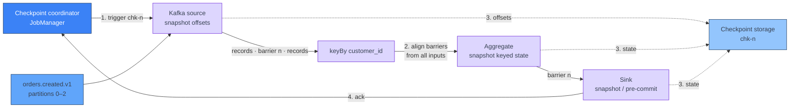

[← Apache Flink](../index.md)

# State, Checkpoints and Savepoints

**A streaming job is only as reliable as its state, and a checkpoint is a
consistent snapshot of all that state plus the source positions it belongs
to.** Any operator that remembers something between records — a running total,
a deduplication set, the open side of a join, a Kafka offset — holds state.
Flink keeps that state local to the subtask that owns it, and periodically
snapshots all of it, together with the source offsets, into durable storage.
On failure it rolls the whole job back to the last snapshot and replays from
there. This page explains that mechanism. Where the snapshots are stored, and
how jobs are resumed and upgraded on Kubernetes, are covered in
[Development and Deployment](../development-and-deployment.md).

!!! abstract "What you should know after reading this page"
    1. What **state** is, and the difference between **keyed state** and
       **operator state** — and that Kafka source offsets are operator state.
    2. The **keyed state types**, and which ones PyFlink exposes.
    3. How the **HashMap** and **RocksDB** state backends differ, and when to
       pick each.
    4. Why **unbounded state** is the most common long-run failure, and how
       **state TTL** prevents it in the DataStream API and in SQL.
    5. How a **checkpoint** works: barriers, alignment, **unaligned**
       checkpoints, and what exactly-once means *inside* Flink.
    6. What a **restart strategy** does, and what Flink restores on failure.
    7. How **savepoints** differ from checkpoints in ownership, format and
       purpose.
    8. Why stateful operators need a stable **UID**, why SQL jobs are harder to
       upgrade, and where **state schema evolution** breaks — especially for
       pickled Python state.

---

## What state is

A stateless operator, such as a `filter` or a field-mapping `map`, looks at one
record and forgets it. Most useful streaming logic cannot do that:

| Logic | State it needs |
|---|---|
| Count orders per customer per hour | A counter per customer and window |
| Drop duplicate payment events | The set of payment IDs already seen |
| Join clicks to orders | Buffered rows from both sides |
| Read from Kafka | The offset reached in each partition |

Flink stores this state **next to the computation**, in the TaskManager that
runs the subtask, rather than in an external database. That keeps access fast,
but it means Flink itself is responsible for making the state durable — which
is what checkpoints are for.

### Keyed state and operator state

| | **Keyed state** | **Operator state** |
|---|---|---|
| Scoped to | One key, after a `keyBy` (or a SQL `GROUP BY` / join key) | One parallel subtask of an operator |
| Who uses it | Your business logic: counters, aggregates, join buffers | Mostly connectors: Kafka source offsets, sink transaction handles |
| Redistributed on rescale by | **Key groups** — ranges of keys move between subtasks | The operator's own rule, e.g. Kafka splits are reassigned |
| PyFlink DataStream | Yes | **No** — not exposed to Python functions (broadcast state is the exception) |

Keyed state is why `keyBy` exists: it guarantees one subtask owns all state for
a key, as described in [Architecture](../architecture.md#keyby-network-shuffle-and-keyed-state).
The number of key groups is the job's **max parallelism**, which is fixed once
state exists — you can rescale up to it, not beyond it.

!!! info "Kafka offsets are state, not consumer-group commits"
    The Kafka source stores the offset of each assigned partition as **operator
    state** in every checkpoint. On restore, it resumes from those offsets.
    Offsets committed back to the consumer group are only for monitoring lag.
    See [Kafka Source](kafka-source.md).

---

## Keyed state types

| Type | Holds | Typical use |
|---|---|---|
| `ValueState` | One value per key | Last seen event, running total, a flag |
| `ListState` | A list per key | Buffered events awaiting a match |
| `MapState` | A map per key | Per-key lookup, e.g. seen IDs with timestamps |
| `ReducingState` | One value, folded with a `ReduceFunction` on each add | Running sum or max |
| `AggregatingState` | An accumulator, folded with an `AggregateFunction` | Running average |

PyFlink exposes all five through descriptors in `pyflink.datastream.state`
(`ValueStateDescriptor`, `ListStateDescriptor`, `MapStateDescriptor`,
`ReducingStateDescriptor`, `AggregatingStateDescriptor`). You create them in
`open()` from the runtime context:

```python
from pyflink.common import Types
from pyflink.datastream import KeyedProcessFunction, RuntimeContext
from pyflink.datastream.state import ValueStateDescriptor

class OrderCount(KeyedProcessFunction):
    def open(self, ctx: RuntimeContext):
        self.count = ctx.get_state(
            ValueStateDescriptor("order_count", Types.LONG()))

    def process_element(self, order, ctx):
        n = (self.count.value() or 0) + 1
        self.count.update(n)
        yield order["customer_id"], n

counts = (orders
          .key_by(lambda o: o["customer_id"])
          .process(OrderCount(), output_type=Types.TUPLE([Types.STRING(), Types.LONG()]))
          .uid("order-count"))
```

In the Table API and SQL you do not declare state yourself. The planner creates
it for every stateful operator — aggregations, joins, deduplication, windows —
see [Table and DataStream API](table-and-datastream-api.md).

---

## State backends

The **state backend** decides where live state sits while the job runs. It is
separate from **checkpoint storage**, which decides where snapshots are written.

| | **HashMap** (`hashmap`, the default) | **RocksDB** (`rocksdb`) |
|---|---|---|
| Live state lives in | Java objects on the TaskManager heap | An embedded RocksDB instance on local disk, with an in-memory cache |
| Max state size | Bounded by memory | Bounded by local disk — **larger than memory** works |
| Access cost | Fast; no serialization on read/write | Every read and write serializes and deserializes |
| GC pressure | Grows with state size | Low; state is off-heap |
| Incremental checkpoints | No — full snapshot each time | **Yes** — only changed files are uploaded |
| Good for | Small or moderate state, lowest latency | Large keyed state, long TTLs, many keys |

Set it with `state.backend.type`, and enable incremental checkpoints with
`execution.checkpointing.incremental` (the older `state.backend.incremental`
name still works).

!!! tip "Default to RocksDB for long-running keyed jobs"
    The HashMap backend is faster per access, but a job whose key space grows
    will eventually run out of heap — and it does so gradually, with GC pauses
    and slow checkpoints first. RocksDB with incremental checkpoints keeps
    checkpoint time proportional to what *changed*, not to total state size.

---

## State TTL and unbounded state

**Unbounded state** is state that grows for as long as the job runs, because
nothing ever deletes it. It is the most common reason a job that ran fine for
weeks starts failing: checkpoints get slower, then time out, then the
TaskManager runs out of memory or disk.

Typical causes:

- A key per user, device or order ID, with no rule for when that key is done.
- A SQL **regular join** (no time bound), which keeps every row of both sides.
- A SQL `GROUP BY` or `DISTINCT` on a high-cardinality column.

Windowed operators clean up after the window fires — see
[Windows and Joins](windows-and-joins.md). Everything else needs a **TTL**.

### DataStream: `StateTtlConfig`

```python
from pyflink.common.time import Time
from pyflink.datastream.state import StateTtlConfig, MapStateDescriptor

ttl = (StateTtlConfig
       .new_builder(Time.days(7))
       .set_update_type(StateTtlConfig.UpdateType.OnCreateAndWrite)
       .set_state_visibility(StateTtlConfig.StateVisibility.NeverReturnExpired)
       .build())

seen = MapStateDescriptor("seen_payment_ids", Types.STRING(), Types.LONG())
seen.enable_time_to_live(ttl)
```

TTL is per descriptor, measured in **processing time**, and refreshed on write
(or also on read, with `OnReadAndWrite`). By default, expired entries are
removed when read and garbage-collected in the background where the backend
supports it — so disk usage drops some time after expiry, not at the instant.

### SQL: `table.exec.state.ttl`

```python
t_env.get_config().set("table.exec.state.ttl", "7 d")
```

```sql
SET 'table.exec.state.ttl' = '7 d';
```

This applies to every stateful SQL operator in the job. Its default is `0`,
meaning **state is never cleaned up**. State for a key is dropped once it has
been idle for at least the TTL.

!!! warning "TTL changes results"
    TTL is not free cleanup: once a key's state expires, Flink behaves as if the
    key had never been seen. A join emits no match for a late row, an
    aggregate restarts from zero, a deduplicator lets a duplicate through. Pick
    the TTL from the business rule ("payments are never retried after 24
    hours"), not from memory pressure.

---

## How a checkpoint works

The JobManager's checkpoint coordinator periodically injects a **checkpoint
barrier** into every source. A barrier is a marker that flows through the
stream with the records. Everything before barrier *n* belongs to checkpoint
*n*; everything after belongs to the next one.



1. **Sources** record their current offsets as state, then emit the barrier
   downstream.
2. An operator with several inputs waits until barrier *n* has arrived on
   **all** of them — **alignment** — buffering records from inputs that are
   ahead. It then snapshots its state and forwards the barrier.
3. Snapshots are written **asynchronously** to checkpoint storage, so
   processing continues while the upload runs.
4. When every operator has acknowledged, the checkpoint is **complete**. Only
   complete checkpoints are used for recovery.

The result is a snapshot in which every operator's state reflects exactly the
same set of input records, and the source offsets point just past them.

### Aligned and unaligned checkpoints

Under **backpressure**, barriers queue behind slow records, and alignment can
take minutes. **Unaligned checkpoints** let a barrier overtake buffered
records; the in-flight records are stored as part of the checkpoint instead.

| | **Aligned** (default) | **Unaligned** |
|---|---|---|
| Barrier waits behind in-flight data | Yes | No — it overtakes buffers |
| Checkpoint contains | Operator state | Operator state **plus in-flight buffers** |
| Checkpoint duration under backpressure | Grows with backpressure | Roughly constant |
| Checkpoint size | Smaller | Larger |
| Limitations | — | Exactly-once mode only; no concurrent checkpoints; some restrictions on restore and rescaling |

Enable with `execution.checkpointing.unaligned.enabled: true`.
`execution.checkpointing.aligned-checkpoint-timeout` starts each checkpoint
aligned and switches to unaligned only if alignment takes too long.

!!! note "Unaligned checkpoints treat the symptom"
    They make checkpoints succeed under backpressure; they do not remove the
    backpressure. Find the slow operator first.

### Exactly-once and at-least-once inside Flink

`execution.checkpointing.mode` (default `EXACTLY_ONCE`) controls alignment:

| Mode | Behaviour | After restore |
|---|---|---|
| `EXACTLY_ONCE` | Barriers are aligned (or unaligned with buffers saved) | Every record affects state **exactly once** |
| `AT_LEAST_ONCE` | No alignment — records arriving after a barrier on one input are processed before the snapshot | Some records may affect state **twice** |

```python
from pyflink.datastream import CheckpointingMode
env.enable_checkpointing(60_000, CheckpointingMode.EXACTLY_ONCE)
```

!!! danger "Exactly-once state is not exactly-once output"
    This mode guarantees what happens to Flink's **internal state**. Whether
    the outside world sees each result once depends on the **sink**: a
    transactional or idempotent sink is needed, otherwise records written
    between the last checkpoint and the failure are written again on replay.
    See [Sinks and Delivery Guarantees](sinks-and-delivery-guarantees.md).

---

## Failure and restart strategies

When a task fails — an exception in a UDF, a lost TaskManager, a broken
connection — Flink:

1. Cancels the affected tasks (by default the failed **pipelined region**, set
   by `jobmanager.execution.failover-strategy`).
2. Waits as the **restart strategy** says.
3. Restores every operator's state from the **latest completed checkpoint**.
4. **Rewinds the sources** to the offsets in that checkpoint and replays.

Infrastructure recovery — the pod being replaced — is described in
[Architecture](../architecture.md#failure-and-recovery).

| `restart-strategy.type` | Behaviour | Key options |
|---|---|---|
| `exponential-delay` | Retries forever, with growing backoff; resets after a stable period. **Default when checkpointing is on.** | `restart-strategy.exponential-delay.initial-backoff`, `.max-backoff`, `.backoff-multiplier` |
| `fixed-delay` | A fixed number of attempts with a fixed delay, then the job fails | `restart-strategy.fixed-delay.attempts`, `.delay` |
| `failure-rate` | Restarts until failures in a time window exceed a limit | `restart-strategy.failure-rate.max-failures-per-interval`, `.failure-rate-interval`, `.delay` |
| `none` | Fail immediately. **Default when checkpointing is off.** | — |

!!! warning "Restarts do not fix deterministic failures"
    If the failure is caused by a record — one that cannot be decoded, or that
    hits a bug — every restart rewinds to before it and fails again. The job
    loops forever under `exponential-delay`. Handle bad records in code; see
    [Avro and Schema Registry](../../kafka/avro-and-schema-registry.md).

---

## Savepoints versus checkpoints

A **savepoint** uses the same snapshot mechanism, but is triggered by you, for
a planned change.

| | **Checkpoint** | **Savepoint** |
|---|---|---|
| Purpose | Automatic recovery from failure | Planned stop: upgrade, rescale, migration, backup |
| Triggered by | Flink, on an interval | You — `flink savepoint`, `flink stop`, or the Operator |
| Owned by | **Flink** — it deletes old ones | **You** — Flink never deletes them |
| Format | Backend-specific (native), may be incremental | **Canonical** (backend-independent) by default; **native** optional |
| Survives a state-backend change | No | Canonical: yes |

Treat checkpoints as Flink's private recovery log and savepoints as your
portable backup. For the commands and the Kubernetes upgrade flow, see
[Development and Deployment](../development-and-deployment.md#upgrading-a-job).

---

## Operator UIDs and state compatibility

A snapshot stores state **per operator ID**. On restore, Flink matches each
operator in the new job to state in the snapshot by that ID. If no ID is set,
Flink generates one from the job graph's structure — so adding, removing or
reordering an operator can change the generated IDs of others, and their state
no longer maps.

### DataStream: set `.uid()` on every stateful operator

```python
(orders
    .key_by(lambda o: o["customer_id"])
    .process(OrderCount(), output_type=...)
    .uid("order-count")        # stable state identity
    .name("Order count"))      # display name only
```

Keep the UID fixed for the life of that state. Changing it is the same as
deleting the state.

### Table API and SQL: generated IDs

SQL and Table jobs do not let you set UIDs. The planner translates the query
into operators and assigns their IDs itself. **Changing the query** — adding a
column to a `GROUP BY`, changing a join, even a planner change between Flink
versions — can produce a different operator graph whose state cannot be
mapped. Flink does not promise state compatibility across arbitrary query
changes.

!!! tip "Planning SQL upgrades"
    Assume a non-trivial change to a stateful SQL query needs either a fresh
    start (with sources reset to a chosen offset or timestamp) or a backfill.
    Flink's **compiled plans** (`COMPILE PLAN` / `EXECUTE PLAN`) exist to pin
    the operator graph across Flink upgrades, but they do not make arbitrary
    query edits restorable.

### `--allowNonRestoredState`

If the snapshot contains state for an operator that no longer exists, restore
**fails** by default. `flink run -s <path> --allowNonRestoredState` (`-n`)
skips that state. Use it deliberately: it is also what silently discards state
when a UID was changed by mistake.

| Change since the snapshot | Result |
|---|---|
| Operator added | Starts with empty state |
| Operator removed | Restore fails unless `--allowNonRestoredState` |
| UID changed | Old state is orphaned (fails, or dropped with `-n`); new operator starts empty |
| Parallelism changed (≤ max parallelism) | Keyed state redistributed by key group |

---

## State schema evolution

The type of a state value can change between versions of a job. Whether a
restore survives that depends on the **serializer** behind the state.

| State type | Evolution |
|---|---|
| Avro types | Supported — Avro schema resolution applies |
| Java POJOs | Supported for adding and removing fields |
| Flink SQL / Table internal rows | Tied to the query; see the previous section |
| Other Java types (Kryo fallback) | **Not supported** |

!!! warning "Pickled Python state is opaque"
    In PyFlink, state declared with `Types.PICKLED_BYTE_ARRAY()` — or any
    arbitrary Python object stored that way — is serialized with Python's
    pickle. Flink sees only bytes and cannot evolve them. Whether an old value
    unpickles after you rename a class, move a module or change an object's
    attributes is up to pickle, not Flink, and it can fail at restore or at the
    first read. Prefer explicit Flink types (`Types.ROW_NAMED`, `Types.LONG()`,
    `Types.STRING()`) for state that must survive upgrades, and test restores
    from a real savepoint before deploying a change to state shape.

---

## Self-check

Answer these from memory before expanding them. They map to the outcomes listed
at the top of the page.

??? question "1. A job that deduplicates payments by ID ran fine for a month, then checkpoints started timing out and TaskManagers ran out of memory. What is the likely cause, and what is the fix?"
    **Unbounded keyed state**: every payment ID ever seen is still stored, so
    state grows forever. Add a **TTL** (`StateTtlConfig` on the descriptor,
    or `table.exec.state.ttl` in SQL) set from the business rule for how long
    duplicates can arrive. Moving to **RocksDB** with incremental checkpoints
    buys headroom, but does not stop the growth.

??? question "2. After a restore, a job re-reads Kafka from offsets older than the consumer group's committed offsets. Is that a bug?"
    No. The Kafka source restores from the offsets in its **operator state**
    in the checkpoint, not from the consumer group. Committed offsets are for
    monitoring. Rewinding to the checkpoint's offsets is what makes the
    restored state and the input consistent.

??? question "3. Under heavy backpressure, checkpoints take ten minutes and often time out. What is happening, and what are the options?"
    Barriers are queued behind in-flight records, and **alignment** waits for
    them. **Unaligned checkpoints** (or an aligned-checkpoint timeout) let
    barriers overtake buffers, so checkpoints complete. The real fix is still
    to remove the backpressure at the slow operator.

??? question "4. A job uses `EXACTLY_ONCE` checkpointing, yet the downstream table contains duplicate rows after a failure. How?"
    Exactly-once applies to Flink's **internal state**. Records the sink wrote
    after the last checkpoint are written again when sources rewind. End-to-end
    exactly-once needs a **transactional or idempotent sink**.

??? question "5. A job fails on the same record every few seconds and never stops restarting. Why does the restart strategy not help?"
    Each restart restores the last checkpoint and **rewinds the source** to
    before the bad record, so it fails again. The default with checkpointing
    on, `exponential-delay`, retries forever. Restarts handle transient
    failures; deterministic ones need handling in code.

??? question "6. You inserted a `filter` before a stateful `process` and the job now refuses to restore from the savepoint. What went wrong?"
    The stateful operator had **no explicit UID**, so its generated ID depended
    on the graph shape and changed. Flink found state for an ID that no longer
    exists. Set `.uid()` on stateful operators from the start; restoring with
    `--allowNonRestoredState` here would silently drop that state.

??? question "7. A PyFlink job stores a Python object in `PICKLED_BYTE_ARRAY` state. You rename one of its attributes and redeploy from a savepoint. What might happen?"
    Flink cannot evolve pickled bytes; whether the old value loads is up to
    **pickle**. It may fail on restore or on first read, or load an object with
    the old attribute. Use explicit Flink types for long-lived state, and test
    the restore before deploying.

---

## References

### Apache Flink

- [Working with State](https://nightlies.apache.org/flink/flink-docs-release-1.20/docs/dev/datastream/fault-tolerance/state/) — keyed state types, descriptors and state TTL.
- [Stateful Stream Processing](https://nightlies.apache.org/flink/flink-docs-release-1.20/docs/concepts/stateful-stream-processing/) — barriers, alignment and the snapshot algorithm.
- [State Backends](https://nightlies.apache.org/flink/flink-docs-release-1.20/docs/ops/state/state_backends/) — HashMap and RocksDB, incremental checkpoints.
- [Checkpointing](https://nightlies.apache.org/flink/flink-docs-release-1.20/docs/dev/datastream/fault-tolerance/checkpointing/) — enabling checkpoints and their options.
- [Checkpointing under backpressure](https://nightlies.apache.org/flink/flink-docs-release-1.20/docs/ops/state/checkpointing_under_backpressure/) — unaligned checkpoints and their limitations.
- [Task Failure Recovery](https://nightlies.apache.org/flink/flink-docs-release-1.20/docs/ops/state/task_failure_recovery/) — restart and failover strategies.
- [Checkpoints vs Savepoints](https://nightlies.apache.org/flink/flink-docs-release-1.20/docs/ops/state/checkpoints_vs_savepoints/) — ownership, format and supported operations.
- [Savepoints](https://nightlies.apache.org/flink/flink-docs-release-1.20/docs/ops/state/savepoints/) — operator UIDs and `--allowNonRestoredState`.
- [State Schema Evolution](https://nightlies.apache.org/flink/flink-docs-release-1.20/docs/dev/datastream/fault-tolerance/serialization/schema_evolution/) — which serializers support evolution.
- [Table configuration](https://nightlies.apache.org/flink/flink-docs-release-1.20/docs/dev/table/config/) — `table.exec.state.ttl`.

### Related

- [Apache Flink overview](../index.md) — what each Flink page covers.
- [Architecture](../architecture.md) — `keyBy`, keyed-state ownership and TaskManager recovery.
- [Development and Deployment](../development-and-deployment.md) — checkpoint storage, retention, resuming and savepoint-based upgrades.
- [Kafka Source](kafka-source.md) — how the source stores and restores offsets.
- [Table and DataStream API](table-and-datastream-api.md) — where SQL creates state for you.
- [Time and Watermarks](time-and-watermarks.md) — event time, which windows and timers depend on.
- [Windows and Joins](windows-and-joins.md) — operators that clean up their own state.
- [Sinks and Delivery Guarantees](sinks-and-delivery-guarantees.md) — what makes output exactly-once.
- [Avro and Schema Registry](../../kafka/avro-and-schema-registry.md) — handling records that cannot be decoded.
