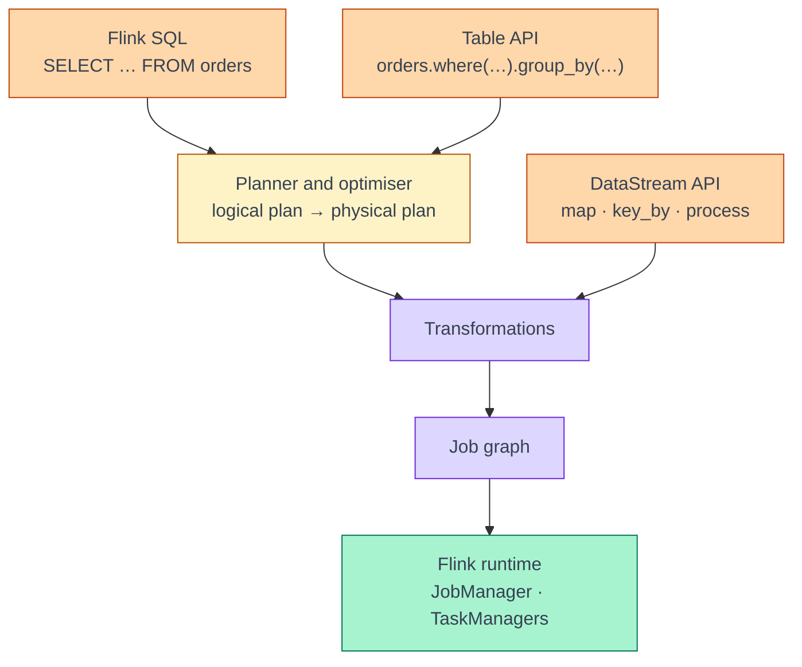
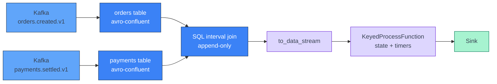

[← Apache Flink](../index.md)

# Table API and DataStream API

**SQL, the Table API and the DataStream API are three ways to describe the same
kind of Flink job, and all three end up as the same runtime job graph.** What
differs is what you describe. With SQL and the Table API you say *what* result
you want and the planner works out the operators. With the DataStream API you
write the operators yourself, one record at a time. Most real PyFlink jobs use
both: tables for sources, formats and joins, and DataStream for the one step that
needs custom state or timers. To mix them safely you need to know whether a
table's result is **append-only** or **updating**.

!!! abstract "What you should know after reading this page"
    1. How the **API stack** is layered, and that SQL, Table API and DataStream
       all compile to one **job graph** on the same runtime.
    2. What the **Table API and SQL** are good at: declarative joins and windows,
       connectors and formats such as `avro-confluent`, and the optimiser.
    3. What the **DataStream API** is good at: per-record control, custom state
       and timers, and side outputs.
    4. How to choose between them for a given step, using the decision table.
    5. The difference between **append-only** and **updating** results, the four
       changelog row kinds `+I`, `-U`, `+U`, `-D`, and which operations produce
       each.
    6. How to convert in PyFlink with `from_data_stream`, `to_data_stream` and
       `to_changelog_stream`, and why `to_data_stream` fails on an updating table.
    7. What happens to **types and time attributes** when a stream crosses the
       Table/DataStream boundary.
    8. The common **hybrid pattern**: Table API source and SQL joins, then a
       `KeyedProcessFunction` on the DataStream side.

---

## The API stack

Flink offers three APIs at two levels. SQL and the Table API sit on top and share
one planner. The DataStream API sits below them. Both paths produce
**transformations**, which become a single **job graph** that the JobManager
schedules into slots, as described in [Architecture](../architecture.md).



With SQL and the Table API the **planner** picks the operators; with DataStream
you do. SQL and the Table API produce the same logical plan, so you can mix them
freely in one job.

---

## What each API is good at

### Table API and SQL

- **Declarative joins and windows.** One clause each; the operator, its state
  and its cleanup are generated for you.
- **Connectors and formats.** One `CREATE TABLE` gives you a source and a
  decoder. **`avro-confluent`** handles the Confluent header and registry — see
  [Avro and Schema Registry](../../kafka/avro-and-schema-registry.md#decoding-in-flink).
- **The optimiser.** The planner pushes filters and projections down, reuses
  common sub-plans, and picks the join and aggregation strategy.
- **Operators run in the JVM.** Unless you call a Python UDF, a Table/SQL job
  written in PyFlink runs no Python code at runtime.

### DataStream API

- **Per-record control.** You decide what each record emits — zero, one or many.
- **Custom state and timers.** A `KeyedProcessFunction` keeps any state per key
  and registers timers — logic such as "alert if no payment arrives within ten
  minutes". See [State and checkpoints](state-and-checkpoints.md).
- **Side outputs.** One function can split records, for example bad ones to a
  dead-letter stream.

### Choosing

| Use Table API / SQL when… | Use DataStream when… |
|---|---|
| You are reading or writing through a connector and a format. | You need state whose shape SQL cannot express. |
| The logic is a filter, projection, join, window or aggregation. | You need timers — "do X if Y has not happened by T". |
| You want the planner to manage state size and cleanup. | You need side outputs to split one stream several ways. |
| You want the job to stay in the JVM. | You need per-record control over what, and how much, to emit. |
| You need to decode Confluent Avro in PyFlink. | You are calling an external library per record. |

!!! tip "Default to tables, drop down for one step"
    Start in SQL or the Table API, and drop to DataStream only for the step that
    needs it. You do not have to pick one API for the whole job.

---

## The same pipeline, both ways

The pipeline: read orders from `orders.created.v1`, keep only paid ones, and
keep a running total per customer. To keep the comparison about the API rather
than the format, both versions read **JSON**.

### Table API

```python
from pyflink.table import EnvironmentSettings, TableEnvironment
from pyflink.table.expressions import col

t_env = TableEnvironment.create(EnvironmentSettings.in_streaming_mode())
t_env.execute_sql("""
    CREATE TABLE orders (
      order_id STRING, customer_id STRING, status STRING, amount DOUBLE
    ) WITH (
      'connector' = 'kafka',
      'topic' = 'orders.created.v1',
      'properties.bootstrap.servers' = 'broker:9092',
      'properties.group.id' = 'order-totals',
      'scan.startup.mode' = 'earliest-offset',
      'format' = 'json'
    )""")

totals = (t_env.from_path("orders")
          .where(col("status") == "PAID")
          .group_by(col("customer_id"))
          .select(col("customer_id"), col("amount").sum.alias("total")))
totals.execute().print()
```

### DataStream API

```python
from pyflink.common import Types, WatermarkStrategy
from pyflink.datastream import StreamExecutionEnvironment
from pyflink.datastream.connectors.kafka import KafkaSource, KafkaOffsetsInitializer
from pyflink.datastream.formats.json import JsonRowDeserializationSchema

order_type = Types.ROW_NAMED(
    ["order_id", "customer_id", "status", "amount"],
    [Types.STRING(), Types.STRING(), Types.STRING(), Types.DOUBLE()])
source = (KafkaSource.builder()
          .set_bootstrap_servers("broker:9092")
          .set_topics("orders.created.v1")
          .set_group_id("order-totals")
          .set_starting_offsets(KafkaOffsetsInitializer.earliest())
          .set_value_only_deserializer(JsonRowDeserializationSchema.builder()
                                       .type_info(order_type).build()).build())

env = StreamExecutionEnvironment.get_execution_environment()
(env.from_source(source, WatermarkStrategy.no_watermarks(), "orders")
    .filter(lambda r: r.status == "PAID")
    .map(lambda r: (r.customer_id, r.amount),
         output_type=Types.TUPLE([Types.STRING(), Types.DOUBLE()]))
    .key_by(lambda t: t[0])
    .reduce(lambda a, b: (a[0], a[1] + b[1]))
    .print())
env.execute("order-totals")
```

| | Table API | DataStream API |
|---|---|---|
| Source and decoding | One DDL statement. | Source builder plus a deserialisation schema. |
| Types | Column types in the DDL. | `Types.ROW_NAMED` and `output_type` by hand. |
| Where `filter` and `sum` run | JVM operators the planner generates. | Python lambdas — each record crosses to the Python worker. |
| What the result *is* | An **updating** table: each new order replaces the customer's previous total. | A plain stream: each new order emits a new tuple; nothing says it replaces the last one. |

The last row is the important one. Both versions print a new total each time an
order arrives, but only the table knows that the new total **replaces** the old
one. That knowledge is the changelog.

!!! note "Every Python function is a JVM↔Python hop"
    In PyFlink, each Python function in a DataStream step — the lambdas above
    included — runs in a separate Python worker, so records are serialised
    across the JVM↔Python boundary. See
    [PyFlink execution model](pyflink-execution-model.md).

---

## Append-only and updating results

A table in a streaming job is a **dynamic table**: its contents change as
records arrive. Flink represents those changes as a **changelog**, a stream of
rows each tagged with a **row kind**.

| Row kind | Short form | Meaning |
|---|---|---|
| `INSERT` | `+I` | A new row. |
| `UPDATE_BEFORE` | `-U` | Retract the old version of a row that is about to change. |
| `UPDATE_AFTER` | `+U` | The new version of that row. |
| `DELETE` | `-D` | Remove a row. |

An **append-only** result contains only `+I`. An **updating** result contains
`-U`, `+U` or `-D` as well. For the running total above, two paid orders from
customer `c-1` produce:

```text
+I[c-1, 20.0]
-U[c-1, 20.0]
+U[c-1, 55.0]
```

### Which operations produce which

| Stays append-only (on append-only input) | Produces updates |
|---|---|
| Filters and projections (`WHERE`, `SELECT` expressions). | Non-windowed `GROUP BY` aggregation. |
| Window aggregates (`TUMBLE`, `HOP`, `CUMULATE` TVFs) — each window emits once, when it closes. | Outer joins (`LEFT`, `RIGHT`, `FULL`) — a null-padded row is retracted when its match arrives. |
| Interval joins — a match is final once emitted. | Any operation whose input is already updating. |
| Inner regular joins of two append-only inputs. | Top-N (`ROW_NUMBER() … WHERE rn <= N`) and last-row deduplication. |

!!! warning "Updating is contagious"
    Once a step produces updates, everything downstream of it must accept
    updates too. A filter on an updating table is still updating. This decides
    which sinks you can use — a plain `kafka` sink accepts only inserts, while
    `upsert-kafka` accepts updates. See
    [Sinks and delivery guarantees](sinks-and-delivery-guarantees.md).

---

## Converting between Table and DataStream

Conversion needs a **`StreamTableEnvironment`**, created with
`StreamTableEnvironment.create(env)` on a `StreamExecutionEnvironment`. A plain
`TableEnvironment`, as in the Table API example above, cannot convert.

| Method | Direction | Accepts | Result |
|---|---|---|---|
| `t_env.from_data_stream(ds)` | DataStream → Table | An insert-only stream. | An append-only table. |
| `t_env.to_data_stream(table)` | Table → DataStream | **Insert-only tables only.** | A stream of `Row`. |
| `t_env.to_changelog_stream(table)` | Table → DataStream | Any table. | A stream of `Row`, each carrying its row kind. |

### `to_data_stream` fails on updating tables

`to_data_stream` has no way to tell the downstream code that a row replaces an
earlier one, so it refuses updating input. Planning fails with an error along
the lines of *"Table sink '…' doesn't support consuming update changes"*.
Either make the query append-only (for example, a window aggregate instead of a
plain `GROUP BY`) or use `to_changelog_stream` and handle the row kinds:

```python
from pyflink.common.types import RowKind

changes = t_env.to_changelog_stream(totals)
latest = changes.filter(
    lambda r: r.get_row_kind() in (RowKind.INSERT, RowKind.UPDATE_AFTER))
```

### Types across the boundary

- **Table → DataStream.** Each row becomes a PyFlink `Row` with the table's
  column names, so `r.customer_id` works. `TIMESTAMP(3)` arrives as a
  `datetime`, `DECIMAL` as a `Decimal`.
- **DataStream → Table.** A Python `map` without `output_type` produces pickled
  bytes the planner cannot split into columns. Give the last step before
  `from_data_stream` an explicit `Types.ROW_NAMED([...], [...])`.

### Time attributes across the boundary

- **Table → DataStream.** A single **rowtime** column is written into each
  record's timestamp, and **watermarks** carry over, so downstream event-time
  timers work without a new `WatermarkStrategy`.
- **DataStream → Table.** Declare timestamps with a `Schema`: a metadata column
  `rowtime` of type
  `TIMESTAMP_LTZ(3)`, and `watermark("rowtime", "SOURCE_WATERMARK()")` to reuse
  the stream's watermarks. See [Time and watermarks](time-and-watermarks.md).

---

## The hybrid pattern

Let the Table API do the source, format and joins, then convert to a DataStream
for the step that needs custom state or timers.



**1. Tables and SQL.** Declare `orders` and `payments` with the Kafka connector
and `avro-confluent` — the simplest way to read Confluent Avro in PyFlink — each
with a `WATERMARK` on its event-time column. Join them with an interval join,
which keeps the result append-only:

```python
paid = t_env.sql_query("""
    SELECT o.order_id, o.customer_id, p.amount, p.paid_at
    FROM orders o
    JOIN payments p
      ON p.order_id = o.order_id
     AND p.paid_at BETWEEN o.created_at AND o.created_at + INTERVAL '1' HOUR
""")
paid_stream = t_env.to_data_stream(paid)
```

**2. DataStream.** Flag a customer who pays for more than three orders within
ten minutes of their first one. The state and the timer that clears it are what
SQL does not give you directly:

```python
from pyflink.common import Types
from pyflink.datastream.functions import KeyedProcessFunction
from pyflink.datastream.state import ValueStateDescriptor

class BurstDetector(KeyedProcessFunction):
    def open(self, runtime_context):
        self.count = runtime_context.get_state(
            ValueStateDescriptor("count", Types.INT()))

    def process_element(self, row, ctx):
        n = (self.count.value() or 0) + 1
        if n == 1:
            ctx.timer_service().register_event_time_timer(
                ctx.timestamp() + 10 * 60 * 1000)
        self.count.update(n)
        if n == 4:
            yield row.customer_id, n

    def on_timer(self, timestamp, ctx):
        self.count.clear()

alerts = (paid_stream.key_by(lambda r: r.customer_id)
          .process(BurstDetector(),
                   output_type=Types.TUPLE([Types.STRING(), Types.INT()])))
```

`ctx.timestamp()` is the `paid_at` rowtime carried over by `to_data_stream`, and
the timer fires when the joined stream's watermark passes it.

!!! warning "Keep the converted query append-only"
    With a `LEFT JOIN` or a `GROUP BY` in step 1, `to_data_stream` would fail.
    `paid.explain(ExplainDetail.CHANGELOG_MODE)` shows a query's changelog mode.

---

## Self-check

Answer these from memory before expanding them. They map to the outcomes listed
at the top of the page.

??? question "1. A colleague says a Table API job and a DataStream job \"run on different engines\". Are they right?"
    No. SQL and the Table API go through the planner, DataStream code does not,
    but both produce **transformations** that become one **job graph**, which
    the JobManager schedules into slots the same way.

??? question "2. You need to emit an alert when an order has had no payment ten minutes after it was created. Table/SQL or DataStream?"
    **DataStream**, in a `KeyedProcessFunction`. "Do X if Y has not happened by
    T" needs a **timer** that fires on the absence of an event, plus state
    holding the pending order. Keep sources and decoding in tables and convert
    just before this step.

??? question "3. `t_env.to_data_stream(t)` fails with \"doesn't support consuming update changes\". `t` is `SELECT customer_id, COUNT(*) FROM clicks GROUP BY customer_id`. Why, and what are your options?"
    A **non-windowed `GROUP BY`** produces an **updating** table — each new click
    retracts the old count (`-U`) and emits the new one (`+U`). `to_data_stream`
    accepts insert-only tables only. Either make the query append-only with a
    window aggregate (one final count per window), or use
    **`to_changelog_stream`** and handle the row kinds yourself.

??? question "4. Which of these results are append-only on Kafka input: a `WHERE` filter, a `TUMBLE` window count, a `LEFT JOIN`, an interval join?"
    The **filter**, the **window count** and the **interval join** are
    append-only. The filter never revisits a row, a window emits once when it
    closes, and an interval-join match is final. The **`LEFT JOIN`** is
    updating: it can emit a null-padded row and later retract it (`-U`/`-D`)
    when the matching row arrives.

??? question "5. You call `from_data_stream` on the output of a Python `map` and get a single unusable column. What went wrong?"
    The `map` had no **`output_type`**, so PyFlink passed the records as pickled
    bytes and the planner could not split them into columns. Give the step an
    explicit `Types.ROW_NAMED([...], [...])` so each field becomes a typed
    column.

??? question "6. After `to_data_stream`, an event-time timer in your `KeyedProcessFunction` never fires. The table had a `WATERMARK` clause. What should you check?"
    Watermarks do carry over from a table with a rowtime attribute, so check
    that the converted table **still has** that rowtime column — a projection
    that drops it, or a cast that turns it into a plain `TIMESTAMP`, loses the
    time attribute. Also check that every source partition is producing data,
    because an idle partition holds the watermark back. See
    [Time and watermarks](time-and-watermarks.md).

---

## References

### Apache Flink

- [Table API & SQL overview](https://nightlies.apache.org/flink/flink-docs-release-1.20/docs/dev/table/overview/) — how the relational APIs sit on top of the runtime.
- [Dynamic Tables](https://nightlies.apache.org/flink/flink-docs-release-1.20/docs/dev/table/concepts/dynamic_tables/) — changelogs, append-only versus updating queries.
- [DataStream API Integration](https://nightlies.apache.org/flink/flink-docs-release-1.20/docs/dev/table/data_stream_api/) — `fromDataStream`, `toDataStream`, `toChangelogStream`, and time attributes across the boundary.
- [Python: Conversions between Table and DataStream](https://nightlies.apache.org/flink/flink-docs-release-1.20/docs/dev/python/table/conversion_of_data_stream/) — the PyFlink conversion methods.
- [Python DataStream API: Process Function](https://nightlies.apache.org/flink/flink-docs-release-1.20/docs/dev/python/datastream/operators/process_function/) — `KeyedProcessFunction`, state and timers in PyFlink.
- [Joins](https://nightlies.apache.org/flink/flink-docs-release-1.20/docs/dev/table/sql/queries/joins/) — regular, interval and temporal joins.

### Related

- [Apache Flink overview](../index.md) — what each Flink page covers, and the order to read them in.
- [Architecture](../architecture.md) — how the job graph is scheduled into slots.
- [Avro and Schema Registry](../../kafka/avro-and-schema-registry.md) — the `avro-confluent` format and the PyFlink DataStream gap.
- [Kafka source](kafka-source.md) — reading Kafka from both APIs.
- [Time and watermarks](time-and-watermarks.md) — event time, rowtime attributes and watermarks.
- [Windows and joins](windows-and-joins.md) — window aggregates and join types in detail.
- [State and checkpoints](state-and-checkpoints.md) — keyed state, TTL and recovery.
- [PyFlink execution model](pyflink-execution-model.md) — what the JVM↔Python hop costs.
- [Sinks and delivery guarantees](sinks-and-delivery-guarantees.md) — which sinks accept updating results.
