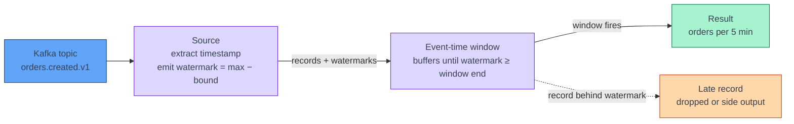
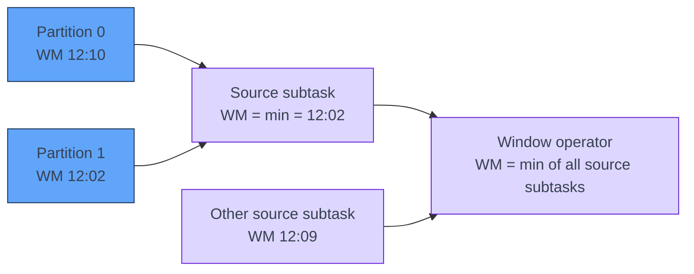

[← Apache Flink](../index.md)

# Time and Watermarks

**A watermark is Flink's only way of knowing that event time has moved on.**
Records carry their own timestamps, but they arrive out of order, so no single
record can tell an operator "the 12:00–12:05 window is now complete". The
watermark does: it is a promise that no more events older than a given time are
expected. Every event-time window, interval join and `MATCH_RECOGNIZE` waits for
it. Most event-time bugs, such as windows that never fire or rows that silently
disappear, come down to a watermark that is too slow, stuck, or too eager.

!!! abstract "What you should know after reading this page"
    1. The difference between **event time**, **ingestion time** and
       **processing time**, and why only event time gives repeatable results.
    2. What a **watermark** asserts, and how it decides when a window fires.
    3. How **bounded out-of-orderness** trades latency against completeness,
       and how to choose the bound.
    4. How to declare watermarks in **Flink SQL** and in the **PyFlink
       DataStream API** with a custom `TimestampAssigner`.
    5. Why an operator's watermark is the **minimum of its inputs**, and why
       the Kafka source tracks watermarks **per partition**.
    6. How an **idle partition stalls** the whole job, and the two settings
       that fix it.
    7. What happens to **late data** in SQL and in DataStream windows, and the
       **zero-tolerance** watermark pitfall.
    8. How `TIMESTAMP` and `TIMESTAMP_LTZ` differ, and what
       `table.local-time-zone` changes.

---

## Three notions of time

Every record has several timestamps. Flink lets you choose which one drives
time-based operators.

| Notion | Meaning | Use it when | Deterministic? |
|---|---|---|---|
| **Event time** | When the event happened, taken from a field in the record (for example `created_at`). | Results must reflect when things happened: business windows, joins across topics, replays and backfills. | **Yes.** Replaying the same input gives the same output, whatever the speed or lag. |
| **Ingestion time** | When the record entered the pipeline, for example the Kafka broker's append time or a timestamp stamped at the source. | The payload has no usable timestamp, but you want something more stable than the wall clock. | **Partly.** Stable once written, but it reflects pipeline delays, not the real event. |
| **Processing time** | The wall clock of the machine running the operator. | Monitoring, rough rate limits, anything where "now" is what you mean. | **No.** A restart, a backlog or a slow TaskManager changes which window a record lands in. |

!!! info "Ingestion time is not a separate mode any more"
    Older Flink versions had an explicit ingestion-time setting. In Flink 1.20
    you get the same effect by treating a source-side timestamp as the event
    time. For Kafka, that is the record timestamp, which the broker sets when
    the topic uses `LogAppendTime`. Flink still handles it as event time with
    watermarks.

!!! note "There is no \"completion time\""
    People sometimes talk about a window's "completion time" as if it were a
    fourth notion of time. It is not. A window **completes**, or *fires*, when
    the **watermark passes the window's end**. That moment depends on event time
    and on how the watermark is generated. It has nothing to do with the wall
    clock.

---

## What a watermark is

A **watermark** with timestamp `T` is an assertion that flows through the job
with the records: *no more events with a timestamp ≤ T are expected*. When an
event-time operator receives it, the operator can finalise everything up to `T`.
It closes windows, emits join results and clears state.

The source generates watermarks from the timestamps it has seen, and they then
travel downstream as special elements in the stream. Flink emits them
periodically, by default every 200 ms (`pipeline.auto-watermark-interval`). It
does not emit one per record.

The timeline below uses a 5-second bound. Events arrive in the order shown; the
number is the event time.

```text
arrival order →   e(12:00:03)  e(12:00:07)  e(12:00:05)  e(12:00:12)  e(12:00:04)
max seen          12:00:03     12:00:07     12:00:07     12:00:12     12:00:12
watermark (−5s)   11:59:58     12:00:02     12:00:02     12:00:07     12:00:07
                                            ↑ out of order,           ↑ 12:00:04 ≤ 12:00:07
                                              but ahead of watermark:   behind watermark:
                                              on time                   LATE
```

`e(12:00:05)` is out of order but still ahead of the watermark, so it counts.
`e(12:00:04)` arrives after the watermark has already passed `12:00:07`, so it
is **late**. A `[12:00:00, 12:00:05)` tumbling window has already fired without
it.



---

## Bounded out-of-orderness

The common strategy is **bounded out-of-orderness**: the watermark trails the
largest timestamp seen so far by a fixed bound. It assumes no event arrives
more than *bound* behind the newest one.

| Bound | Window results appear | Late records | Typical fit |
|---|---|---|---|
| Too small (0–1 s) | Quickly | Many, because ordinary producer jitter is enough | Strictly ordered input only |
| Matched to observed disorder | After roughly *window end + bound* | Rare | Most production jobs |
| Too large (minutes or hours) | Very late; state grows | Almost none | Batch-like correctness, high latency tolerated |

**Choosing the bound.** Measure how far behind the newest event a typical
record arrives. Kafka producer retries, mobile clients that buffer offline and
upstream batching all add to it. Pick a bound that covers the bulk of that
distribution, then decide what happens to the rest (see
[Late data](#late-data)). The bound is a latency cost on **every** window, so do
not pad it "just in case".

!!! tip "Monotonous timestamps"
    If a partition is guaranteed to be in timestamp order, use
    `WatermarkStrategy.for_monotonous_timestamps()` in DataStream. In SQL,
    write `WATERMARK FOR ts AS ts`. Only do this when the order is guaranteed;
    see [The zero-tolerance pitfall](#the-zero-tolerance-pitfall).

---

## Declaring watermarks

### Flink SQL and Table API

In SQL the watermark is part of the table definition. The column it names
becomes the table's **rowtime attribute**.

```sql
CREATE TABLE orders (
  order_id    STRING,
  amount      DECIMAL(10, 2),
  created_at  TIMESTAMP(3),
  WATERMARK FOR created_at AS created_at - INTERVAL '5' SECOND
) WITH (
  'connector' = 'kafka',
  'topic' = 'orders.created.v1',
  'properties.bootstrap.servers' = 'broker:9092',
  'scan.startup.mode' = 'earliest-offset',
  'format' = 'avro-confluent',
  'avro-confluent.url' = 'https://schema-registry:8081'
);
```

If the payload carries epoch milliseconds instead, derive a computed column and
put the watermark on that:

```sql
  created_ms  BIGINT,
  created_at  AS TO_TIMESTAMP_LTZ(created_ms, 3),
  WATERMARK FOR created_at AS created_at - INTERVAL '5' SECOND
```

`CURRENT_WATERMARK(created_at)` returns the current watermark for that column.
It is useful for checking a stuck pipeline from inside a query. See
[Table and DataStream API](table-and-datastream-api.md) for how a table
definition like this becomes a running job.

### PyFlink DataStream API

In DataStream you pass a `WatermarkStrategy` to `from_source`. A custom
`TimestampAssigner` tells Flink where the event time lives in each record.

```python
import json
from pyflink.common import Duration, WatermarkStrategy
from pyflink.common.watermark_strategy import TimestampAssigner

class CreatedAtAssigner(TimestampAssigner):
    def extract_timestamp(self, value, record_timestamp) -> int:
        # value is the raw JSON string; return epoch milliseconds
        return int(json.loads(value)["created_ms"])

strategy = (
    WatermarkStrategy
    .for_bounded_out_of_orderness(Duration.of_seconds(5))
    .with_timestamp_assigner(CreatedAtAssigner())
    .with_idleness(Duration.of_minutes(1))
)

orders = env.from_source(kafka_source, strategy, "orders-source")
```

Building `kafka_source` is covered in [Kafka source](kafka-source.md).

| Situation | Timestamp to return |
|---|---|
| The record has an epoch-millis field | That field, as `int` |
| The record has an ISO-8601 string | Parse it and convert it to epoch millis **in UTC** |
| The record has no usable field | `record_timestamp`, the Kafka record timestamp (the "ingestion time" option above) |

!!! warning "The assigner runs for every record and must not fail"
    An exception in `extract_timestamp` fails the task, and the job restarts
    into the same bad record. Parse defensively. A record with a missing
    timestamp should either be routed away before this point or get a fallback
    such as `record_timestamp`.

!!! note "Custom extractors and out-of-order events"
    The assigner only *reads* a timestamp. It does not reorder anything. The
    bound in `for_bounded_out_of_orderness` is what tolerates disorder.
    Extracting the right field is still the most important fix for apparent
    disorder: a timestamp taken from a producer-side "sent at" field rather than
    the business "created at" field can make orderly data look badly out of
    order.

---

## How watermarks propagate

### An operator's watermark is the minimum of its inputs

An operator with several input channels, such as the subtask after a `keyBy`,
a union or a join, tracks the latest watermark from **each** input. It then
forwards the **minimum** of them. It cannot claim "no events older than `T`"
while any input might still send one.



### Per-partition watermarks in the Kafka source

The Kafka source generates watermarks **per partition** inside each source
subtask, then emits the minimum across the partitions that subtask reads. This
matters because each partition is usually ordered on its own, while the
interleaving of partitions is arbitrary. Per-partition tracking means the bound
only has to cover disorder *within* a partition, not the gap between a fast
partition and a slow one.

The consequence is that **the slowest partition sets the pace** for the whole
job. A partition that is far behind holds every downstream window open.

---

## Idle sources and partitions

A partition that receives **no records** produces no new watermark. Because
operators take the minimum, one silent partition freezes the watermark for the
entire job. Windows stop firing and state keeps growing, even though the other
partitions are full of data.

Common causes:

- A topic with more partitions than active keys, so some partitions stay empty.
- Low-traffic periods, such as nights or weekends.
- A source parallelism higher than the partition count. The extra subtasks have
  no partitions (see [Architecture](../architecture.md)).

The fix is to mark an input **idle** after a timeout. An idle input is left out
of the minimum until it receives data again.

| API | Setting | Default |
|---|---|---|
| SQL / Table API, job-wide | `table.exec.source.idle-timeout`, for example `'30 s'` | `0 ms`, which disables idleness detection |
| SQL / Table API, per table | The `scan.watermark.idle-timeout` table option (Flink 1.18 and later) | Unset |
| DataStream | `WatermarkStrategy...with_idleness(Duration.of_minutes(1))` | Not applied unless you call it |

```python
t_env.get_config().set("table.exec.source.idle-timeout", "30 s")
```

!!! warning "Idleness lets the watermark run ahead"
    When an idle partition wakes up, its first records may already be behind
    the watermark that the other partitions pushed forward, so they are late.
    Set the timeout well above the normal gap between records on a healthy
    partition. Treat it as a cure for genuinely empty partitions, not as a way to
    hide a slow producer.

---

## Late data

A record is **late** when its timestamp is at or before the current watermark
by the time it reaches an event-time operator.

### In SQL

Event-time operators **drop late rows**. This applies to window TVFs (`TUMBLE`,
`HOP`, `CUMULATE`, `SESSION`), interval joins, event-time temporal joins and
`MATCH_RECOGNIZE`. The drop is silent: there is no error and no side table. It
shows up only in operator metrics such as `numLateRecordsDropped`, where an
operator reports it.

Operators that do not use time attributes, such as a regular `JOIN`, a
non-windowed `GROUP BY` or a plain filter, **ignore watermarks**. They never
drop rows for lateness.

### In DataStream windows

DataStream windows give you two tools, and PyFlink 1.20 exposes both on
`WindowedStream`:

- **Allowed lateness**: the window keeps its state for an extra period after
  it fires, and each late record re-fires it with an updated result.
  Downstream must accept updates.
- **Side output for late data**: records later than the allowed lateness go to
  a separate stream instead of being dropped.

```python
from pyflink.common import Time, Types
from pyflink.datastream import OutputTag
from pyflink.datastream.window import TumblingEventTimeWindows

late_tag = OutputTag("late-orders", Types.STRING())

totals = (
    orders.key_by(lambda o: json.loads(o)["customer_id"])
    .window(TumblingEventTimeWindows.of(Time.minutes(5)))
    .allowed_lateness(60_000)            # milliseconds in PyFlink
    .side_output_late_data(late_tag)
    .reduce(merge_orders)
)
late_orders = totals.get_side_output(late_tag)
```

Window types and joins are covered in detail in
[Windows and joins](windows-and-joins.md).

---

## The zero-tolerance pitfall

A watermark **equal to the event time** has no tolerance for disorder. This
covers `WATERMARK FOR ts AS ts`, `ts - INTERVAL '0' SECOND`, or monotonous
timestamps on input that is not actually ordered.

```sql
WATERMARK FOR created_at AS created_at - INTERVAL '0' SECOND   -- risky
```

With this definition, every event that arrives even 1 ms behind the newest one
is late. In a pipeline that joins `orders` to `payments` with an interval join,
or counts clicks per minute, the effect is:

1. The job runs, and the results look plausible.
2. Any record overtaken by a newer one, through producer retries, multiple
   producers or a partition rebalance, is dropped by the window or join.
3. Totals are a few percent low, and some joins are missing their match. No
   error is raised anywhere.

!!! danger "Silent under-counting"
    A zero bound does not fail loudly. It produces results that are slightly
    wrong. If an event-time aggregate does not reconcile with a batch recount of
    the same data, check the watermark expression before anything else.
    Unless ordering is guaranteed end to end, use a bound measured from real
    data, typically a few seconds.

---

## Time zones

Flink SQL has two timestamp types, and they behave differently.

| Type | Holds | Shown as | Typical source |
|---|---|---|---|
| `TIMESTAMP(p)` | A wall-clock date and time with **no zone** | Exactly as stored, independent of session zone | Strings such as `2024-03-01 09:30:00`; Avro `local-timestamp-*` |
| `TIMESTAMP_LTZ(p)` | An **instant**, stored internally as UTC | Converted to the **session time zone** | Epoch millis; Avro `timestamp-millis`; `PROCTIME()` |

The **session time zone** is `table.local-time-zone`. Its default value,
`default`, means the JVM's system zone. Set it explicitly so results do not
depend on where a TaskManager runs:

```python
t_env.get_config().set("table.local-time-zone", "UTC")
```

It affects converting `TIMESTAMP_LTZ` to `TIMESTAMP` or `STRING`, functions such
as `CURRENT_TIMESTAMP`, and the boundaries of windows defined on a
`TIMESTAMP_LTZ` rowtime. A daily window on `TIMESTAMP_LTZ` starts at midnight
**in the session zone**.

!!! info "Rowtime column types"
    A rowtime attribute, which is the column in `WATERMARK FOR`, must be
    `TIMESTAMP` or `TIMESTAMP_LTZ` with precision up to 3. `TIMESTAMP(3)` and
    `TIMESTAMP_LTZ(3)` are the usual choices. A `BIGINT` epoch column cannot be
    a rowtime directly; convert it with `TO_TIMESTAMP_LTZ(col, 3)` in a computed
    column, as shown above.

How Avro's `timestamp-millis` and `local-timestamp-millis` logical types map
onto these two types is covered in
[Avro and Schema Registry](../../kafka/avro-and-schema-registry.md#type-mapping).

---

## Self-check

Answer these from memory before expanding them. They map to the outcomes listed
at the top of the page.

??? question "1. A job counting payments per minute is replayed from the earliest offset and produces different totals from the live run. What notion of time is it probably using?"
    **Processing time.** Under processing time, a record's window depends on when
    the operator saw it. During a replay, hours of data are processed in
    minutes, so records crowd into a few windows. With **event time**, each
    record's window comes from its own timestamp, and a replay gives the same
    result.

??? question "2. A 5-minute tumbling window on `orders` with a 10-second bound has received all its records, but no result has appeared. What is it waiting for?"
    The **watermark** to pass the window's end, which means an event with a
    timestamp of about *window end + 10 s* must arrive on **every** input. A
    window fires on watermark progress, not on the wall clock or on "no more
    records". If traffic stops, the watermark stops too.

??? question "3. A team raises the out-of-orderness bound from 5 s to 10 min to stop losing late clicks. What do they pay for it?"
    **Latency and state.** Every window now fires about 10 minutes after its
    end, and Flink must keep 10 minutes' more open window state. A better
    approach is a bound that covers ordinary disorder, plus allowed lateness or
    a side output for the rare stragglers.

??? question "4. A topic has 12 partitions and only 9 of them receive data overnight. Windows stop firing at night but recover in the morning. Why, and how do you fix it?"
    The three empty partitions emit no new watermark, and every operator takes
    the **minimum** of its inputs, so the job's watermark freezes. Mark idle
    inputs with `table.exec.source.idle-timeout` in SQL or
    `WatermarkStrategy.with_idleness(...)` in DataStream. Choose a timeout well
    above the normal gap between records.

??? question "5. An interval join between `orders` and `payments` uses `WATERMARK FOR ts AS ts`. Join output is about 3% short of a batch recount, and there are no errors. What is happening?"
    The **zero-tolerance pitfall**. With no bound, any record that arrives even
    slightly behind the newest one is behind the watermark, and the interval
    join silently drops it as late. Replace it with a measured bound, for
    example `ts - INTERVAL '5' SECOND`, and check `numLateRecordsDropped`.

??? question "6. A DataStream job must not lose late orders, but the sink cannot handle updated results. Which late-data tool fits?"
    A **side output** via `side_output_late_data(tag)`, with `allowed_lateness`
    left at zero. Late records go to a separate stream, for example a
    correction topic, and the main window result is emitted only once.
    Allowed lateness would instead re-fire windows with updated results, which
    this sink cannot handle.

??? question "7. A daily revenue window on a `TIMESTAMP_LTZ(3)` rowtime closes at 07:00 local time instead of midnight. What setting is involved?"
    `table.local-time-zone`. Windows on a `TIMESTAMP_LTZ` rowtime are aligned
    in the **session time zone**. That is the JVM's zone when the setting is
    left at `default`, which here is evidently UTC on a machine whose users are
    at UTC+7. Set the zone explicitly to the zone the business day is defined in.

---

## References

### Apache Flink

- [Timely Stream Processing](https://nightlies.apache.org/flink/flink-docs-release-1.20/docs/concepts/time/) — event time, processing time and watermarks as concepts.
- [Generating Watermarks](https://nightlies.apache.org/flink/flink-docs-release-1.20/docs/dev/datastream/event-time/generating_watermarks/) — `WatermarkStrategy`, timestamp assigners, idleness and per-partition watermarking.
- [Time Attributes](https://nightlies.apache.org/flink/flink-docs-release-1.20/docs/dev/table/concepts/time_attributes/) — rowtime and proctime columns in SQL and the Table API.
- [Timezone](https://nightlies.apache.org/flink/flink-docs-release-1.20/docs/dev/table/timezone/) — `TIMESTAMP` versus `TIMESTAMP_LTZ` and `table.local-time-zone`.
- [Table configuration](https://nightlies.apache.org/flink/flink-docs-release-1.20/docs/dev/table/config/) — `table.exec.source.idle-timeout` and `table.local-time-zone`.
- [Windows (DataStream)](https://nightlies.apache.org/flink/flink-docs-release-1.20/docs/dev/datastream/operators/windows/) — allowed lateness and side output for late data.

### Related

- [Apache Flink overview](../index.md)
- [Architecture](../architecture.md) — partitions, source parallelism and idle subtasks.
- [Kafka source](kafka-source.md) — building the source that the watermark strategy attaches to.
- [Table and DataStream API](table-and-datastream-api.md)
- [Windows and joins](windows-and-joins.md) — the operators that consume watermarks.
- [State and checkpoints](state-and-checkpoints.md) — why a stuck watermark means growing state.
- [Avro and Schema Registry](../../kafka/avro-and-schema-registry.md) — Avro timestamp logical types.
