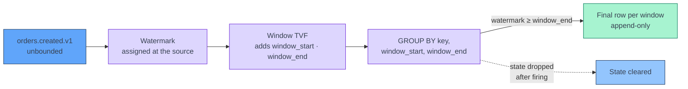
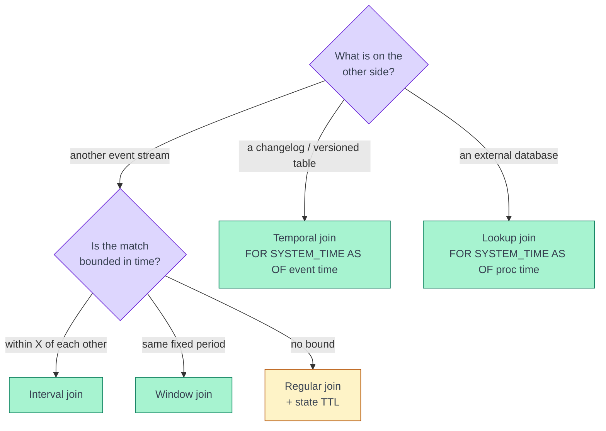

[← Apache Flink](../index.md)

# Windows and Joins

**Every aggregation or join on an unbounded stream needs a bound, and the kind
of bound you pick decides how much state the job keeps and what kind of result
it emits.** A window cuts the stream into finite groups that can be closed and
forgotten. A time-bounded join only remembers rows that can still match. A
join or aggregation with no bound keeps state forever and emits results that
are corrected later. This page covers the window TVFs and OVER aggregations in
Flink SQL, the five join types, and how to build a window by hand in the
DataStream API when SQL does not express what you need.

!!! abstract "What you should know after reading this page"
    1. Why an unbounded stream needs **windows** before it can be aggregated,
       and that a window **fires when the watermark passes its end**.
    2. The shape and typical use of the four **window TVFs** — `TUMBLE`, `HOP`,
       `CUMULATE` and `SESSION` — and the columns they add.
    3. How a **window aggregation** differs from an **OVER aggregation**: one
       row per window versus one row per input event.
    4. The five join types — **regular, interval, window, temporal, lookup** —
       and how they compare on state size, result type and time requirements.
    5. Why a **regular join** on two streams grows state without bound, and what
       `table.exec.state.ttl` trades for limiting it.
    6. How to write an **interval join**, and why late events silently miss it
       when the watermark is too tight.
    7. How to hand-build a **rolling window** with a `KeyedProcessFunction`,
       `MapState` and **event-time timers**, and what it costs compared with SQL.

---

## Why windows exist

A `GROUP BY customer_id` over a bounded table produces one row per customer
and finishes. Over an unbounded stream it never finishes: every new event can
change a total, so Flink must keep every group in state and emit an
**updating** result — retract the old total, emit the new one.

A **window** adds time to the grouping key. "Payments per customer *per
5 minutes*" has groups that end. Once Flink knows a window can no longer
receive events, it emits the final result, appends it downstream and drops
that window's state.

Flink knows a window is complete through the **watermark**. A window
`[12:00, 12:05)` fires when the watermark passes `12:05`. Events that arrive
after that are late, and window aggregations in SQL drop them. The rules for
how watermarks advance are on [Time and Watermarks](time-and-watermarks.md).



---

## Window TVFs

In Flink SQL, windows are **table-valued functions** (TVFs). A window TVF takes
a table and a time attribute, and returns the same rows with three extra
columns: `window_start`, `window_end`, and `window_time` (`window_end - 1 ms`,
itself a time attribute, so the result can feed another windowed operation).

| TVF | Shape | Typical use | Example |
|---|---|---|---|
| `TUMBLE` | Fixed size, no overlap; each event in exactly one window. | Periodic totals. | Orders per merchant per 5 minutes. |
| `HOP` | Fixed size, sliding by a smaller step; each event in `size / slide` windows. | Smoothed "last N minutes", refreshed often. | Payments in the last 1 hour, every 5 minutes. |
| `CUMULATE` | Grows by a step from a fixed start until it reaches its max size. | Running total within a period. | Revenue so far today, updated every 10 minutes. |
| `SESSION` | Closes after a gap with no events; size varies per key. | Activity bursts. | Clicks per user session, 30-minute inactivity gap. |

```sql
TUMBLE(TABLE orders, DESCRIPTOR(order_ts), INTERVAL '5' MINUTES)
HOP(TABLE payments, DESCRIPTOR(paid_ts), INTERVAL '5' MINUTES, INTERVAL '1' HOUR)
CUMULATE(TABLE orders, DESCRIPTOR(order_ts), INTERVAL '10' MINUTES, INTERVAL '1' DAY)
SESSION(TABLE clicks PARTITION BY user_id, DESCRIPTOR(click_ts), INTERVAL '30' MINUTES)
```

Note the argument order: `HOP` takes the **slide first, then the size**, and
`CUMULATE` takes the **step first, then the max size**.

!!! note "SESSION in Flink 1.20"
    The `SESSION` window TVF is available in 1.20 for streaming jobs, with an
    optional `PARTITION BY` so each key gets its own sessions. The 1.20 docs
    list it as unsupported in batch mode, and mark session window join, Top-N
    and deduplication as beta. Before 1.19 the only way to get session windows
    in SQL was the older `GROUP BY SESSION(...)` group window syntax, which is
    deprecated.

### Window aggregation

A window aggregation is a `GROUP BY` that includes `window_start` and
`window_end` alongside the key:

```sql
SELECT merchant_id, window_start, window_end,
       COUNT(*)    AS order_count,
       SUM(amount) AS order_total
FROM TABLE(
  TUMBLE(TABLE orders, DESCRIPTOR(order_ts), INTERVAL '5' MINUTES))
GROUP BY merchant_id, window_start, window_end;
```

The result is **append-only**: one final row per merchant per window, emitted
once the watermark passes `window_end`. A sink that only accepts inserts, such
as a plain Kafka topic, can take it directly.

!!! warning "Grouping on `window_start` alone is not a window aggregation"
    The planner recognises a window aggregation only when **both**
    `window_start` and `window_end` are in the `GROUP BY`. Group on one of them
    and you get a regular, unbounded group aggregation that keeps state forever
    and emits updates.

---

## OVER aggregations

A window aggregation answers "how many payments in each 1-hour window". It
cannot answer "how many payments did this customer make in the hour *before
this payment*" — the window boundaries do not move with each event. An
**OVER aggregation** does: it emits **one row per input row**, with the
aggregate computed over a range ending at that row.

```sql
SELECT payment_id, customer_id, amount, paid_ts,
       COUNT(*)    OVER w AS payments_1h,
       MAX(amount) OVER w AS max_amount_1h
FROM payments
WINDOW w AS (
  PARTITION BY customer_id
  ORDER BY paid_ts
  RANGE BETWEEN INTERVAL '1' HOUR PRECEDING AND CURRENT ROW);
```

| | Window aggregation | OVER aggregation |
|---|---|---|
| Output rows | One per key per window. | One per input event. |
| When emitted | When the watermark passes `window_end`. | When the watermark passes the event's own timestamp. |
| Range | Fixed boundaries, shared by all events. | Relative to each event (`RANGE` by time, or `ROWS` by count). |
| Typical use | Dashboards, periodic reports. | Per-event features, such as rolling counts for scoring. |

Constraints in streaming mode: `ORDER BY` must be a single **ascending time
attribute**, the upper bound must be `CURRENT ROW`, and every OVER aggregate in
one `SELECT` must use the **same window definition**. A query that needs a
15-minute and a 1-hour count therefore needs two OVER queries joined back, or a
hand-built function (see [below](#hand-built-windows-in-the-datastream-api)).

---

## Joins

A join on two streams has the same problem as an aggregation: a row arriving
now may match a row that arrives any time later. Each join type bounds that
differently.

| Join | State kept | Result | Time requirement | Typical use |
|---|---|---|---|---|
| **Regular** `a JOIN b ON a.k = b.k` | Both sides, **forever** (unless TTL). | **Updating** for outer joins; inner joins of append-only inputs append, but results may arrive in any order. | None. | Small or slowly changing tables; batch. |
| **Interval** `... AND b.ts BETWEEN a.ts AND a.ts + INTERVAL ...` | Rows inside the time bound only. | **Append-only.** | Time attributes on both sides. | Correlating two event streams — order and its payment. |
| **Window** `ON a.k = b.k AND a.window_start = b.window_start AND a.window_end = b.window_end` | One window per key, dropped when it fires. | **Append-only**, emitted at window end. | Same window TVF on both sides. | Comparing two streams per period. |
| **Temporal** `JOIN rates FOR SYSTEM_TIME AS OF o.order_ts` | Versions of the versioned table still needed by the watermark. | Append-only. | Event-time attribute on the probe side; versioned table with **primary key** and watermark. | Price or FX rate *as it was* when the event happened. |
| **Lookup** `JOIN customers FOR SYSTEM_TIME AS OF o.proc_time` | None in Flink (optional connector cache). | Append-only. | **Processing-time** attribute on the probe side; lookup-capable connector (JDBC, HBase, …). | Enrich from a database row as it is *now*. |



### Regular joins

A regular join keeps **every row from both sides in state**, because Flink
cannot know that a future row will not match. On two Kafka streams this state
grows for the life of the job, and checkpoints grow with it.

!!! danger "Unbounded state"
    `table.exec.state.ttl` sets an idle-state retention for stateful SQL
    operators, regular joins included. It is **off by default**. Setting it
    stops the growth, but a row whose partner arrives after the TTL expired
    simply does not join — the result becomes silently incomplete. Treat TTL as
    a guard rail, not a join design. If the match has a natural time bound, use
    an interval join instead. State backends and TTL are covered on
    [State and Checkpoints](state-and-checkpoints.md).

### Interval joins

An **interval join** adds a time bound to an equi-join, so Flink can drop rows
once the watermark shows no partner can still arrive. Orders joined with the
payment made within 15 minutes:

```sql
SELECT o.order_id, o.customer_id, o.amount,
       p.payment_id, p.paid_ts
FROM orders o
JOIN payments p
  ON  p.order_id = o.order_id
  AND p.paid_ts BETWEEN o.order_ts AND o.order_ts + INTERVAL '15' MINUTES;
```

Both `order_ts` and `paid_ts` must be **time attributes** — declared with a
`WATERMARK` in the table DDL, see [Kafka Source](kafka-source.md). If either is
a plain `TIMESTAMP` column the planner falls back to a regular join, with
unbounded state. The result is append-only. `LEFT JOIN` is also supported:
an order without a payment is emitted with `NULL` payment columns once the
watermark passes `order_ts + 15 minutes`.

!!! warning "Late events silently miss the join"
    The interval join drops a row from state once the **watermark** passes the
    end of its bound. If the payments topic lags the orders topic, or the
    watermark's out-of-orderness bound is smaller than real event delay, a
    payment can arrive after its order has already been evicted. It is not an
    error and nothing is logged: the payment just finds no match, and a
    `LEFT JOIN` has already emitted the order with `NULL`s. Size the watermark
    delay from observed lateness on **both** inputs, and remember that the
    join's watermark is the **minimum** of the two sides. See
    [Time and Watermarks](time-and-watermarks.md).

### Window, temporal and lookup joins

A **window join** is an interval join with fixed boundaries: both sides go
through the same window TVF, and rows match only within the same window. A
payment at `12:04:59` and an order at `12:05:01` do not match in a 5-minute
tumbling window join, even though they are two seconds apart — which is
usually the argument for an interval join instead.

A **temporal join** looks up the version of a table that was valid at the
event's time — the exchange rate when the order was placed, not the current
one. The right side must be a **versioned table**: a changelog with a primary
key and an event-time attribute, for example an `upsert-kafka` table.

A **lookup join** queries an external system per row (with an optional cache)
at **processing time**. It keeps no join state, but the result is not
reproducible: replaying the same events tomorrow reads tomorrow's data.

```sql
SELECT o.order_id, o.amount, c.segment
FROM orders o
JOIN customers FOR SYSTEM_TIME AS OF o.proc_time AS c
  ON c.customer_id = o.customer_id;
```

---

## Hand-built windows in the DataStream API

SQL windows cover fixed shapes. Some features do not fit: a 15-minute **and**
a 1-hour count per customer in one pass, an eviction rule that depends on the
event, or output only when a threshold is crossed. Then you build the window
yourself in a `KeyedProcessFunction`: keep recent events in **keyed state**,
and evict them with **event-time timers**.

```python
from pyflink.common import Row, Types
from pyflink.datastream import KeyedProcessFunction, RuntimeContext
from pyflink.datastream.state import MapStateDescriptor

MIN, HOUR = 60_000, 3_600_000

class RollingPayments(KeyedProcessFunction):
    def open(self, ctx: RuntimeContext):
        self.events = ctx.get_map_state(MapStateDescriptor(
            "amounts_by_ts", Types.LONG(), Types.LIST(Types.DOUBLE())))

    def process_element(self, p, ctx):
        ts = ctx.timestamp()                       # event time, from the watermark strategy
        self.events.put(ts, (self.events.get(ts) or []) + [p.amount])
        ctx.timer_service().register_event_time_timer(ts + HOUR)
        last_1h = [(t, a) for t, amts in self.events.items()
                   if t > ts - HOUR for a in amts]   # timers may lag behind
        last_15 = [a for t, a in last_1h if t > ts - 15 * MIN]
        yield Row(p.customer_id, ts, len(last_15), max(last_15),
                  len(last_1h), max(a for _, a in last_1h))

    def on_timer(self, timestamp, ctx):
        self.events.remove(timestamp - HOUR)       # evict the entry that just aged out
```

Applied as `payments.key_by(lambda p: p.customer_id).process(RollingPayments(), output_type=...)`.
Each event gets a row with its customer's count and max over the last 15
minutes and the last hour. Events are grouped by millisecond so two payments
with the same timestamp do not overwrite each other, and one timer per
timestamp evicts them — Flink deduplicates timers registered for the same key
and time.

!!! tip "Timers versus state TTL"
    State TTL in Flink is based on **processing time**, so it cannot express
    "older than one hour of event time". Use **event-time timers** for the
    eviction that defines the window. A TTL on the descriptor
    (`StateTtlConfig`) is still useful as a safety net for keys that go quiet,
    as long as it is comfortably longer than the window.

| | SQL window / OVER | Hand-built `KeyedProcessFunction` |
|---|---|---|
| Flexibility | Fixed shapes; one OVER range per query. | Any rule, several ranges at once, custom output. |
| Per-event cost | Incremental accumulators in the JVM. | Iterates the key's state on every event; cost grows with events per key. |
| Language cost | Runs in Java, even when submitted from PyFlink. | Python UDF: every record crosses the JVM–Python boundary. See [PyFlink Execution Model](pyflink-execution-model.md). |
| State | Managed by the planner, cleared on fire. | Yours to evict; a missing timer is a leak. See [State and Checkpoints](state-and-checkpoints.md). |
| Late events | Dropped by the window operator. | Yours to decide; compare `ctx.timestamp()` with `ctx.timer_service().current_watermark()`. |

!!! info "Choose SQL first"
    If the metric fits a window TVF or an OVER aggregation, use it. It is
    faster, its state is bounded by construction, and the planner handles
    late data consistently. Hand-build only the part SQL cannot express, and
    keep the number of entries per key small — a customer with thousands of
    payments an hour makes every event iterate thousands of map entries.

---

## Self-check

Answer these from memory before expanding them. They map to the outcomes listed
at the top of the page.

??? question "1. A 5-minute tumbling window aggregation emits nothing, though events are arriving. Why?"
    A window fires only when the **watermark** passes `window_end`. If the
    watermark is not advancing — a source partition is idle, or event
    timestamps are far behind — no window ever closes. Check the watermark of
    the window operator in the Flink UI before looking at the query.

??? question "2. You need \"payments in the last hour, refreshed every 5 minutes\". Which TVF, and what are its arguments?"
    `HOP(TABLE payments, DESCRIPTOR(paid_ts), INTERVAL '5' MINUTES, INTERVAL '1' HOUR)` —
    **slide first, then size**. Each payment belongs to 12 windows. If you
    instead need the count as of each individual payment, use an **OVER**
    aggregation with `RANGE BETWEEN INTERVAL '1' HOUR PRECEDING AND CURRENT ROW`.

??? question "3. A query groups by `merchant_id, window_start` over a TUMBLE TVF. The sink rejects it as an updating result. What is wrong?"
    Without `window_end` in the `GROUP BY`, the planner does not recognise a
    window aggregation. It runs a **regular group aggregation**, which keeps
    state forever and emits retractions. Group by both `window_start` and
    `window_end`.

??? question "4. A join between two Kafka streams has run for a month and its checkpoints keep growing. What is the likely cause, and the two fixes?"
    A **regular join**, which keeps both sides in state forever. If the match is
    naturally time-bounded, rewrite it as an **interval join** on time
    attributes. Otherwise set `table.exec.state.ttl`, accepting that rows whose
    partner arrives after the TTL will not join.

??? question "5. An interval join of orders and payments within 15 minutes misses about 1% of payments that do exist. Nothing errors. What is happening?"
    Those payments arrive after the **watermark** has passed their order's
    bound, so the order has already been evicted from state. The watermark
    delay is smaller than the real delay on one of the inputs, often the
    slower topic. Measure lateness on both inputs and widen the watermark
    bound.

??? question "6. Enrichment must use the customer segment as it was at order time, and backfills must give the same answer. Lookup or temporal join?"
    **Temporal join** on event time against a versioned table. A lookup join
    reads the external table at **processing time**, so a replay reads current
    data and gives different results.

??? question "7. A PyFlink `KeyedProcessFunction` computing rolling counts slows down as traffic grows, and its state never shrinks. Name two causes."
    It **iterates all of a key's entries on every event**, so cost grows with
    events per key; and every record crosses the **JVM–Python** boundary. State
    that never shrinks means eviction is missing — no **event-time timer** is
    registered per entry, or `on_timer` removes the wrong key. A processing-time
    TTL does not replace event-time eviction.

---

## References

### Apache Flink

- [Windowing TVF](https://nightlies.apache.org/flink/flink-docs-release-1.20/docs/dev/table/sql/queries/window-tvf/) — `TUMBLE`, `HOP`, `CUMULATE`, `SESSION` and their columns.
- [Window Aggregation](https://nightlies.apache.org/flink/flink-docs-release-1.20/docs/dev/table/sql/queries/window-agg/) — grouping on window TVFs, `GROUPING SETS`, cascading windows.
- [Over Aggregation](https://nightlies.apache.org/flink/flink-docs-release-1.20/docs/dev/table/sql/queries/over-agg/) — `RANGE` and `ROWS` intervals and their streaming limits.
- [Joins](https://nightlies.apache.org/flink/flink-docs-release-1.20/docs/dev/table/sql/queries/joins/) — regular, interval, temporal and lookup joins.
- [Window Join](https://nightlies.apache.org/flink/flink-docs-release-1.20/docs/dev/table/sql/queries/window-join/) — join types and window-equality requirements.
- [Configuration: `table.exec.state.ttl`](https://nightlies.apache.org/flink/flink-docs-release-1.20/docs/dev/table/config/) — idle-state retention for SQL operators.
- [Process Function](https://nightlies.apache.org/flink/flink-docs-release-1.20/docs/dev/datastream/operators/process_function/) — `KeyedProcessFunction` and timers.
- [Working with State](https://nightlies.apache.org/flink/flink-docs-release-1.20/docs/dev/datastream/fault-tolerance/state/) — `MapState`, `ListState` and state TTL.

### Related

- [Time and Watermarks](time-and-watermarks.md) — when windows fire and which events count as late.
- [Kafka Source](kafka-source.md) — declaring time attributes and watermarks on a Kafka table.
- [State and Checkpoints](state-and-checkpoints.md) — state backends, TTL and checkpoint size.
- [PyFlink Execution Model](pyflink-execution-model.md) — what a Python `KeyedProcessFunction` costs per record.
- [Sinks and Delivery Guarantees](sinks-and-delivery-guarantees.md) — which sinks accept append-only and updating results.
- [Architecture](../architecture.md) — how `keyBy` assigns each key's state to one subtask.
