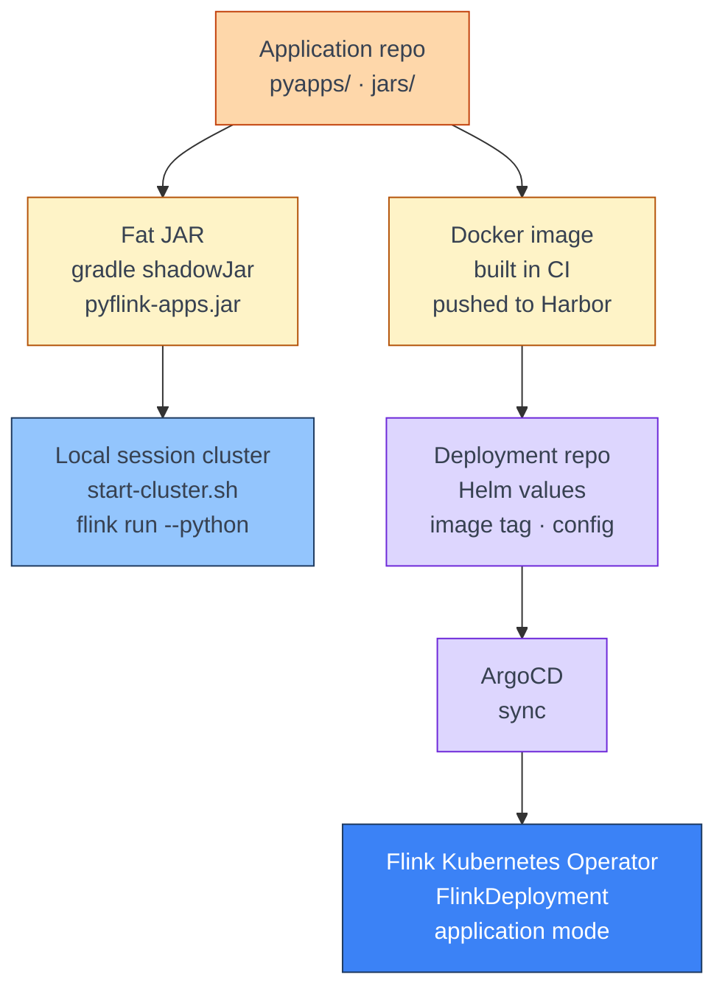

[← Streaming](../index.md)

# Development and Deployment

**A PyFlink job is a Python program plus a fat JAR of Java connectors, and it
runs the same way on a laptop as on Kubernetes — only the cluster around it
changes.** Locally you start a standalone session cluster and submit the job
to it with `flink run`. In production the Flink Kubernetes Operator starts a
dedicated cluster per job, in application mode, from the image built in CI.
This page walks that path end to end, using a Kafka-to-Cassandra streaming job
as the running example.

!!! abstract "What you should know after reading this page"
    1. Why a PyFlink job needs a **fat JAR**, how Gradle `shadowJar` builds it,
       and why `mergeServiceFiles()` matters.
    2. How to start a **local session cluster** and submit a PyFlink job to it
       with `flink run --python`.
    3. That `start-cluster.sh` starts the cluster, and **`flink run` only
       submits** to it.
    4. The difference between **attached and detached** submission, and between
       **session and application** clusters — two separate choices.
    5. Where **checkpoints are stored**, locally and in production, and why the
       RocksDB local directory is not one of those places.
    6. How to **retain checkpoints** after cancelling a job, and resume from one
       for debugging.
    7. How a job reaches production: **image → Helm values → ArgoCD → Operator**,
       and why every upgrade goes through a **savepoint**.

---

## From laptop to production



| Stage | Where | Repository |
|---|---|---|
| Develop and run locally | Your laptop | Application repo |
| Build the image | CI, from the repo's `Dockerfile` | Application repo |
| Push the image | Harbor image registry | — |
| Deploy | ArgoCD, from Helm values | Deployment repo |

---

## Prerequisites

| Tool | Version |
|---|---|
| Apache Flink | 1.20, installed at `$FLINK_HOME` |
| Java | 17 (Temurin) |
| Python | 3.10, with dependencies installed by Poetry into `.venv` |
| Gradle | Via the wrapper in `jars/` |

---

## Build the fat JAR

PyFlink runs Python, but the **connectors are Java** — Kafka, Avro with the
Confluent Schema Registry, and Cassandra. The job needs them on the classpath,
so they are bundled into one **fat JAR** with the Gradle Shadow plugin:

```bash
cd jars && ./gradlew clean shadowJar && cd ..
# → jars/build/libs/pyflink-apps.jar
```

Three details in `jars/build.gradle` decide whether that JAR works:

| Setting | Why |
|---|---|
| Flink core and table APIs are **`compileOnly`** | The cluster already provides them. Bundling a second copy causes class conflicts. |
| Connectors are **`implementation`** | These are what the cluster does *not* have, so they go into the JAR. |
| **`mergeServiceFiles()`** | Each connector registers its table factory in `META-INF/services`. Without merging, only one connector's file survives, and the others fail with *"Could not find any factory for identifier …"*. |

!!! note "Building behind a proxy"
    If your network needs an HTTP proxy, set it in `jars/gradle.properties`
    (`systemProp.https.proxyHost` and `systemProp.https.proxyPort`). Remove it
    when you are off that network, or dependency resolution hangs.

---

## Run locally

### 1. Configure the environment

Connection settings — Kafka, the schema registry and the sink — are read from
environment variables. Copy the template and fill it in:

```bash
cp .env.example .env
set -a && source .env && set +a
```

!!! danger "Keep credentials out of scripts"
    Put Kafka, Schema Registry, Cassandra and S3 credentials in `.env`, which
    is git-ignored — never inline in a run script you might commit or share.
    Pointing at **local** or **non-prod** Kafka and Cassandra is only a
    matter of which values `.env` holds; the submit command is the same.

### 2. Start a session cluster

```bash
export JAVA_HOME="/Library/Java/JavaVirtualMachines/temurin-17.jdk/Contents/Home"
export FLINK_HOME="$HOME/.local/share/flink"
export PYTHONPATH="${PYTHONPATH}:$(pwd)"

# Flink on Java 17 needs these module opens
export FLINK_ENV_JAVA_OPTS="--add-opens=java.base/java.util=ALL-UNNAMED --add-opens=java.base/java.lang=ALL-UNNAMED"

"$FLINK_HOME/bin/stop-cluster.sh"     # clear any previous cluster
"$FLINK_HOME/bin/start-cluster.sh"    # JobManager + one TaskManager

# wait until the REST endpoint answers
until curl -s http://localhost:8081/overview > /dev/null; do sleep 1; done
```

The Flink UI is now at **<http://localhost:8081>**. This cluster keeps running
until you stop it, whether or not a job is running on it.

### 3. Submit the job

```bash
flink run \
  -D python.fn-execution.bundle.time=100 \
  -D state.backend.type=rocksdb \
  -D state.backend.rocksdb.localdir=/tmp/flink-rocksdb \
  -D state.backend.incremental=true \
  -D execution.checkpointing.interval=60s \
  -D execution.checkpointing.storage=filesystem \
  -D execution.checkpointing.dir=file:///tmp/flink-checkpoints \
  -D execution.checkpointing.externalized-checkpoint-retention=RETAIN_ON_CANCELLATION \
  -D table.local-time-zone=UTC \
  -D table.exec.source.idle-timeout=60s \
  --python pyapps/pipelines/streaming_job.py \
  --jarfile jars/build/libs/pyflink-apps.jar \
  --pyFiles pyapps \
  --pyExecutable .venv/bin/python \
  --group_id "streaming_job_local" \
  --topics "orders.checkout.v1,orders.offers.v1" \
  --keyspace "$KEYSPACE" \
  --table "$TABLE"
```

Everything **before** `--python` configures Flink; everything **after** the
Flink options is passed to the application's own CLI.

| Option | What it does |
|---|---|
| `-D key=value` | Sets a Flink configuration option for this job. |
| `--python` (`-py`) | The Python entry point. |
| `--jarfile` (`-j`) | The fat JAR with the connectors. |
| `--pyFiles` (`-pyfs`) | Python code shipped to the TaskManagers, so UDFs can import `pyapps`. |
| `--pyExecutable` (`-pyexec`) | The Python interpreter the TaskManagers use to run UDFs — point it at the venv that has the dependencies. |
| `--topics`, `--group_id`, `--keyspace`, `--table` | Application arguments, parsed by the job's own CLI — here, `click`. |

!!! warning "`flink run` does not start a cluster"
    `start-cluster.sh` starts the cluster; `flink run` only **submits** a job to
    the one already listening on `localhost:8081`. If no cluster is running,
    `flink run` fails with a connection error. For the same reason, passing
    `-D rest.bind-address` or `-D rest.bind-port` to `flink run` changes
    nothing — those are settings of the cluster, read from
    `$FLINK_HOME/conf/config.yaml` when it starts.

### Submit modes

Two choices are often confused, because both get called "the mode":

| Choice | Options | What it decides |
|---|---|---|
| **Client: attached or detached** | Attached is the default. **`-d` / `--detached`** detaches. | Whether `flink run` **waits** for the job, or returns immediately after printing the JobID. |
| **Cluster: session or application** | Session — `start-cluster.sh`, then `flink run`. Application — `standalone-job.sh` locally, or a `FlinkDeployment` on Kubernetes. | Whether the cluster is **shared** by any job submitted to it, or **dedicated** to one job and torn down with it. |

The local workflow on this page is a **session cluster, submitted attached**.
Production is an **application cluster**, created by the Operator.

!!! info "Stopping an attached job"
    Pressing **Ctrl+C** on an attached `flink run` stops the *client*, not the
    job — the job keeps running on the session cluster. Stop the job itself
    from the Flink UI, or with `flink cancel <job-id>` or
    `flink stop <job-id>`. Use `-d` when you do not want a terminal tied to the
    job at all.

Logs from Python UDFs appear in the **TaskManager log**, under
`$FLINK_HOME/log/`, or in the TaskManager's *Logs* tab in the Flink UI — not in
the terminal that ran `flink run`.

---

## Checkpoints

### Where they are stored

Checkpoints are written to the directory in **`execution.checkpointing.dir`**,
one folder per job and one sub-folder per checkpoint:

```text
<execution.checkpointing.dir>/<job-id>/chk-<n>/_metadata
```

| Environment | `execution.checkpointing.dir` |
|---|---|
| Local | `file:///tmp/flink-checkpoints` — as set in the submit command above |
| Production | `s3://<bucket>/flink_jobs/<job>/checkpoints/` — set per job in the production Helm values |

Savepoints go to **`execution.checkpointing.savepoint-dir`** — in production,
`s3://<bucket>/flink_jobs/<job>/savepoints/`.

!!! warning "No interval, no checkpoints"
    Checkpointing is **off** unless `execution.checkpointing.interval` is set.
    Without it, a job has nothing to recover from and nothing to retain. Set it
    locally too, as the submit command above does.

!!! note "`state.backend.rocksdb.localdir` is not checkpoint storage"
    `/tmp/flink-rocksdb` is RocksDB's **working directory** — the live state on
    the TaskManager's local disk. It is not durable and is not what you restore
    from. The checkpoint is the copy Flink writes to `execution.checkpointing.dir`.

### Retaining checkpoints for debugging

Checkpoints exist for **automatic recovery**, so Flink owns them. When you
**cancel** a job, Flink deletes its checkpoints by default — which is exactly
what you do not want when you are debugging state, or want to resume where the
job left off.

Set the retention policy to keep them:

```text
execution.checkpointing.externalized-checkpoint-retention=RETAIN_ON_CANCELLATION
```

| Value | On cancel |
|---|---|
| `RETAIN_ON_CANCELLATION` | Checkpoints are **kept**. You clean them up yourself. |
| `DELETE_ON_CANCELLATION` | Checkpoints are deleted. They survive only if the job **fails**. |

Set it in production too, in the Helm values shared by every job, so a
cancelled job never loses its last checkpoint.

To resume from a retained checkpoint, pass its `chk-<n>` directory to
`flink run` with **`-s`**:

```bash
flink run -s file:///tmp/flink-checkpoints/<job-id>/chk-42 \
  ... # the same options as before
```

Add **`-n`** (`--allowNonRestoredState`) if you removed an operator since the
checkpoint was taken and Flink refuses to map its state.

!!! tip "Checkpoint or savepoint?"
    A retained checkpoint is a debugging and recovery convenience. For a planned
    change — an upgrade, a new image, a changed job graph — take a **savepoint**
    (`flink stop <job-id>`), which you own and Flink never deletes. See
    [Checkpoints vs Savepoints](https://nightlies.apache.org/flink/flink-docs-release-1.20/docs/ops/state/checkpoints_vs_savepoints/).

---

## Deploy to Kubernetes

### The image

The repository's multi-stage `Dockerfile` builds everything CI ships:

1. **`gradle_builder`** — builds the fat JAR with `shadowJar`.
2. **`base`** — `flink:1.20.0-java17` with Python 3.10 and the
   **S3 filesystem plugin** enabled, so checkpoints can be written to Ceph S3.
3. **`tester`** — runs pre-commit and `pytest`; a failing test fails the build.
4. **`runner`** — the final image: the JAR in `$FLINK_HOME/usrlib/`, Python
   dependencies installed, and `pyapps/` under `/opt/app`.

CI pushes the image to the **Harbor** image registry, tagged with the release
version. That tag is what the Helm values refer to, and what the Operator pulls.

### Helm values

The deployment repo's Helm chart renders one `FlinkDeployment` per
application. Values are split in two:

| File | Holds |
|---|---|
| `values/common.yaml` | Shared settings, credentials wiring, and each app's Flink configuration — checkpointing, restart strategy, state backend, `upgradeMode`. |
| `values/<env>.yaml` | Per-environment: the **image tag**, resources, parallelism, S3 checkpoint/savepoint/HA paths, and the application arguments. |

Every application runs **`org.apache.flink.client.python.PythonDriver`** in
application mode, with job arguments shaped like the local submit:

```yaml
jobArgs:
  - "-pyclientexec"
  - "/usr/bin/python"
  - "-py"
  - "/opt/app/pyapps/pipelines/streaming_job.py"
  - "--topics"
  - "orders.checkout.v1,orders.offers.v1"
  # ...
```

Credentials are never in the values files — they come from Kubernetes secrets,
mounted as environment variables and truststore files.

### Upgrading a job

**Every upgrade goes through a savepoint**, set by `upgradeMode: savepoint`.

1. Bump the image tag for the application in `values/<env>.yaml`.
2. ArgoCD syncs the change.
3. The Operator **suspends** the job with a savepoint, deploys the new image,
   and **restores** from that savepoint.

If a restore fails, check that the savepoint exists under the job's
`savepoints/` path, and that the state is still compatible with the new job
graph. For how the Operator and the cluster fit together, see
[Architecture Overview](architecture.md).

---

## Self-check

Answer these from memory before expanding them. They map to the outcomes listed
at the top of the page.

??? question "1. The job fails at startup with \"Could not find any factory for identifier 'kafka'\", but the Kafka connector is in `build.gradle`. What is the likely cause?"
    The fat JAR lost the connector's `META-INF/services` registration. Several
    connectors each ship a service file under the same name, and without
    **`mergeServiceFiles()`** in the `shadowJar` task only one of them survives.
    Check that the JAR was rebuilt with it, and that it is the JAR passed with
    `--jarfile`.

??? question "2. You run `flink run --python …` and get \"Connection refused\" on port 8081. What is missing?"
    A cluster. `flink run` only **submits** to an existing cluster; it does not
    start one. Run `$FLINK_HOME/bin/start-cluster.sh` first, and wait until
    `http://localhost:8081/overview` answers.

??? question "3. You press Ctrl+C on an attached `flink run`. Is the job still running?"
    Yes. Ctrl+C stops the **client**, not the job on the session cluster. Stop
    the job from the Flink UI, or with `flink cancel` or `flink stop`.
    Detached (`-d`) and attached are about the client; session and application
    are about the cluster — two separate choices.

??? question "4. You cancelled a local job to inspect its state, and the checkpoint directory is empty. Why, and how do you prevent it next time?"
    Checkpoints are owned by Flink and **deleted on cancel** unless you set
    `execution.checkpointing.externalized-checkpoint-retention=RETAIN_ON_CANCELLATION`.
    Also check that `execution.checkpointing.interval` was set at all — without
    it, no checkpoint was ever taken.

??? question "5. Can you restore a job from `/tmp/flink-rocksdb`?"
    No. That is RocksDB's **local working directory**, not checkpoint storage.
    Restore from a `chk-<n>` directory under `execution.checkpointing.dir`, with
    `flink run -s <path>`.

??? question "6. You need to ship a change to a production streaming job. What do you change, and what keeps its state?"
    Bump the image tag in the production Helm values and let ArgoCD sync.
    Because the job has `upgradeMode: savepoint`, the Operator takes a
    **savepoint**, deploys the new image and restores from it — the state
    carries over.

---

## References

### Apache Flink

- [Command-Line Interface](https://nightlies.apache.org/flink/flink-docs-release-1.20/docs/deployment/cli/) — `flink run`, `cancel`, `stop`, and submitting PyFlink jobs.
- [Using Gradle](https://nightlies.apache.org/flink/flink-docs-release-1.20/docs/dev/configuration/gradle/) — building a fat JAR for connectors.
- [Checkpointing](https://nightlies.apache.org/flink/flink-docs-release-1.20/docs/dev/datastream/fault-tolerance/checkpointing/) — interval, storage and retention options.
- [Checkpoints vs Savepoints](https://nightlies.apache.org/flink/flink-docs-release-1.20/docs/ops/state/checkpoints_vs_savepoints/) — who owns each, and when to use which.

### Flink Kubernetes Operator

- [Job Management](https://nightlies.apache.org/flink/flink-kubernetes-operator-docs-release-1.14/docs/custom-resource/job-management/) — `upgradeMode`, suspend and restore.

### Related

- [Streaming](../index.md) — what each Flink page covers, and the order to read them in.
- [Architecture Overview](architecture.md) — how the Operator, JobManager and TaskManagers fit together.
- [Architecture Walkthrough](architecture-walkthrough.md) — the same concepts traced through one job.
