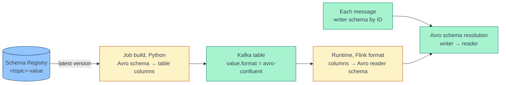

[← Streaming](../index.md)

# Reader Schema from Schema Registry

**A PyFlink job never writes an Avro reader schema itself — it writes table
columns, and Flink's `avro-confluent` format turns those columns into the
reader schema at runtime.** Many jobs generate the columns from the latest
schema in Schema Registry, so whatever converts Avro types into Flink column
types is, in effect, building the reader schema. A common choice is a
hand-written Python converter; Flink ships its own converter that can do the
same job. This page explains how such a converter works, where it can go
wrong, and how the two ways compare.

!!! abstract "What you should know after reading this page"
    1. The **two steps** that produce a reader schema: Python builds the table
       columns when the job is built, and Flink derives the Avro reader schema
       from them at runtime.
    2. What a Python converter has to do: **fetch** the schema, **collect named
       types**, and **map each Avro type** to a Flink type.
    3. The typical **weak spots** of a hand-written converter — silent
       fallbacks to `STRING`, named-type lookups, unions — and why each
       surfaces only at runtime.
    4. The **two ways** to create the columns — a Python converter or Flink's
       `AvroSchemaConverter` — and the pros and cons of each.
    5. When to declare **only the columns you use**, why to **pin a schema
       version**, and why the `avro-confluent.schema` option does not fit
       source tables.

---

## Two steps, two systems



| Step | Runs | Produces |
|---|---|---|
| **1. Build the columns** | Python, when the job graph is built — once per start | The table's physical value columns, with Flink types |
| **2. Derive the reader schema** | Flink's `avro-confluent` format, in each source subtask | An Avro schema converted from the value columns the format must produce (`AvroSchemaConverter.convertToSchema`) |
| **3. Resolve** | Flink, per message | The writer schema is fetched by the message's schema ID and resolved against the reader schema |

A mistake in step 1 therefore becomes a mistake in the reader schema — and it
shows up in step 3, as a decode failure on live data, far from its cause.

---

## What a Python converter does

A typical generated source table is built in four parts:

1. **Kafka metadata columns** — topic, partition, offset, timestamp, headers —
   and the key column, with `key.format = raw` and
   `value.fields-include = EXCEPT_KEY` so the value holds only the Avro
   fields.
2. **One column per top-level Avro field**, typed by the converter.
3. **Computed columns**, if any.
4. **The watermark**, if any.

The converter itself has three jobs.

### 1. Fetch the schema

Fetch the **latest version** of subject `<topic>-value` with a Schema Registry
client. A fallback to a subject named just `<topic>` is a common addition. The
alternative is to fetch one exact schema **by ID** or version — see
[Pin the schema version](#pin-the-schema-version).

### 2. Collect named types

In Avro, a named type — a `record`, `enum` or `fixed` — is defined once and
can then be used elsewhere just by its name:

```json
{"name": "amount", "type": {"type": "record", "name": "Amount", "namespace": "ns", "fields": [...]}},
{"name": "fee",    "type": "ns.Amount"}
```

So before mapping, the converter walks the whole schema — record fields,
every branch of a union, array items and map values — and builds a **schema
context**: a map from each type's full name to its definition. When a field's
type is just a name, the converter looks it up there.

### 3. Map each Avro type

A typical mapping, applied recursively:

| Avro type | Flink type | Note |
|---|---|---|
| `["null", T]` | `T`, nullable | PyFlink types are nullable by default, so every column ends up nullable — the safe choice. |
| Union of two or more non-null types | *No good answer* | Flink cannot represent it; a converter must pick a branch or fail. |
| A name, e.g. `"ns.Amount"` | The referenced type | Looked up in the schema context. |
| `string`, `int`, `long`, `float`, `double`, `boolean`, `bytes` | `STRING`, `INT`, `BIGINT`, `FLOAT`, `DOUBLE`, `BOOLEAN`, `BYTES` | Direct mapping. |
| `record` | `ROW<field …>` | Fields converted recursively; recursive records cannot be represented. |
| `array` | `ARRAY<item>` | |
| `map` | `MAP<STRING, value>` | Avro map keys are always strings. |
| `enum` | `STRING` | The symbol name. |
| `fixed` | `VARBINARY(size)` | Unless it has a logical type. |

Logical types:

| Avro logical type | Flink type |
|---|---|
| `timestamp-millis` / `timestamp-micros` | `TIMESTAMP(3)` / `TIMESTAMP(6)` in Flink's default (legacy) mapping, or `TIMESTAMP_LTZ` |
| `local-timestamp-millis` / `local-timestamp-micros` | `TIMESTAMP(3)` / `TIMESTAMP(6)` |
| `date` | `DATE` |
| `time-millis` / `time-micros` | `TIME(3)` / `TIME(6)` |
| `decimal` on `bytes` or `fixed` | `DECIMAL(precision, scale)` |
| `uuid` | `STRING` |

!!! note "Instants without a time zone"
    In the legacy mapping, `timestamp-millis` — an instant — becomes
    `TIMESTAMP(3)`, without a time zone, so the column holds UTC wall-clock
    time. `TIMESTAMP_LTZ` keeps the instant meaning. See
    [Avro and Schema Registry](../kafka/avro-and-schema-registry.md#type-mapping).

---

## Weak spots of a hand-written converter

The common thread: a converter that **guesses instead of failing**. Each guess
becomes a wrong reader schema, which fails later, on live data, with an error
that does not point back at the converter.

| Weak spot | What happens |
|---|---|
| **Silent `STRING` fallback** | A converter that returns `STRING` for anything unexpected starts fine. If the writer sends a record or an array there, resolution fails at runtime. |
| **Naive named-type lookup** | Avro namespaces are inherited: a nested type without its own `namespace` takes its parent's. A lookup that only recognises names containing a `.`, or stores a type under its bare name, can miss — and the field quietly becomes `STRING`. Avro's own parser applies the namespace rules correctly. |
| **First branch of a multi-type union** | The job starts, then every record that uses another branch fails. |
| **Mapping drift** | Any type mapped differently from Flink's own converter — `fixed`, `time-micros`, a default decimal precision — is a chance for the columns and the format to disagree. |
| **Latest version, read once** | A field added to the subject later is ignored until the job restarts, and two restarts a week apart can build differently shaped tables. |
| **Own code to maintain** | Logic and tests that duplicate what Flink already ships. |

---

## Two ways to create the columns

### Way 1: a Python converter

What the previous sections describe: fetch the schema with the Python client,
convert it with your own code, build the columns.

### Way 2: Flink's `AvroSchemaConverter`

`flink-avro` includes
`AvroSchemaConverter.convertToDataType(String avroSchema, boolean legacyTimestampMapping)`
— the same class the `avro-confluent` format uses to turn columns back into a
reader schema. If the job's jars include `flink-avro`, as a connector fat JAR
usually does, PyFlink can call it through the Java gateway and keep everything
else — the registry fetch, metadata columns, computed columns, watermark —
unchanged:

```python
from pyflink.java_gateway import get_gateway


def avro_to_columns(schema_str: str, legacy_timestamps: bool = True) -> list[tuple[str, str]]:
    """Top-level (name, SQL type) pairs, converted by Flink itself."""
    jvm = get_gateway().jvm
    converter = jvm.org.apache.flink.formats.avro.typeutils.AvroSchemaConverter
    row = converter.convertToDataType(schema_str, legacy_timestamps)  # static method call
    names = row.getLogicalType().getFieldNames()
    types = row.getChildren()
    return [
        # .nullable(): keep every top-level column nullable
        (names[i], types[i].nullable().getLogicalType().asSerializableString())
        for i in range(len(names))
    ]


# when building the table schema:
for name, sql_type in avro_to_columns(schema_str):
    schema_builder.column(name, sql_type)  # Schema.Builder accepts a SQL type string
```

!!! warning "A sketch, not tested code"
    Before adopting it, check these points:

    - **Classpath.** The jar with `flink-avro` must already be loaded into
      PyFlink's JVM when the function runs — that is, after the job adds its
      jars — and must not relocate the package.
    - **Use the JVM view, not `load_java_class`.** `get_gateway().jvm.<class>`
      calls the static method. `pyflink.util.java_utils.load_java_class`
      returns a `java.lang.Class` object, on which `convertToDataType` does not
      exist.
    - **Nullability.** Flink marks non-union fields `NOT NULL`. `.nullable()`
      relaxes only the top-level columns; nested fields keep `NOT NULL`, so the
      derived reader schema has plain types there.
    - **Timestamps.** `legacy_timestamps=True` is Flink's default. `False` maps
      `timestamp-*` to `TIMESTAMP_LTZ` and `local-timestamp-*` to `TIMESTAMP` —
      more correct, but it changes column types under existing SQL.

### Pros and cons

| | **Way 1: Python converter** | **Way 2: Flink's `AvroSchemaConverter`** |
|---|---|---|
| **Consistency with the format** | A separate mapping that must be kept in line with Flink's by hand. | The same class the format uses at runtime — columns and reader schema cannot disagree on a mapping. |
| **Named types and namespaces** | Your own lookup; easy to get subtly wrong. | Avro's own parser, which applies the spec's namespace rules. |
| **Unsupported schemas** | Whatever you code — guessing fails at runtime, raising fails at build. | Fails when the job is built: a multi-type union becomes a `RAW` type, which has no SQL form. |
| **Timestamps** | Whatever you choose, including custom precision attributes. | Flink's documented legacy and non-legacy mappings only. |
| **Nullability** | You decide; all-nullable is easy. | `NOT NULL` for non-union fields; you relax what you need. |
| **Dependencies** | Pure Python; testable without a JVM. | Needs the JVM and the `flink-avro` classes; tests need a PyFlink gateway. |
| **Debugging** | Python code you can step through. | Java code behind the gateway. |
| **Customisation** | Easy to special-case a type. | Flink's behaviour as is — customise only around it. |
| **Maintenance** | Your code and tests. | A few lines of glue. |

### Flink's converter at a glance

Where Flink's `convertToDataType` behaves in ways a hand-written converter
often does not, with the legacy timestamp mapping (the default):

| Avro | Flink's converter |
|---|---|
| Non-union field | `NOT NULL` |
| Union of two or more non-null types | `RAW` — fails when turned into a SQL type |
| Unresolvable named type | Avro parse error |
| Recursive record | Not supported — fails |
| `fixed` | `VARBINARY(size)` |
| `time-micros` | `TIME(6)` |
| `local-timestamp-millis` / `-micros` | `BIGINT` in legacy mode; `TIMESTAMP(3)` / `(6)` otherwise |
| `decimal` without precision | Not a valid decimal — read as plain `bytes` |

---

## Choices that apply to either way

### Declare only the columns you use

The format derives the reader schema from the value columns, and Avro
resolution **ignores writer fields the reader does not have**. A table may
therefore declare just the fields the pipeline needs. The reader schema then
becomes a fixed, reviewed contract: a new version in the registry changes
nothing until you choose to add a column. The cost is editing the column list
when the job needs a new field. For a job that reads a handful of fields from
a wide event, this is often the best fit — and it combines with either way:
generate the columns, then keep the ones you need.

### Pin the schema version

Reading the **latest** version at every start lets the table's shape change
between restarts without a code change. Fetching one schema by ID or version
makes builds reproducible. A `FULL_TRANSITIVE` compatibility rule still
protects the job as producers move ahead: the pinned reader can resolve every
newer writer.

### The `avro-confluent.schema` option

The format accepts an explicit Avro schema string as
`value.avro-confluent.schema`. For decoding it does not help: Flink converts
that string back to a row type and **requires it to equal the table's row type
exactly** — every column, every nullability flag — and otherwise rejects the
table. All-nullable columns, a column subset, or computed columns break that
match. The option is meant for sinks, where it fixes the schema written to the
registry.

---

## Recommendation

1. **Way 2 by default.** Use Flink's `AvroSchemaConverter`, keeping
   `.nullable()` on top-level columns and the legacy timestamp mapping until
   the downstream SQL is ready for `TIMESTAMP_LTZ`.
2. **A column subset for narrow jobs** that read a few fields from a wide
   event.
3. **Pin the schema version** for production jobs.
4. **If you keep a Python converter**, make it strict — raise instead of
   returning `STRING`, reject multi-type unions, resolve named types by Avro's
   namespace rules.

---

## Self-check

Answer these from memory before expanding them. They map to the outcomes listed
at the top of the page.

??? question "1. Where is the Avro reader schema of a PyFlink `avro-confluent` source actually created?"
    In Flink's `avro-confluent` format, at runtime, from the table's value
    columns. Your Python code creates only the columns; their types decide the
    reader schema.

??? question "2. A producer adds a field `fee` of type `ns.Amount`, defined earlier in the schema. After a restart the job fails to decode every record. What might the converter have done?"
    If `Amount` was stored under a different name than the reference uses —
    for example it inherited its namespace — the lookup missed, and `fee`
    became `STRING`. The writer sends a record; a string reader cannot read
    it, so resolution fails.

??? question "3. A field is `[\"null\", \"string\", \"long\"]`. What does each way do?"
    A converter that picks the first non-null type gives `STRING` and the job
    starts; records carrying a `long` then fail. Flink's converter produces a
    `RAW` type, which has no SQL form, so the job fails when it is built.

??? question "4. A producer adds a new field while the job runs. When does the job see it?"
    Only after a restart, if the columns are built from the latest version at
    start-up — resolution ignores writer fields the reader lacks. With a
    pinned version or a column subset, not until you change the code.

??? question "5. Why not pass the registry schema as `value.avro-confluent.schema` and skip the conversion?"
    Flink requires that schema's row type to equal the table's row type
    exactly. Nullable columns, a subset, or computed columns break the match,
    and the table is rejected. The option is meant for sinks.

??? question "6. What do you give up by moving to Flink's converter?"
    Pure-Python testing and easy special cases. The converter runs in the JVM
    behind the gateway, tests need a PyFlink gateway, and custom attributes
    are not honoured.

---

## References

### Apache Flink and Avro

- [Confluent Avro format](https://nightlies.apache.org/flink/flink-docs-release-1.20/docs/connectors/table/formats/avro-confluent/) — format options, including `schema`.
- [Avro format](https://nightlies.apache.org/flink/flink-docs-release-1.20/docs/connectors/table/formats/avro/) — the Avro ↔ Flink SQL type mapping and the legacy timestamp option.
- [Avro specification: names](https://avro.apache.org/docs/1.11.1/specification/#names) — how namespaces are declared and inherited.
- [Avro specification: schema resolution](https://avro.apache.org/docs/1.11.1/specification/#schema-resolution) — how a writer schema is read with a reader schema.

### Related

- [Avro and Schema Registry](../kafka/avro-and-schema-registry.md) — the wire format, writer and reader schemas, and decoding in Flink and Spark.
- [Kafka Source](concepts/kafka-source.md) — key and value formats and metadata columns.
- [Development and Deployment](development-and-deployment.md) — building the connector fat JAR the job loads.
