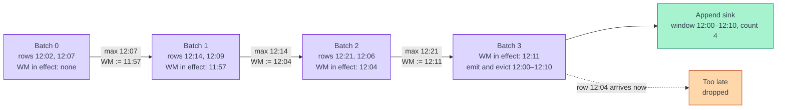

[← Spark Structured Streaming](../index.md)

# Event Time and Watermarks

**Spark keeps one watermark per query, and the driver computes it between
micro-batches.** Flink tracks watermarks per partition and sends them through
the job with the records. Spark does not. Each micro-batch reports the largest
event time it saw, and the driver turns that into a single number that the next
batch uses. That one number decides when windows emit in append mode and when
old state is deleted. Most event-time surprises in Spark, such as results that
appear one batch late, windows that never close on a quiet topic, or a join
held back by its slower side, follow from this design.

!!! abstract "What you should know after reading this page"
    1. The difference between **event time** and **processing time**, and how
       `window()` and `session_window()` group rows by event time.
    2. How `withWatermark()` computes the watermark, and why it **lags one
       micro-batch** behind the data.
    3. What the watermark **guarantees** about late data, and what it does
       not.
    4. Which operators use the watermark to **emit results** and **evict
       state**, and what happens to state without one.
    5. How Spark combines watermarks from **several inputs**, and how
       `spark.sql.streaming.multipleWatermarkPolicy` changes that.
    6. Why Spark has **no idleness** setting, and what **no-data
       micro-batches** do and do not fix.
    7. How the Kafka record timestamp, `TimestampType`, `TimestampNTZType` and
       `spark.sql.session.timeZone` affect event time and local dates.
    8. Where to **read the current watermark** in query progress.

All behaviour on this page is for **Apache Spark 3.5.5**. Items that need
Spark 4.x are marked.

---

## Event time and processing time

Every row has at least two times. Spark lets you choose which one drives
time-based grouping.

| Notion | Meaning | How you get it in Spark | Deterministic? |
|---|---|---|---|
| **Event time** | When the event happened, taken from a column in the data (for example `created_at`). | Any timestamp column, used in `window()`, `session_window()` and `withWatermark()`. | **Yes.** Replaying the same input gives the same windows. |
| **Processing time** | The clock on the driver or executor when the row is processed. | `current_timestamp()`, or the trigger interval itself. | **No.** A backlog or a restart moves rows into different windows. |

Spark has no separate "ingestion time" mode. If you want it, use the Kafka
record timestamp as the event-time column (see
[Kafka timestamp or payload time](#kafka-timestamp-or-payload-time)).

!!! note "Event time is just a column"
    Spark does not attach a hidden timestamp to each row as Flink does. Event
    time is an ordinary column. It becomes special only when you pass it to
    `withWatermark()` and group by it, or by a window on it.

---

## Event-time windows

Windowed aggregation in Spark is a `groupBy` on a window column. Spark supports
three kinds of time window.

| Window | Function | Behaviour |
|---|---|---|
| **Tumbling** | `window(col, "10 minutes")` | Fixed size, no overlap. Each row lands in exactly one window. |
| **Sliding** | `window(col, "10 minutes", "5 minutes")` | Fixed size; windows overlap when the slide is shorter than the size. A row can land in several windows. |
| **Session** | `session_window(col, "5 minutes")` (Spark 3.2 and later) | Dynamic size. A session starts with a row and extends while the next row for the same key arrives within the gap. |

```python
from pyspark.sql import functions as F

orders = (
    raw.select(
        F.col("order_id"),
        F.col("customer_id"),
        F.col("amount"),
        F.col("created_at"),            # TimestampType
    )
)

# Tumbling: orders per 5 minutes
per_5_min = (
    orders
    .withWatermark("created_at", "10 minutes")
    .groupBy(F.window("created_at", "5 minutes"))
    .agg(F.count("*").alias("orders"), F.sum("amount").alias("revenue"))
)

# Session: a customer's activity, closed after 30 minutes of silence
sessions = (
    orders
    .withWatermark("created_at", "10 minutes")
    .groupBy(F.session_window("created_at", "30 minutes"), "customer_id")
    .agg(F.count("*").alias("orders_in_session"))
)
```

The result has a struct column, `window` or `session_window`, with `start` and
`end` fields. Window starts are inclusive and ends are exclusive: `12:05`
belongs to `[12:05, 12:10)`, not to `[12:00, 12:05)`.

**The time column must be a timestamp.** The PySpark docs for `window()`
require `TimestampType` or `TimestampNTZType`. A string or an epoch number must be converted first,
for example with `F.to_timestamp(...)` or `F.timestamp_millis(...)`.

### Session windows

A session window groups one key's rows into bursts of activity. Each row opens
a window `[ts, ts + gap)`. Windows of the same key that overlap merge into one
session, so a session runs from its first row to its **last row + gap**.

```text
customer 7, gap 10 minutes:   rows at 10:00  10:05  10:12          10:50  10:55

tumbling 10 min:   [10:00, 10:10) → 2   [10:10, 10:20) → 1   [10:50, 11:00) → 2
session:           [10:00, 10:22) → 3                        [10:50, 11:05) → 2
```

The first session ends at 10:22: the last row, 10:12, plus the 10-minute gap.
The 10:12 row lands in a different tumbling window from 10:05, but in the same
session. The 38-minute silence after it ends the session.

The gap can depend on the row:

```python
F.session_window(
    "created_at",
    F.when(F.col("channel") == "app", "5 minutes").otherwise("30 minutes"),
)
```

**In a streaming query**, a session closes when the watermark passes its end,
like any window. Until then, an out-of-order row can **extend** a session or
**merge** two of them. With a 10-minute gap:

| Rows received | Sessions for customer 7 |
|---|---|
| 10:00, 10:18 | `[10:00, 10:10)` → 1, `[10:18, 10:28)` → 1 |
| then **10:09**, out of order, both still open | `[10:00, 10:28)` → 3, one merged session |

Two restrictions apply in streaming:

| Restriction | Why |
|---|---|
| **No update mode.** Use append with a watermark, or complete. | A session's start and end are part of its key, and they change as it grows. In update mode the sink overwrites by key, so `[10:00, 10:10) → 1` would stay next to the new `[10:00, 10:28) → 3` as a stale row. Append writes each session once, when it is final. |
| **At least one other grouping column,** such as `customer_id` | A session belongs to someone; a global session over all rows is supported only in batch queries. |

Typical uses are one user's visit, ending after 30 minutes of inactivity, or a
customer's checkout attempts grouped into one shopping session.

!!! warning "Window boundaries are aligned to UTC"
    `window()` aligns windows to `1970-01-01 00:00:00 UTC`, shifted by the
    optional `startTime` argument. A one-day tumbling window therefore runs
    from UTC midnight to UTC midnight. For a business day in UTC+7, shift it:
    `F.window("created_at", "1 day", startTime="17 hours")` starts each window
    at 17:00 UTC, which is 00:00 in UTC+7. See [Time zones](#time-zones).

Windows and stream-stream joins are covered from the state point of view in
[Stateful operations and the state store](stateful-operations-and-state-store.md).

---

## How the watermark is computed

You declare the watermark on the input DataFrame, before any stateful
operator:

```python
orders_wm = orders.withWatermark("created_at", "10 minutes")
```

The two arguments are the **event-time column** and the **delay threshold**.
The watermark is:

```text
watermark = max(created_at seen so far) − 10 minutes
```

The steps inside the engine are:

1. While a micro-batch runs, every task records the largest `created_at` it
   saw.
2. When the batch ends, the driver collects these values and takes the
   overall maximum.
3. The driver subtracts the delay. If the result is larger than the current
   watermark, it becomes the new watermark. **The watermark never moves
   backward.**
4. The driver writes the new watermark into the batch metadata in the
   checkpoint, so it survives a restart.
5. The **next** micro-batch uses it to decide what is late, what to emit and
   what state to evict.

Step 5 is the key difference from Flink. A batch never uses the watermark that
its own data would produce. The Spark guide describes it this way: watermarks
are advanced at the end of a micro-batch, and the next micro-batch uses the
updated watermark.



The diagram uses a 10-minute delay and 10-minute tumbling windows. The arrows
show the driver's work between batches.

| Batch | Rows arriving | Watermark in effect | Max seen after batch | Watermark for next batch |
|---|---|---|---|---|
| 0 | 12:02, 12:07 | none | 12:07 | 11:57 |
| 1 | 12:14, 12:09 | 11:57 | 12:14 | 12:04 |
| 2 | 12:21, 12:06 | 12:04 | 12:21 | 12:11 |
| 3 | (none, or new rows) | **12:11** | | |

- In batch 2, `12:06` is out of order, but its window `[12:00, 12:10)` is still
  open because the watermark in effect is only `12:04`. It is counted.
- In batch 3, the watermark `12:11` has passed the window end `12:10`. In
  append mode the final count for `[12:00, 12:10)` is written once, and its
  state is deleted.
- A row with `12:04` arriving in batch 3 or later is too late and is ignored.

!!! info "Before the first watermark"
    Until a batch with data has completed, there is no watermark yet. Query
    progress then reports it as the epoch, `1970-01-01T00:00:00.000Z`. Nothing
    is late in the first batch.

---

## What the watermark guarantees

The Spark guide states the guarantee for aggregations, and repeats it for
stream-stream joins. With a delay of 2 hours:

- The engine will **never drop** data that is less than 2 hours delayed, measured
  in event time against the latest data processed so far. Such data is
  guaranteed to be processed.
- The guarantee is **strict in one direction only**. Data delayed by more than 2
  hours is **not guaranteed to be dropped**. It may or may not be processed.
  The more delayed the data, the less likely the engine is to process it.

The one-batch lag is the main reason the second point holds. Suppose one
micro-batch contains rows with `12:40` and `12:15`, and the watermark in effect
is `12:11`. The row `12:15` is 25 minutes behind the newest row, which is more
than the 10-minute delay, but it is ahead of the watermark the batch uses, so it
is processed.

!!! warning "Late means \"behind the operator's state\", not \"behind the delay\""
    Do not build logic on the idea that every row older than *max − delay* is
    discarded. Treat the delay as a **lower bound** on how much lateness is
    tolerated. If you need an exact cut-off, filter explicitly on event time.

### What happens to late rows

What "dropped" means depends on the operator. Only stateful operators that use
the watermark drop anything.

| Operator | Effect of a row that is too late |
|---|---|
| Windowed aggregation (`window`, `session_window`) | Ignored if the window it belongs to has already been finalised and evicted. |
| `dropDuplicates` with the event-time column | Ignored; its state has already been evicted. |
| `dropDuplicatesWithinWatermark` | Ignored, as above. |
| Stream-stream join | Dropped, according to the join's time constraint and watermark. |
| Stateless operators (`select`, `filter`, a plain sink) | **No effect.** The row flows through. Late rows only matter to stateful operators. |

Spark reports rows dropped for lateness per stateful operator in query
progress, in the `numRowsDroppedByWatermark` field of `stateOperators`. There
is no side output for late rows as in Flink DataStream. See
[Micro-batch execution and triggers](micro-batch-execution-and-triggers.md#monitoring-a-query)
for reading progress.

---

## What the watermark controls

The watermark does two jobs: it decides **when results are final** and **when
state can go**.

| Operator | Emission controlled by the watermark | State eviction controlled by the watermark |
|---|---|---|
| Windowed aggregation, **append** mode | Yes. A window is written once, after the watermark passes its end. | Yes |
| Windowed aggregation, **update** mode | No. Changed rows are written every batch. | Yes |
| Any aggregation, **complete** mode | No. The whole result is written every batch. | **No.** Complete mode keeps all state. |
| `dropDuplicates("id", "event_time")` | Not applicable | Yes |
| `dropDuplicatesWithinWatermark("id")` | Not applicable | Yes; the watermark is required |
| Stream-stream inner join | No | Yes, when both sides have a watermark and the join has a time constraint |
| Stream-stream outer and semi joins | Yes. Unmatched (NULL) results are emitted only once the watermark shows no match can arrive. | Yes; watermark and time constraint are **required** |

For a watermark to clean aggregation state, the Spark guide lists these
conditions:

- The output mode is **append** or **update**.
- The aggregation groups by the event-time column, or by a window on it.
- `withWatermark` is called on the **same column** as the one used in the
  aggregation.
- `withWatermark` is called **before** the aggregation.

```python
# Wrong: watermark on a different column from the grouping column
orders.withWatermark("created_at", "10 minutes").groupBy("updated_at").count()

# Wrong: watermark after the aggregation
orders.groupBy(F.window("created_at", "5 minutes")).count() \
      .withWatermark("created_at", "10 minutes")
```

!!! danger "No watermark means state grows forever"
    A streaming aggregation, `dropDuplicates` or stream-stream join without a
    usable watermark keeps every key it has ever seen. The query runs well for
    days, then slows down and runs out of memory or disk. See
    [Stateful operations and the state store](stateful-operations-and-state-store.md).

!!! note "Spark 4.x: event-time timers"
    The `transformWithState` API, which lets custom stateful logic register
    event-time timers driven by the watermark, is **Spark 4.0 and later only**.
    In Spark 3.5.5, custom logic uses `applyInPandasWithState` with its own
    timeout handling.

---

## Choosing the delay

The delay works like Flink's out-of-orderness bound, with one difference: it
also adds to a latency of about one micro-batch.

| Delay | Append results appear | Late rows | Typical fit |
|---|---|---|---|
| Too small (seconds) | Soon after window end | Many; ordinary producer jitter is enough | Strictly ordered input only |
| Matched to observed disorder | After roughly *window end + delay + one trigger interval* | Rare | Most production queries |
| Too large (hours) | Very late; state is large | Almost none | Correctness first, latency tolerated |

**Measuring disorder.** Compare each row's event time with the newest event time
in the same partition or batch. Producer retries, mobile clients that buffer
offline and upstream batching all add to it. Choose a delay that covers the
bulk of that spread. It is a cost on every window, so do not pad it "just in
case".

---

## Several inputs

A query can union or join several streams, each with its own watermark:

```python
orders_wm = orders.withWatermark("created_at", "10 minutes")
payments_wm = payments.withWatermark("paid_at", "30 minutes")

joined = orders_wm.alias("o").join(
    payments_wm.alias("p"),
    F.expr("""
        p.order_id = o.order_id AND
        p.paid_at >= o.created_at AND
        p.paid_at <= o.created_at + interval 1 hour
    """),
    "leftOuter",
)
```

Spark tracks the maximum event time and computes a watermark **for each
input**. It then chooses **one global watermark** for all stateful operators.

| `spark.sql.streaming.multipleWatermarkPolicy` | Global watermark | Effect |
|---|---|---|
| `min` (default) | The smallest input watermark | Safe. No input's data is dropped because another input ran ahead. The query moves at the pace of the **slowest** input. |
| `max` | The largest input watermark | Faster results. Data from slower inputs is **dropped aggressively**. Use with care. |

```python
spark.conf.set("spark.sql.streaming.multipleWatermarkPolicy", "min")
```

This setting **cannot be changed** between restarts from the same checkpoint.

!!! warning "One quiet input holds back the whole query"
    With `min`, an input that stops receiving data stops moving its watermark,
    so the global watermark stops too. In the join above, if `payments` goes
    quiet, left-outer results for unpaid orders are never emitted and state for
    **both** sides keeps growing. This is the Spark equivalent of Flink's idle
    partition problem, but at the level of whole inputs.

!!! note "Partitions do not hold the watermark back"
    Inside one input, Spark takes the **maximum** event time across all
    partitions. An empty or lagging Kafka partition does **not** stall the
    watermark as it does in Flink. The flip side: rows from a lagging partition
    can be dropped as late, because the fast partitions already pushed the
    watermark forward. When one partition has a large consumer lag, pick a
    delay that covers it.

---

## No idleness, and no-data micro-batches

Spark has **no idleness setting** like Flink's `table.exec.source.idle-timeout`.
It does not need one for partitions, as explained above. But the watermark
still moves **only when new data arrives**. If every input stops, the
watermark stops, and the last open windows stay open.

`spark.sql.streaming.noDataMicroBatches.enabled` (default `true`) addresses the
one-batch lag, not silence. The configuration reference describes it as running
batches without data for eager state management. In practice:

1. A batch with data moves the watermark forward.
2. Because of the lag, that new watermark has not been applied yet.
3. If the new watermark would let a stateful operator emit results or evict
   state, Spark runs an extra batch straight away, with **no new data**, to
   apply it.

So with the setting on, append results and state cleanup do not wait for the
next data to arrive. With it off, they wait for the next batch that brings
data.

| Situation | Watermark moves? | Windows close? |
|---|---|---|
| Data keeps flowing | Yes | Yes, one batch after the watermark passes |
| Data stops after a batch that moved the watermark, no-data batches on | No further | Yes, for windows that the last watermark already passed |
| Data stops after a batch that moved the watermark, no-data batches off | No further | Not until the next batch with data |
| Data stops completely | No | Windows newer than the last watermark stay open indefinitely |

!!! tip "Low-traffic topics"
    If a topic can be silent for hours and the last window must still be
    emitted on time, the only real fix is to make data arrive. A common
    pattern is a producer that sends periodic heartbeat records with a current
    event time, which the query then filters out after the watermark step.

The `AvailableNow` trigger also runs a final no-data batch before it stops, if
the last batch moved the watermark. Triggers are covered in
[Micro-batch execution and triggers](micro-batch-execution-and-triggers.md).

---

## Kafka timestamp or payload time

A Kafka row in Spark has a `timestamp` column (`TimestampType`) and a
`timestampType` column. The value is the Kafka record timestamp: the
producer's create time, or the broker's append time if the topic uses
`LogAppendTime`.

| Event-time column | Meaning | Use it when |
|---|---|---|
| A field in the payload, for example `created_at` | When the business event happened | Almost always. Replays and backfills give the same windows. |
| The Kafka `timestamp` column | When the producer sent it, or when the broker stored it | The payload has no usable time, and "ingestion time" is acceptable. |

```python
from pyspark.sql.avro.functions import from_avro

events = (
    spark.readStream.format("kafka")
    .option("kafka.bootstrap.servers", "broker:9092")
    .option("subscribe", "orders.created.v1")
    .load()
    .select(
        F.col("timestamp").alias("kafka_ts"),
        from_avro(F.expr("substring(value, 6)"), order_schema_json).alias("o"),
    )
    .select("kafka_ts", "o.*")
    # payload epoch millis -> TimestampType
    .withColumn("created_at", F.timestamp_millis("created_ms"))
    .withWatermark("created_at", "10 minutes")
)
```

Reading from Kafka and checkpointing offsets is covered in
[Kafka source and checkpoints](kafka-source-and-checkpoints.md). Decoding
Confluent Avro is covered in
[Avro and Schema Registry](../../kafka/avro-and-schema-registry.md).

!!! warning "Producer time can make ordered data look disordered"
    A "sent at" field set by a client, or a Kafka create time from a producer
    with a wrong clock, can be far from the real event time. Pick the business
    timestamp, and check its spread before choosing a delay.

---

## Time zones

Spark has two timestamp types.

| Type | SQL name | Holds | Shown as |
|---|---|---|---|
| `TimestampType` | `TIMESTAMP_LTZ` (the default `TIMESTAMP`) | An **instant**, stored as microseconds since the epoch in UTC | Converted to the **session time zone** |
| `TimestampNTZType` (Spark 3.4 and later) | `TIMESTAMP_NTZ` | A wall-clock date and time with **no zone** | Exactly as stored |

`spark.sql.timestampType` chooses which one the plain `TIMESTAMP` keyword means.
Its default is `TIMESTAMP_LTZ`, so `TimestampType` is what you normally get.

The **session time zone** is `spark.sql.session.timeZone`. By default it is the
JVM's local zone. It changes how `TimestampType` values are displayed, cast to
strings or dates, and parsed from strings without a zone. It does not change the
instant stored. Set it explicitly so results do not depend on where the driver
runs:

```python
spark.conf.set("spark.sql.session.timeZone", "UTC")
```

### Local dates from a UTC instant

A common need is a date partition in a local zone, for example Vietnam time
(`Asia/Ho_Chi_Minh`, UTC+7), from a `TimestampType` event time.

```python
# Session time zone is UTC (set above)
out = events.withColumn(
    "event_date_local",
    F.to_date(F.from_utc_timestamp("created_at", "Asia/Ho_Chi_Minh")),
)
```

An event at `2024-03-01 18:30:00 UTC` gets `event_date_local = 2024-03-02`,
because it is 01:30 the next morning in UTC+7. Without the conversion,
`to_date` uses the session zone and returns `2024-03-01`.

!!! warning "`from_utc_timestamp` assumes a UTC session"
    `from_utc_timestamp` shifts the value by the zone's offset (+7 hours for
    `Asia/Ho_Chi_Minh`), and `to_date` then reads the shifted value in the
    session time zone. The pair gives the local date only when the session
    time zone is `UTC`; under any other session zone the offset is applied
    twice. If you would rather not depend on that, set the
    session zone to `Asia/Ho_Chi_Minh` and call `F.to_date("created_at")`
    directly. Pick one approach per query and write it down.

How Avro's `timestamp-millis` and `local-timestamp-millis` logical types map to
Spark types is covered in
[Avro and Schema Registry](../../kafka/avro-and-schema-registry.md#type-mapping).

---

## Reading the watermark

Each micro-batch produces a `StreamingQueryProgress`. Its `eventTime` map shows
what the watermark step saw in that batch, as ISO-8601 strings in UTC:

```json
"eventTime" : {
  "avg" : "2024-03-01T10:02:31.512Z",
  "max" : "2024-03-01T10:04:58.000Z",
  "min" : "2024-03-01T09:58:12.000Z",
  "watermark" : "2024-03-01T09:51:40.000Z"
}
```

| Field | Meaning |
|---|---|
| `min`, `max`, `avg` | Event times in this batch's input. Absent in a batch with no rows. |
| `watermark` | The watermark this batch **used**, which is the one computed after the previous batch. |

```python
progress = query.lastProgress
print(progress["eventTime"].get("watermark"))
for op in progress["stateOperators"]:
    print(op["operatorName"], op["numRowsTotal"], op.get("numRowsDroppedByWatermark"))
```

What to look for:

- **`watermark` not moving** across batches: no new data on some input, or the
  `min` policy waiting for a quiet input.
- **`max − watermark` much larger than the delay**: the query is far behind, or
  some rows have event times far in the future that pushed `max` up. Check for
  bad timestamps.
- **`numRowsDroppedByWatermark` rising**: the delay is too small for the real
  disorder.

The same values are visible per batch in the Structured Streaming tab of the
Spark UI and in the Spark History Server. Monitoring progress in general is
covered in
[Micro-batch execution and triggers](micro-batch-execution-and-triggers.md#monitoring-a-query).

---

## Flink and Spark compared

| Aspect | Apache Flink 1.20 | Spark Structured Streaming 3.5.5 |
|---|---|---|
| Granularity | Per partition and per operator subtask; each operator takes the **minimum** of its inputs | **One global watermark per query** |
| Where it is computed | In the source tasks, then carried through the job as stream elements | On the **driver**, between micro-batches |
| When it takes effect | Continuously, as watermarks reach each operator | From the **next micro-batch** |
| Within one source | Minimum across partitions, so a slow partition holds the job back | Maximum across partitions, so a slow partition's rows risk being late |
| Several inputs | Always the minimum | `min` by default, or `max` via `spark.sql.streaming.multipleWatermarkPolicy` |
| Idle inputs | `table.exec.source.idle-timeout` or `with_idleness(...)` | No idleness concept; the watermark moves only when data arrives |
| Window emission | When the watermark passes the window end | In append mode, the batch after the watermark passes the window end |
| Late rows | Dropped in SQL; allowed lateness or side output in DataStream | Dropped by stateful operators; no side output |
| Declared in | `WATERMARK FOR` in the table DDL, or a `WatermarkStrategy` | `withWatermark(col, delay)` on the DataFrame |

The Flink side is explained in
[Time and watermarks (Flink)](../../apache-flink/concepts/time-and-watermarks.md)
and [Windows and joins (Flink)](../../apache-flink/concepts/windows-and-joins.md).

---

## Self-check

Answer these from memory before expanding them. They map to the outcomes listed
at the top of the page.

??? question "1. A query counts orders per minute using `current_timestamp()`. A replay of yesterday's data gives completely different totals from the live run. Why?"
    `current_timestamp()` is **processing time**. During a replay, a day of
    data is processed in a few minutes, so the rows crowd into a few windows.
    Group by `window()` on an event-time column from the payload instead, so
    each row's window comes from its own timestamp.

??? question "2. A 5-minute tumbling window in append mode, with a 10-minute delay, has received all its rows. The max event time is now 12:16, but the `[12:00, 12:05)` result has still not been written. Why?"
    The watermark computed from `12:16` is `12:06`, and it is only **applied in
    the next micro-batch**. The window is written in the batch whose watermark
    in effect is past `12:05`. With no-data micro-batches enabled, Spark runs
    that batch straight away; otherwise it waits for new data.

??? question "3. With a 10-minute delay, a row arrives 25 minutes behind the newest row, yet it is counted. Is this a bug?"
    No. The guarantee is strict in **one direction only**: data within the
    delay is never dropped, but data later than the delay **may or may not**
    be processed. Here the row was ahead of the watermark the batch used,
    which lags one batch behind the data.

??? question "4. A streaming `groupBy(\"customer_id\").count()` in update mode runs fine for a week, then the state store keeps growing until executors fail. What is missing?"
    A usable **watermark**. The aggregation has no event-time column or window
    in its key, so the watermark cannot tell Spark when a key is finished, and
    state is never evicted. Group by a window on the event-time column with
    `withWatermark` on the same column, or bound the state in another way.

??? question "5. A left-outer stream-stream join between `orders` and `payments` stops emitting unmatched orders every night, but works in the day. Payments are rare at night. What is happening?"
    Each input has its own watermark, and with the default
    `spark.sql.streaming.multipleWatermarkPolicy = min` the global watermark is
    the **smaller** one. When `payments` goes quiet its watermark stops, the
    global watermark stops, and outer results wait. Spark has no idleness
    setting; options are heartbeat records on the quiet topic, or `max` if
    dropping late payments is acceptable.

??? question "6. One Kafka partition of an input is 20 minutes behind the others because of consumer lag. The delay is 5 minutes. What happens to its rows in a windowed aggregation?"
    Within one input Spark takes the **maximum** event time across partitions,
    so the fast partitions set the watermark. Rows from the lagging partition
    are about 20 minutes behind it, and many belong to windows that have
    already been finalised, so they are **dropped as late**. The watermark does
    not wait for the slow partition as it would in Flink.

??? question "7. Daily partitions are written by `to_date(created_at)`, and events after 17:00 UTC land in the previous day for a business in Vietnam. What is wrong?"
    `to_date` on a `TimestampType` uses `spark.sql.session.timeZone`, which is
    `UTC` here. Convert to local time first, with
    `to_date(from_utc_timestamp(created_at, "Asia/Ho_Chi_Minh"))` under a UTC
    session, or set the session time zone to `Asia/Ho_Chi_Minh`.

---

## References

### Apache Spark

- [Structured Streaming Programming Guide (3.5.5)](https://archive.apache.org/dist/spark/docs/3.5.5/structured-streaming-programming-guide.html) — event-time windows, watermarking, its guarantees, joins and the multiple watermark policy.
- [Spark configuration (3.5.5)](https://archive.apache.org/dist/spark/docs/3.5.5/configuration.html) — `spark.sql.streaming.multipleWatermarkPolicy`, `spark.sql.streaming.noDataMicroBatches.enabled`, `spark.sql.session.timeZone` and `spark.sql.timestampType`.
- [`DataFrame.withWatermark` (PySpark 3.5.5)](https://archive.apache.org/dist/spark/docs/3.5.5/api/python/reference/pyspark.sql/api/pyspark.sql.DataFrame.withWatermark.html) — how the watermark is computed.
- [`functions.window` (PySpark 3.5.5)](https://archive.apache.org/dist/spark/docs/3.5.5/api/python/reference/pyspark.sql/api/pyspark.sql.functions.window.html) and [`functions.session_window`](https://archive.apache.org/dist/spark/docs/3.5.5/api/python/reference/pyspark.sql/api/pyspark.sql.functions.session_window.html) — window arguments, alignment and column types.
- [Structured Streaming + Kafka Integration Guide (3.5.5)](https://archive.apache.org/dist/spark/docs/3.5.5/structured-streaming-kafka-integration.html) — the Kafka source schema, including `timestamp` and `timestampType`.

### Related

- [Spark Structured Streaming overview](../index.md)
- [Micro-batch execution and triggers](micro-batch-execution-and-triggers.md) — the batch loop, triggers and reading query progress.
- [Kafka source and checkpoints](kafka-source-and-checkpoints.md) — reading Kafka and where the watermark is stored.
- [Stateful operations and the state store](stateful-operations-and-state-store.md) — what the watermark evicts, and what happens without it.
- [Output modes and sinks](output-modes-and-sinks.md) — append, update and complete, and how they interact with the watermark.
- [Time and watermarks (Flink)](../../apache-flink/concepts/time-and-watermarks.md) — the per-partition model in depth.
- [Windows and joins (Flink)](../../apache-flink/concepts/windows-and-joins.md)
- [Avro and Schema Registry](../../kafka/avro-and-schema-registry.md#type-mapping) — Avro timestamp logical types.
