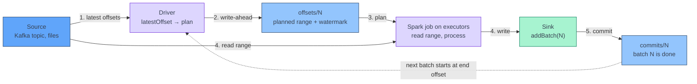

[← Spark Structured Streaming](../index.md)

# Micro-batch Execution and Triggers

**A Spark Structured Streaming query is a loop of small batch jobs: the
driver picks a fixed range of input offsets, runs one ordinary Spark job over
it, records that the batch is done, and then starts again.**

!!! abstract "What you should know after reading this page"
    1. How the **micro-batch model** works, and how it differs from Flink's
       continuously running operators.
    2. The steps of one batch, and why writing the **offsets log before** the
       batch and the **commits log after** it makes a replay deterministic.
    3. What each **trigger** does: default, `processingTime`, `availableNow`,
       the deprecated `once`, and the experimental `continuous`.
    4. What happens when a batch takes **longer than the trigger interval**.
    5. How **batch duration**, **trigger interval** and **input caps** relate,
       and what very short and very long triggers cost.
    6. How to read **`StreamingQueryProgress`** to see whether a query is
       **falling behind**, and where to find these numbers in the Spark UI.

---

## The micro-batch model

Structured Streaming treats a stream as a table that keeps growing. Each
micro-batch processes the rows that arrived since the previous batch, as if
they were a small batch table.

| Step | Who does it | What happens |
|---|---|---|
| Plan | Driver | Asks every source for its latest offset and fixes the range `[start, end)` for this batch. |
| Execute | Executors | Runs one normal Spark job over exactly that range: read, transform, update state, write to the sink. |
| Commit | Driver | Records that the batch finished. The next batch starts from `end`. |

Three properties follow from this design:

- **A batch has a fixed size.** The offset range is decided before any data is
  read. Records that arrive while the batch runs wait for the next batch.
- **Batches never overlap.** The driver runs one batch at a time. Batch `N + 1`
  starts only after batch `N` has committed.
- **Latency is at least one batch.** A record can only reach the sink when the
  batch that contains it finishes. The Spark documentation puts the best
  micro-batch latency at around 100 ms.

---

## Lifecycle of one batch

Every micro-batch goes through the same steps, in the same order. The names in
brackets are the keys of the `durationMs` map in the query progress, covered
in [Monitoring a query](#monitoring-a-query).

1. **Find new data** (`latestOffset`). The driver asks each source for its
   latest available offset. A source can cap this, for example with
   `maxOffsetsPerTrigger` on Kafka.
2. **Write the offsets log** (`walCommit`). The driver writes the planned range
   for batch `N` to the `offsets/` folder of the checkpoint, together with the
   batch's watermark and timestamp. This is the **write-ahead log**.
3. **Plan** (`getBatch`, `queryPlanning`). The driver builds the physical plan
   for this batch's input.
4. **Run and write** (`addBatch`). Executors read the range, process it, and
   the sink writes the result. This is usually the largest part of the batch.
5. **Write the commits log** (`commitOffsets`). The driver writes batch `N` to
   the `commits/` folder. Only now is the batch finished.

The whole loop is measured as `triggerExecution`.



### Why the order makes replay deterministic

The offsets entry is written **before** any data is processed, and the commits
entry **after** the sink has written. When a query restarts from its
checkpoint, it compares the two logs:

| State found on restart | Meaning | What Spark does |
|---|---|---|
| `offsets/N` and `commits/N` both exist | Batch `N` finished. | Plans batch `N + 1` from batch `N`'s end offset. |
| `offsets/N` exists, `commits/N` does not | Batch `N` was planned but not finished. | Runs batch `N` **again**, with the **same** offset range, watermark and batch timestamp. |

Because the range for batch `N` was stored before the crash, the rerun reads
exactly the same records, not "whatever is available now". Together with a
replayable source such as Kafka and an idempotent sink, this gives
exactly-once results. The sink may still receive `addBatch(N)` twice, which is
why sinks need to handle a repeated batch id. See
[Output Modes, Sinks and Exactly-once](output-modes-and-sinks.md).

The checkpoint folder, its other subfolders, and what you may and may not
change between restarts are covered in
[Kafka Source and Checkpoints](kafka-source-and-checkpoints.md).

!!! note "Batches without new data"
    A batch uses the watermark computed by the **previous** batch. If a batch
    moves the watermark past a window's end and no new data follows, Spark runs
    a **no-data batch** (`numInputRows = 0`) to apply it: closed windows are
    written and expired state is dropped. Stateful queries only. See
    [Event Time and Watermarks](event-time-and-watermarks.md#no-idleness-and-no-data-micro-batches).

---

## Triggers

The trigger is set on the `DataStreamWriter` with `.trigger(...)`. It controls
**when** the next batch starts, not how much data it reads.

| Trigger | PySpark | When the next batch starts | Stops by itself? |
|---|---|---|---|
| Default (none set) | no `.trigger(...)` call | As soon as the previous batch finishes. | No |
| Fixed interval | `.trigger(processingTime="1 minute")` | At the next interval boundary. | No |
| Available-now | `.trigger(availableNow=True)` | Immediately, in as many batches as needed for the data available at start. | Yes |
| Once (deprecated) | `.trigger(once=True)` | One single batch for all available data. | Yes |
| Continuous (experimental) | `.trigger(continuous="1 second")` | Not micro-batch. Long-running tasks; the value is the checkpoint interval. | No |

```python
query = (
    events.writeStream
    .format("parquet")
    .option("path", "s3a://example-bucket/tables/page_views/")
    .option("checkpointLocation", "s3a://example-bucket/checkpoints/page_views/")
    .trigger(processingTime="1 minute")
    .start()
)
```

### Default and fixed interval

With **no trigger**, the query runs batches back to back. It reacts as fast as
possible, but an idle query still polls its sources in a loop.

With **`processingTime`**, Spark starts a batch at each interval boundary. If
the previous batch finished early, Spark waits until the boundary. If no new
data is available at the boundary, no batch with input is started. Intervals
are written as strings, such as `"500 milliseconds"`, `"10 seconds"` or
`"5 minutes"`. In practice, triggers range from sub-second to a few
minutes.

### Available-now and once

**`availableNow`** (Spark 3.3 and later) processes all data that is available
**when the query starts**, then stops. It splits that data into several
batches according to the source's limits, such as `maxOffsetsPerTrigger` for
Kafka or `maxFilesPerTrigger` for files. Any batch that was planned but not
committed in a previous run is processed first. The watermark advances after
each batch, and a final no-data batch runs if needed, so stateful results are
emitted before the query stops.

**`once`** does the same work in **one** batch and ignores the source limits.
It is deprecated. Use `availableNow` instead.

!!! tip "Scheduled streaming"
    `availableNow` lets a streaming query run like a scheduled batch job: start
    it, let it catch up, and let it exit. The checkpoint still tracks offsets
    and state between runs, so each run continues where the last one stopped.
    This is often cheaper than a cluster that waits for data all day.

### Continuous

**Continuous processing** is a separate execution mode, marked experimental in
Spark 3.5. It starts long-running tasks that read and write records
continuously, with latency around 1 ms. It has strict limits:

| Area | Limitation |
|---|---|
| Operations | Only map-like operations: `select`, `filter`, `map` and similar. No aggregations. `current_timestamp()` and `current_date()` are not supported. |
| Sources and sinks | Kafka, rate source, memory and console sinks only. |
| Guarantee | **At-least-once**, not exactly-once. |
| Resources | One core per input partition, held for the life of the query. |
| Failures | No automatic task retries. A failure stops the query, which must be restarted from the checkpoint. |

!!! warning "Do not use continuous mode for production pipelines"
    Continuous mode is experimental, cannot aggregate or join with state, and
    gives only at-least-once delivery. When you need latency below what
    micro-batches give, that is a strong signal to use Flink instead.

---

## When a batch overruns the interval

The trigger interval is a **minimum spacing**, not a deadline. If a batch takes
longer than the interval, Spark does not start a second batch alongside it,
and it does not wait for the next boundary either. The next batch starts **as
soon as the late batch commits**.

```text
trigger = 10 s

time      0s        10s       20s       30s       40s
batch 0   [==4s==]
batch 1             [=======17s========]
batch 2                                [==6s==]            ← starts at 27s, not at 30s
batch 3                                          [==5s==]  ← back on the 40s boundary
                    boundary at 20s missed: batch 1 still running
```

Two consequences:

- **A query that is always late behaves like the default trigger.** Batches run
  back to back, and the interval has no effect.
- **The late batch picks up more data.** Batch 2 above covers everything that
  arrived during batch 1's 17 seconds, unless the source caps it. Without a
  cap, a slow batch can make the next one slower too.

---

## Choosing a trigger interval

Three numbers are easy to confuse:

| Number | Set by | Meaning |
|---|---|---|
| **Trigger interval** | `.trigger(processingTime=...)` | The minimum time between batch starts. |
| **Batch duration** | The data and the cluster | How long one batch actually takes, `durationMs.triggerExecution` in the progress. |
| **Input cap** | Source option, such as `maxOffsetsPerTrigger` | The maximum amount of data one batch reads. See [Kafka Source and Checkpoints](kafka-source-and-checkpoints.md). |

A healthy query has a batch duration clearly **below** its trigger interval.
The input cap bounds how long one batch can take, which protects the query
after a restart or a traffic spike. It also sets a throughput ceiling of about
*cap ÷ batch spacing*; see
[Kafka Source and Checkpoints](kafka-source-and-checkpoints.md#rate-limiting)
before choosing a value.

### What a short trigger costs

Every batch has a fixed cost that does not depend on how much data it reads:

- **Driver work.** The driver asks the sources for offsets, plans the query
  and schedules tasks for every batch. With very short batches, this overhead
  can take more time than the actual processing.
- **Checkpoint writes.** Every batch writes one entry to `offsets/` and one to
  `commits/`, plus state store files for stateful queries. On object storage
  such as S3, these writes are slow compared with the batch itself.
- **Small output files.** File and table sinks usually write one or more files per
  writing task in every batch. Short batches produce many small files, which slow down
  later reads until they are compacted.

| | Very short trigger (sub-second) | Long trigger (minutes) |
|---|---|---|
| End-to-end latency | Low, near one second | High, up to one interval plus batch duration |
| Driver overhead | High share of each batch | Negligible |
| Checkpoint entries | Many per minute | A few per hour |
| Output files for file and table sinks | Many small files | Fewer, larger files |
| Effect of a slow batch | Next batch starts late; easily falls behind | Absorbed by the spare time in the interval |
| Data per batch | Small, so less memory per batch | Large; needs a cap or enough memory for spikes |
| Good fit | Low-latency Kafka-to-Kafka or key-value sinks | Writing to tables or files, aggregations where minutes of delay are fine |

!!! tip "Pick the longest interval the consumers accept"
    Start from the latency the downstream users need, and choose the longest
    trigger that meets it. A shorter interval than needed adds cost on the
    driver and in storage, and gives nothing back.

!!! note "Asynchronous progress tracking"
    Spark 3.5 has an option, `asyncProgressTrackingEnabled`, that writes the
    offsets and commits logs in the background instead of in every batch. It
    is limited to **stateless** queries with a **Kafka sink**, and it gives up
    exactly-once processing. Treat it as a specialist option, not a default.

---

## Monitoring a query

### StreamingQueryProgress

After every batch, Spark produces a **progress report**. In PySpark 3.5,
`query.lastProgress` returns the latest report as a `dict`, and
`query.recentProgress` returns a list of the last few. `query.status` tells
you what the query is doing right now, such as "Waiting for data to arrive".

```python
import json

p = query.lastProgress
if p is not None:
    print(json.dumps(p, indent=2))
```

The fields you will use most:

| Field | Meaning |
|---|---|
| `batchId` | The id of the batch. It matches the file names in `offsets/` and `commits/`. |
| `numInputRows` | Rows read in this batch, across all sources. |
| `inputRowsPerSecond` | Rate at which data **arrived**: input rows divided by the time since the previous batch started. |
| `processedRowsPerSecond` | Rate at which Spark **processed** data: input rows divided by this batch's `triggerExecution` time. |
| `durationMs.latestOffset` | Time spent asking sources for their latest offsets. |
| `durationMs.queryPlanning` | Time spent planning the batch on the driver. |
| `durationMs.walCommit` | Time spent writing the offsets log. |
| `durationMs.addBatch` | Time spent reading, processing and writing to the sink. Usually the largest. |
| `durationMs.triggerExecution` | Total time of the batch. Compare it with the trigger interval. |
| `eventTime.watermark` | The watermark used by this batch, when the query defines one. |
| `stateOperators[].numRowsTotal` | Rows held in each stateful operator's state. |
| `stateOperators[].memoryUsedBytes` | Memory used by that state. |
| `sources[].startOffset` / `endOffset` | The offset range this batch read. |
| `sources[].latestOffset` | The latest offset the source reported when the batch was planned. |

For Kafka, the gap between `endOffset` and `latestOffset` is the **lag** that
remained after the batch was planned. The Kafka source's lag metrics are
described in
[Kafka Source and Checkpoints](kafka-source-and-checkpoints.md#monitoring-lag).

!!! danger "The falling-behind rule"
    If `processedRowsPerSecond` stays **below** `inputRowsPerSecond` for many
    batches, the query is **falling behind**. Data arrives faster than Spark
    can process it, lag grows, and the gap between `endOffset` and
    `latestOffset` widens. One slow batch is normal. A gap that lasts for
    minutes is not. Look at `durationMs` to find where the time goes, then add
    resources, raise the input cap, or simplify the query.

!!! warning "With an input cap, watch the lag instead"
    `inputRowsPerSecond` counts only the rows a batch **read**, not the rows
    that arrived in Kafka. With `maxOffsetsPerTrigger` set, it can never exceed
    the cap, so a capped query that falls behind can show input and processed
    rates that look equal. For capped queries, the reliable signal is the
    **lag**: the gap between `endOffset` and `latestOffset`, or
    `sources[].metrics.avgOffsetsBehindLatest`, growing batch after batch.

Other warning signs:

| Signal | Likely cause |
|---|---|
| `triggerExecution` regularly above the trigger interval | Batches run back to back; the interval no longer applies. |
| `queryPlanning` or `latestOffset` a large share of a short batch | Driver overhead dominates; the trigger is probably too short. |
| `walCommit` high | Slow writes to the checkpoint location. |
| `numRowsTotal` growing without limit | State is never dropped. Check the watermark. See [Stateful Operations and the State Store](stateful-operations-and-state-store.md). |
| `eventTime.watermark` not moving | No new event time in the input, or a problem with the watermark column. |

### StreamingQueryListener

Polling `lastProgress` works in a notebook. In an application, register a
**`StreamingQueryListener`** to receive every progress report as it happens.
The Python listener is available since Spark 3.4. In the listener,
`event.progress` is an object with the same fields as attributes.

```python
from pyspark.sql.streaming import StreamingQueryListener

class ProgressLogger(StreamingQueryListener):
    def onQueryStarted(self, event):
        print(f"started id={event.id} run={event.runId}")

    def onQueryProgress(self, event):
        p = event.progress
        print(
            f"batch={p.batchId} rows={p.numInputRows} "
            f"in={p.inputRowsPerSecond:.1f}/s done={p.processedRowsPerSecond:.1f}/s "
            f"total_ms={p.durationMs.get('triggerExecution')}"
        )

    def onQueryTerminated(self, event):
        print(f"terminated id={event.id} exception={event.exception}")

spark.streams.addListener(ProgressLogger())
```

The callbacks run on the driver. Keep them short, and send the numbers to
logs or a metrics system rather than doing heavy work inside them. Spark 3.5
also has an optional `onQueryIdle` callback.

### The Structured Streaming tab

The Spark UI has a **Structured Streaming** tab for queries in micro-batch
mode. The overview lists running and completed queries and the last exception
of a failed one. Click a run id to see charts over time:

- **Input Rate** and **Process Rate**, the UI versions of
  `inputRowsPerSecond` and `processedRowsPerSecond`.
- **Input Rows** and **Batch Duration** per batch.
- **Operation Duration**, split into `addBatch`, `getBatch`, `latestOffset`,
  `queryPlanning` and `walCommit`.
- **Global Watermark Gap**, and aggregated **state rows** and **state memory**.

Process Rate below Input Rate for a long stretch is the falling-behind rule
again, in chart form.

### The Spark History Server

The live Spark UI disappears with the driver. The
[Spark History Server](https://archive.apache.org/dist/spark/docs/3.5.5/monitoring.html)
rebuilds the same UI, Structured Streaming tab included, from the event logs
of running and finished applications. For long-running streaming jobs, enable
rolling event logs so the logs do not grow into one huge file.

---

## Flink vs Spark

| | Apache Flink | Spark Structured Streaming (micro-batch) |
|---|---|---|
| Execution | Operators deployed once, running continuously | One Spark job per batch, scheduled by the driver |
| Unit of progress | Each record as it arrives | A fixed offset range per batch |
| Typical latency | Milliseconds | About 100 ms at best; in practice the trigger interval plus batch duration |
| Who decides the pace | Records flow as fast as operators process them; backpressure slows the source | The trigger and the input cap |
| Progress recorded | Checkpoints taken in the background with barriers | Offsets log before each batch, commits log after it |
| Recovery replays | Records since the last completed checkpoint | The last planned but uncommitted batch, with the same range |
| Falling behind shows as | Backpressure and growing consumer lag | `processedRowsPerSecond` below `inputRowsPerSecond`, batch duration above the interval |
| Bounded catch-up run | Bounded source, batch execution mode | `availableNow` trigger |
| Main monitoring view | Flink Web UI, job graph and backpressure | Spark UI Structured Streaming tab, `StreamingQueryProgress` |

Both engines read Kafka from offsets stored in their own checkpoints. Compare
[Kafka Source (Flink)](../../apache-flink/concepts/kafka-source.md) with
[Kafka Source and Checkpoints](kafka-source-and-checkpoints.md).

---

## Self-check

Answer these from memory before expanding them. They map to the outcomes listed
at the top of the page.

??? question "1. A Flink engineer asks which executors are \"running the stream\" between two batches of a Spark query. What is the answer?"
    None of them, for that query. In micro-batch mode, the driver plans each
    batch and schedules one ordinary Spark job for it. Executors run that
    job's tasks and then sit idle until the next batch. Unlike Flink, there
    are no long-lived operators that hold records between batches. State
    lives in the state store, not in a running task.

??? question "2. A query crashes during the sink write of batch 42. The checkpoint has `offsets/42` but no `commits/42`. What happens on restart, and why is the result the same as without the crash?"
    Spark sees that batch 42 was planned but never committed, so it runs batch
    42 **again**. It uses the offset range, watermark and batch timestamp stored
    in `offsets/42`, not the offsets available now, so it reads exactly the same
    records. With an idempotent sink that handles a repeated batch id, the
    output is the same as a run without the crash.

??? question "3. A nightly job must process everything that arrived on a Kafka topic since the last run, respect `maxOffsetsPerTrigger`, and then exit. Which trigger fits?"
    `availableNow=True`. It processes all data available at start in as many
    batches as the source limits require, then stops. `once=True` would also
    stop, but it is deprecated and reads everything in one batch, ignoring the
    cap. The default and `processingTime` triggers never stop by themselves.

??? question "4. A query has a 10-second trigger. One batch takes 25 seconds. When does the next batch start, and could two batches run at once?"
    The next batch starts **immediately** after the 25-second batch commits. It
    does not wait for the next 10-second boundary. Batches never overlap,
    so two batches cannot run at once. The next batch also reads everything
    that arrived during those 25 seconds, unless an input cap limits it.

??? question "5. A team lowers a file-sink query's trigger from 5 minutes to 1 second to make dashboards fresher. Name three costs they take on."
    More **driver overhead**, because offsets, planning and scheduling happen
    for every batch. More **checkpoint writes**, one offsets entry and one
    commits entry per batch. Many more **small output files**, because the
    sink writes new files in every batch. They should choose the
    longest interval that meets the freshness the dashboards actually need.

??? question "6. A streaming job looks slow. Where do you check its batches, and which progress field tells you where the time goes?"
    Open the application in the **Spark History Server** and use the
    Structured Streaming tab. In the progress, `durationMs` splits each
    batch into `latestOffset`, `queryPlanning`, `walCommit`, `addBatch` and
    the total `triggerExecution`. A large `addBatch` means processing or the
    sink is slow. Large planning or offset times in short batches point to a
    trigger that is too short.

---

## References

### Apache Spark

- [Structured Streaming Programming Guide: Triggers](https://archive.apache.org/dist/spark/docs/3.5.5/structured-streaming-programming-guide.html#triggers): trigger types and the behaviour when a batch overruns its interval.
- [Structured Streaming Programming Guide: Monitoring Streaming Queries](https://archive.apache.org/dist/spark/docs/3.5.5/structured-streaming-programming-guide.html#monitoring-streaming-queries): `lastProgress`, `status`, `StreamingQueryListener` and Dropwizard metrics.
- [Structured Streaming Programming Guide: Recovering from Failures with Checkpointing](https://archive.apache.org/dist/spark/docs/3.5.5/structured-streaming-programming-guide.html#recovering-from-failures-with-checkpointing): offset ranges in write-ahead logs.
- [Structured Streaming Programming Guide: Asynchronous Progress Tracking](https://archive.apache.org/dist/spark/docs/3.5.5/structured-streaming-programming-guide.html#asynchronous-progress-tracking): options and limitations.
- [Structured Streaming Programming Guide: Continuous Processing](https://archive.apache.org/dist/spark/docs/3.5.5/structured-streaming-programming-guide.html#continuous-processing): supported queries and caveats.
- [Monitoring and Instrumentation](https://archive.apache.org/dist/spark/docs/3.5.5/monitoring.html): the Spark History Server and rolling event logs.
- [Web UI: Structured Streaming Tab](https://archive.apache.org/dist/spark/docs/3.5.5/web-ui.html#structured-streaming-tab): the charts and operation durations in the UI.
- [PySpark `StreamingQueryListener`](https://archive.apache.org/dist/spark/docs/3.5.5/api/python/reference/pyspark.ss/api/pyspark.sql.streaming.StreamingQueryListener.html): the Python listener API.

### Related

- [Spark Structured Streaming overview](../index.md)
- [Kafka Source and Checkpoints](kafka-source-and-checkpoints.md): `maxOffsetsPerTrigger` and the checkpoint folder.
- [Event Time and Watermarks](event-time-and-watermarks.md): watermarks and no-data batches.
- [Stateful Operations and the State Store](stateful-operations-and-state-store.md): state size and the state operator metrics.
- [Output Modes, Sinks and Exactly-once](output-modes-and-sinks.md): idempotent sinks and repeated batch ids.
- [Flink Architecture](../../apache-flink/architecture.md): continuously running operators, for comparison.
- [Flink State and Checkpoints](../../apache-flink/concepts/state-and-checkpoints.md): barrier checkpoints, for comparison.
- [Flink Time and Watermarks](../../apache-flink/concepts/time-and-watermarks.md): the Flink side of event time.
