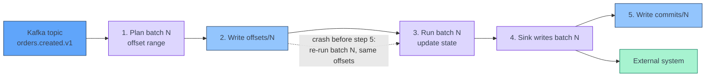

[← Spark Structured Streaming](../index.md)

# Output Modes, Sinks and Exactly-once

**End-to-end exactly-once in Structured Streaming needs three things: a
replayable source, deterministic replay of a micro-batch, and a sink that is
idempotent or transactional per batch.** The engine guarantees the first two
through its checkpoint: it logs the offsets of every micro-batch before running
it, and re-runs the same offsets after a failure. The third is up to the sink.
This page explains what each output mode emits, what each built-in sink
guarantees, and how to make `foreachBatch` writes to Iceberg and Cassandra safe
under replay. Everything here is pinned to Apache Spark 3.5.5.

!!! abstract "What you should know after reading this page"
    1. Why end-to-end exactly-once needs a **replayable source**, a
       **deterministic replay** of each micro-batch and an **idempotent or
       transactional sink**, and which of the three the engine provides.
    2. What **append**, **update** and **complete** output modes emit, and which
       query types support which mode.
    3. Why append mode on a windowed aggregation **waits for the watermark**, and
       why complete mode **never drops state**.
    4. Which **built-in sinks** are exactly-once, at-least-once or not
       fault-tolerant, and why the file sink is the exactly-once one.
    5. Why **`foreachBatch` is at-least-once by default**, and four ways to make
       it idempotent: keyed upserts, `MERGE INTO`, partition overwrite and
       recording `batch_id`.
    6. What a **short trigger** does to an Iceberg table, and which maintenance
       it needs.
    7. What `query.stop()` does to an in-flight batch, and how a restart resumes
       from the checkpoint.

---

## The three ingredients

**Exactly-once is about the effect, not the execution.** A record may be
processed more than once, for example in a replayed batch, but the result must
look as if it was processed once. There are two levels:

| Level | Guarantee | Who provides it |
|---|---|---|
| **Inside the engine** | State reflects each record exactly once: a replayed batch reloads the state version from before it. | Spark, always in micro-batch mode |
| **End to end** | The sink holds each record's effect exactly once. | Spark **and** the sink, through the three ingredients below |

If any ingredient is missing, the result is **at-least-once**: no data is
lost, but duplicates are possible.

Each micro-batch goes through the same steps. The engine writes the batch's
offset range to the **offset log** in the checkpoint, runs the batch, hands the
result to the sink, and then writes an entry to the **commit log**. On restart,
a batch that has an offset entry but no commit entry is run again with the
**same offsets and the same `batch_id`**. See
[Kafka Source and Checkpoints](kafka-source-and-checkpoints.md).



| Ingredient | What it provides | Who provides it |
|---|---|---|
| **Replayable source** | The same offset range can be read again. Kafka can; a socket cannot. | The source. |
| **Deterministic replay** | A re-run of batch N reads the same offsets and restores the same state, so it produces the same rows — if your code is deterministic. | The engine, through the offset log, commit log and state store. |
| **Idempotent or transactional sink** | Writing batch N twice has the same effect as writing it once. | The sink — or your `foreachBatch` code. |

**Deterministic replay, by example.** Batch 42 is recorded as offsets
`100–199`, and a replay reads exactly those records again. Whether it produces
the same rows depends on the code:

```python
.withColumn("event_date", F.to_date("created_at"))   # same rows on replay
.withColumn("processed_at", F.current_timestamp())   # new value on replay
.withColumn("row_id", F.expr("uuid()"))              # new key on replay
```

**Idempotent sink, by example.** Batch 42 holds 100 orders and is written
twice:

| Write | After the replay | Idempotent? |
|---|---|---|
| Cassandra insert keyed by `order_id` | 100 rows, overwritten with the same values | ✅ |
| `MERGE INTO … UPDATE SET cnt = s.cnt` | Same values | ✅ |
| `MERGE INTO … UPDATE SET cnt = t.cnt + s.cnt` | Counts added twice | ❌ |
| `batch_df.write.mode("append")` to Iceberg or Hive | 200 rows | ❌ |

How to make a `foreachBatch` write idempotent is in
[Making it idempotent](#making-it-idempotent).

The step that breaks exactly-once is the gap between 4 and 5. If the driver
dies after the sink wrote batch N but before `commits/N` exists, the sink sees
batch N a second time.

!!! info "The guide's exactly-once claim assumes idempotent sinks"
    The Spark guide states that replayable sources and idempotent sinks
    together give end-to-end exactly-once. The built-in file sink meets that
    bar. Kafka, `foreach` and `foreachBatch` do not do so on their own, as the
    sink table below shows.

!!! warning "Common misunderstandings"
    - **"Spark checkpoints, so the job is exactly-once."** Only if the sink is
      idempotent or transactional too.
    - **"Each record is processed once."** It can be processed twice; only its
      effect counts once.
    - **"Side effects are covered."** An API call or a message sent inside
      `foreachBatch` runs again on a replay.

---

## Output modes

The output mode decides **which rows of the result table** go to the sink at
each trigger. Set it with `.outputMode("append" | "update" | "complete")`.

| Mode | Emits at each trigger | Default? |
|---|---|---|
| **Append** | Only rows **added** to the result table since the last trigger. A row is emitted once and never changed. | Yes |
| **Update** | Only rows **added or changed** since the last trigger. | No |
| **Complete** | The **whole** result table, every trigger. | No |

### Which query supports which mode

This follows the compatibility matrix in the Spark 3.5.5 guide.

| Query type | Supported modes | Notes |
|---|---|---|
| Aggregation on event time **with a watermark** | Append, Update, Complete | Append and update use the watermark to drop old state. Append output is delayed until the watermark passes the window. Complete never drops state. |
| Other aggregations (no watermark) | Complete, Update | Append is not supported, because aggregates can change. Old state is never dropped. |
| `mapGroupsWithState` | Update | Aggregations are not allowed in the query. |
| `flatMapGroupsWithState`, append operation mode | Append | Aggregations are allowed after `flatMapGroupsWithState`. |
| `flatMapGroupsWithState`, update operation mode | Update | Aggregations are not allowed in the query. |
| Joins | Append | Update and complete are not supported. |
| Other queries (select, filter, map, …) | Append, Update | Complete is not supported; keeping all unaggregated rows is infeasible. |

### Why append waits for the watermark

Append promises that a row is never changed after it is emitted. A window's
count can still change while late data for it may arrive. So Spark emits the
window only once it is **final**: when the watermark — max event time seen
minus the delay set in `withWatermark()` — passes the window end. A 10-minute
window with a 5-minute delay is emitted at the earliest once events 5 minutes
past its end have been seen. See [Event Time and Watermarks](event-time-and-watermarks.md).

Update emits a window's current value at every trigger where it changed, so
results appear sooner. The sink must then overwrite rows by key — the same
window appears several times.

### Why complete keeps all state

Complete re-emits the whole result table every trigger, so every group must stay
in the state store forever. The watermark cannot clean state in complete mode.
State grows with the number of distinct keys, which makes complete mode a poor
fit for unbounded keys such as `customer_id`. See
[Stateful Operations and the State Store](stateful-operations-and-state-store.md).

!!! tip "Match the mode to the sink"
    Append suits append-only targets: files, Iceberg appends, Kafka. Update
    suits targets that upsert by key: Cassandra, `MERGE INTO`. Complete suits
    small result tables that the sink replaces each time.

---

## Built-in sinks and their guarantees

From the sink table in the Spark 3.5.5 guide:

| Sink | Supported modes | Fault-tolerant | Notes |
|---|---|---|---|
| **File** (`parquet`, `orc`, `json`, `csv`, …) | Append | Yes (exactly-once) | Supports partitioned writes. Option `retention` sets a TTL for output files in the metadata log. |
| **Kafka** | Append, Update, Complete | Yes (at-least-once) | See [Kafka as a sink](#kafka-as-a-sink). |
| **Foreach** | Append, Update, Complete | Yes (at-least-once) | Row-at-a-time `open` / `process` / `close`. |
| **ForeachBatch** | Append, Update, Complete | Depends on the implementation | See [foreachBatch](#foreachbatch). |
| **Console** | Append, Update, Complete | No | Debugging only. Options `numRows` and `truncate`. |
| **Memory** | Append, Complete | No. In complete mode a restarted query recreates the full table. | Debugging only. The table name is the query name. |

### Why the file sink is exactly-once

The file sink keeps its own log in a `_spark_metadata` directory inside the
output path. Each batch's file list is recorded there under its `batch_id`.
When a batch arrives whose `batch_id` is already in the log, the sink skips it.
Spark readers of that path use the log to decide which files are part of the
output, so files from a half-written attempt are ignored.

!!! warning "Only Spark readers honour `_spark_metadata`"
    A tool that lists the directory directly, rather than reading through
    Spark, also sees files from failed attempts. Prefer a table format such as
    Iceberg for data that other engines read.

!!! note "Console and memory sinks collect to the driver"
    Both collect the output into driver memory every trigger. Use them for
    small samples during development only.

---

## foreachBatch

`foreachBatch` calls a function once per micro-batch with two arguments: a
plain (non-streaming) DataFrame holding that batch's output, and the batch's
unique ID. Inside, you can use any batch writer — which is how streaming jobs
write to Cassandra, or run `MERGE INTO` on Iceberg.

```python
def write_batch(batch_df, batch_id):
    batch_df.persist()
    (batch_df.write
        .format("org.apache.spark.sql.cassandra")
        .options(keyspace="features", table="customer_features")
        .mode("append")
        .save())
    batch_df.writeTo("lake.analytics.customer_features_history").append()
    batch_df.unpersist()

query = (
    features.writeStream
    .foreachBatch(write_batch)
    .option("checkpointLocation", "s3a://checkpoints/customer-features")
    .trigger(processingTime="1 minute")
    .start()
)
```

### Reusing the batch DataFrame

Each action on `batch_df` re-runs its plan, which can mean reading the input
again. When the function writes more than once, `persist()` the batch first and
`unpersist()` it at the end, as above. The guide recommends exactly this
pattern for writing to multiple locations.

### Why it is at-least-once by default

The guide states that `foreachBatch` gives **only at-least-once** write
guarantees by default. If the driver fails after `write_batch` returns but
before the commit log entry is written, the restart calls `write_batch` again
with the **same `batch_id`** and the same input offsets. Two writes in one
function make this worse: a failure between them leaves the first target
written and the second not, and the replay writes the first one again.

`foreachBatch` does not work with continuous processing, because it relies on
micro-batches.

### Making it idempotent

The guide's advice is to use `batch_id` to deduplicate. In practice there are
four patterns:

| Pattern | How a replay is absorbed | Fits |
|---|---|---|
| **Keyed upsert** | The replay writes the same primary keys, overwriting the same rows. | Cassandra — every write is an upsert on the primary key. |
| **`MERGE INTO`** | Matched keys are updated, unmatched keys inserted; a replay matches every key it inserted the first time. | Iceberg and other table formats. |
| **Overwrite a partition derived from the batch** | The replay replaces exactly what the first attempt wrote. | Batches that map to whole partitions, such as a date. |
| **Record processed `batch_id`s** | Before writing, check whether the target already holds this `batch_id`; skip if so. | Append-only targets where no natural key exists. |

=== "Cassandra upsert"

    ```python
    def write_features(batch_df, batch_id):
        (batch_df
            .select("customer_id", "order_count_7d", "amount_sum_7d")
            .write
            .format("org.apache.spark.sql.cassandra")
            .options(keyspace="features", table="customer_features")
            .mode("append")          # Cassandra INSERT is an upsert on the key
            .save())
    ```

=== "Iceberg MERGE INTO"

    ```python
    def merge_orders(batch_df, batch_id):
        batch_df.createOrReplaceTempView("batch_orders")
        batch_df.sparkSession.sql("""
            MERGE INTO lake.sales.orders t
            USING batch_orders s
            ON t.order_id = s.order_id
            WHEN MATCHED THEN UPDATE SET *
            WHEN NOT MATCHED THEN INSERT *
        """)
    ```

=== "Record batch_id"

    ```python
    from pyspark.sql import functions as F

    TARGET = "lake.sales.order_events"

    def append_once(batch_df, batch_id):
        spark = batch_df.sparkSession
        if spark.table(TARGET).where(F.col("batch_id") == batch_id).limit(1).count() > 0:
            return  # this batch was committed before the failure
        batch_df.withColumn("batch_id", F.lit(batch_id)).writeTo(TARGET).append()
    ```

The `batch_id` check works because the rows and their `batch_id` land in the
**same Iceberg commit**: either both are there, or neither is. A separate
control table written after the data is not atomic with it, and can miss a
batch that failed between the two writes.

!!! warning "A new checkpoint restarts `batch_id` at 0"
    Batch IDs are only unique within one checkpoint. If you delete the
    checkpoint or start the query with a new one, the IDs repeat, and a
    `batch_id` check skips new data. Include the query's name or ID next to
    `batch_id` if checkpoints can be replaced.

!!! danger "Non-determinism breaks idempotency"
    Idempotency assumes the replay produces the **same rows**. These do not:

    - `current_timestamp()` and `now()` give a different value on the replay.
    - `uuid()` or random values used as keys land the replay on new rows.
    - Reads of an external lookup that changed between the attempts.

    Derive keys from the record, such as `order_id`. Take times from the event,
    not from the clock. If you need a processing timestamp, accept that a
    replay overwrites it with a later value.

The other limits of idempotent writes — visible intermediate values, counters,
side effects — are the same as in Flink; see
[Sinks and Delivery Guarantees](../../apache-flink/concepts/sinks-and-delivery-guarantees.md#idempotent-sinks).

---

## Writing to Iceberg

There are two ways to write a stream to an Iceberg table.

=== "writeStream directly"

    ```python
    query = (
        orders.writeStream
        .format("iceberg")
        .outputMode("append")
        .trigger(processingTime="1 minute")
        .option("checkpointLocation", "s3a://checkpoints/orders-raw")
        .toTable("lake.sales.orders_raw")
    )
    ```

=== "Inside foreachBatch"

    ```python
    query = (
        orders.writeStream
        .foreachBatch(merge_orders)   # MERGE INTO, as above
        .trigger(processingTime="1 minute")
        .option("checkpointLocation", "s3a://checkpoints/orders-merge")
        .start()
    )
    ```

| | `writeStream` to Iceberg | `foreachBatch` |
|---|---|---|
| Output modes | `append` (adds the batch's rows) and `complete` (replaces the table contents every batch). | Any; you choose the write. |
| Upserts | No. | Yes, with `MERGE INTO`. |
| Replay handling | Uses the sink's own per-batch commit path. | Your code; see the patterns above. |
| Table must exist | Yes — create it before starting the query. | Yes. |

!!! note "Partitioned tables and the fanout writer"
    Iceberg needs rows sorted by partition within each task before writing.
    Sorting adds latency to every batch, so for streaming writes Iceberg offers
    the option `fanout-enabled` set to `true`. The fanout writer keeps one open
    file per partition value until the task ends, so no sort is needed. Iceberg
    advises against it for batch writes.

### Small files and snapshots

**Every micro-batch is one Iceberg commit, and every commit is a new snapshot.**
A 10-second trigger produces 8,640 snapshots a day, each adding small data
files and manifests. Query planning slows and metadata grows.

| Maintenance | Iceberg procedure | Why |
|---|---|---|
| Lengthen the trigger | — | Fewer, larger commits. Iceberg recommends a trigger interval of at least 1 minute. |
| Compact data files | `rewrite_data_files` | Merges small files into larger ones. |
| Expire snapshots | `expire_snapshots` | Removes old snapshots and files no longer referenced. Defaults to snapshots older than five days. |
| Rewrite manifests | `rewrite_manifests` | Streaming uses a fast append that does not compact manifests, so small manifests pile up. |

Run these as a separate scheduled batch job, not from the streaming query.

---

## Kafka as a sink

Kafka only supports at-least-once writes from Spark, for streaming and batch
queries alike. A producer retry after a lost acknowledgement writes a record
twice, and a replayed batch writes all its records again. Spark cannot prevent
either.

```python
query = (
    enriched
    .selectExpr("CAST(order_id AS STRING) AS key", "to_json(struct(*)) AS value")
    .writeStream
    .format("kafka")
    .option("kafka.bootstrap.servers", "broker:9092")
    .option("topic", "orders.enriched.v1")
    .option("checkpointLocation", "s3a://checkpoints/orders-enriched")
    .start()
)
```

Plan for duplicates downstream:

- Give every record a **stable unique key**, such as `order_id` or an event ID,
  built from the input — never from `uuid()`.
- Make consumers **idempotent**: upsert by key, or deduplicate on the event ID.
  The Spark guide suggests exactly this.
- A Spark consumer can use `dropDuplicatesWithinWatermark` or
  `dropDuplicates` with a watermark; see
  [Stateful Operations and the State Store](stateful-operations-and-state-store.md).

---

## Failure scenarios

| Failure point | What is replayed | Effect on sink | Mitigation |
|---|---|---|---|
| Executor lost during the batch | The failed tasks, retried by Spark within the same batch. | Tasks that wrote partially may write again. File and Iceberg sinks do not expose files from failed tasks, because only the batch commit makes them visible. | Built-in sinks handle it. In `foreachBatch`, use idempotent writes. |
| Driver dies before `offsets/N` is written | Nothing; batch N is planned afresh. | None. | — |
| Driver dies after `offsets/N`, before the sink write | Batch N, same offsets. | None; nothing was written. | — |
| Driver dies after the sink write, before `commits/N` | Batch N, same offsets and `batch_id`. | File sink skips it. Kafka and plain `foreachBatch` appends get **duplicates**. For Iceberg `writeStream`, this depends on the connector's commit protocol. | Upsert, `MERGE INTO`, partition overwrite or a `batch_id` check. |
| Failure between two writes in one `foreachBatch` | The whole function. | First target written twice, second once. | Make **each** write idempotent. |
| Checkpoint deleted or replaced | Depends on the source's starting offsets — anything from everything to nothing. | Duplicates, gaps, or both; `batch_id` restarts at 0. | Never delete a checkpoint casually. See [Kafka Source and Checkpoints](kafka-source-and-checkpoints.md). |

---

## Stopping and restarting

`query.stop()` stops the query by interrupting its execution thread. **It does
not wait for the current batch to finish.** A batch in flight is abandoned;
its offsets are already in the offset log, so the next start runs it again.
The setting `spark.sql.streaming.stopTimeout` controls how long `stop()` waits
for the thread to end; the default `0` waits indefinitely.

Killing the driver — a pod eviction, deleting the `SparkApplication` on
Kubernetes, an out-of-memory error — has the same effect on the checkpoint:
the last uncommitted batch is re-run on restart.

| Action | In-flight batch | On restart |
|---|---|---|
| `query.stop()` | Interrupted. | Re-runs the uncommitted batch, then continues. |
| Driver killed | Lost mid-way. | Same. |
| Query fails with an error | Fails. | Same; fix the cause first, or it fails again. |

Either way, a restart with the **same `checkpointLocation`** resumes from the
last committed batch. That is the main reason replay must be safe: stops and
restarts are routine, not just crashes.

!!! tip "Waiting for a quiet moment"
    To reduce replays on planned stops, check `query.status["isTriggerActive"]`
    and call `stop()` when it is `False`. This makes a replay less likely; it
    does not remove the need for idempotent sinks.

---

## Flink and Spark compared

| Aspect | Apache Flink | Spark Structured Streaming |
|---|---|---|
| Unit of commit | A checkpoint, taken every interval across the whole job. | A micro-batch. |
| Transactional sink protocol | Two-phase commit: pre-commit on the checkpoint barrier, commit when the checkpoint completes. | Per-batch commit; the sink commits batch N, then the engine writes `commits/N`. |
| Exactly-once Kafka output | Yes, with Kafka transactions. | No; Kafka sink is at-least-once. |
| Custom sinks | Sink API with commit hooks. | `foreachBatch` — at-least-once unless you make it idempotent. |
| Replay identifier | Checkpoint ID, internal to the sink. | `batch_id`, passed to your code. |
| Output latency for transactional sinks | Roughly the checkpoint interval. | Roughly the trigger interval plus batch duration. |
| Updating results | Changelog to an upsert sink with a `PRIMARY KEY`. | Update mode, written by key in `foreachBatch`. |

See [Sinks and Delivery Guarantees](../../apache-flink/concepts/sinks-and-delivery-guarantees.md)
for the Flink side in detail.

---

## Self-check

Answer these from memory before expanding them. They map to the outcomes listed
at the top of the page.

??? question "1. A team says their job is exactly-once because Spark checkpoints it. They write to Kafka. Are they right?"
    No. The checkpoint gives a replayable source and deterministic replay. The
    Kafka sink is at-least-once, so a batch replayed after a failure is written
    again. Consumers must deduplicate or upsert by key.

??? question "2. A windowed count with a 10-minute watermark runs in append mode. Results appear about 10 minutes after each window closes. Is something wrong?"
    No. Append only emits a window once it is final — when the watermark passes
    its end. Use update mode with a keyed sink if you need earlier, revisable
    results.

??? question "3. An unwindowed `groupBy(\"customer_id\").count()` fails to start in append mode. Why, and what are the options?"
    Aggregations without a watermark support only complete and update. Use
    update with a sink that upserts by `customer_id`. Complete would work too,
    but keeps every key in state and rewrites the whole table each trigger.

??? question "4. A `foreachBatch` function appends each batch to an Iceberg table. After a driver restart, one batch's rows appear twice. What happened, and how do you fix it?"
    The driver died after the append but before the commit log entry, so the
    batch re-ran with the same `batch_id`. Use `MERGE INTO` on a natural key, or
    write `batch_id` into the rows and skip a batch already present.

??? question "5. A Cassandra feature write in `foreachBatch` is keyed on `customer_id` but also sets `updated_at = current_timestamp()`. Is a replay harmless?"
    Mostly. The upsert lands on the same rows, so there are no duplicates, but
    `updated_at` gets a later value on the replay. Any key or value built from
    the clock or `uuid()` differs between attempts.

??? question "6. A query writes to Iceberg with a 5-second trigger. After a week, queries on the table are slow. Why, and what do you do?"
    Each batch is one commit and one snapshot with small files — over 100,000
    snapshots a week. Lengthen the trigger to at least a minute, and schedule
    `rewrite_data_files`, `expire_snapshots` and `rewrite_manifests`.

??? question "7. You call `query.stop()` during a deploy. Does the in-flight batch finish?"
    No. `stop()` interrupts the batch. Its offsets are already logged, so the
    restart re-runs it from the same checkpoint. The sink must tolerate that.

---

## References

### Apache Spark

- [Structured Streaming Programming Guide (3.5.5)](https://archive.apache.org/dist/spark/docs/3.5.5/structured-streaming-programming-guide.html): output modes, the sink table, `foreachBatch` and recovery from checkpoints.
- [Output Modes](https://archive.apache.org/dist/spark/docs/3.5.5/structured-streaming-programming-guide.html#output-modes): the query type and output mode compatibility matrix.
- [Output Sinks](https://archive.apache.org/dist/spark/docs/3.5.5/structured-streaming-programming-guide.html#output-sinks): built-in sinks and their fault-tolerance.
- [Using Foreach and ForeachBatch](https://archive.apache.org/dist/spark/docs/3.5.5/structured-streaming-programming-guide.html#using-foreach-and-foreachbatch): signatures, multiple writes, at-least-once note.
- [Structured Streaming + Kafka Integration Guide (3.5.5)](https://archive.apache.org/dist/spark/docs/3.5.5/structured-streaming-kafka-integration.html): writing to Kafka and its at-least-once semantics.
- [Iceberg: Spark Structured Streaming](https://iceberg.apache.org/docs/latest/spark-structured-streaming/): streaming writes, the fanout writer and maintenance for streaming tables.
- [Iceberg: Spark Procedures](https://iceberg.apache.org/docs/latest/spark-procedures/): `rewrite_data_files`, `expire_snapshots`, `rewrite_manifests`.

### Related

- [Spark Structured Streaming overview](../index.md)
- [Micro-batch Execution and Triggers](micro-batch-execution-and-triggers.md): how batches are planned and how the trigger sets the commit rate.
- [Kafka Source and Checkpoints](kafka-source-and-checkpoints.md): the offset log, the commit log and what a checkpoint holds.
- [Event Time and Watermarks](event-time-and-watermarks.md): when append mode emits a window.
- [Stateful Operations and the State Store](stateful-operations-and-state-store.md): state growth per output mode, and deduplication.
- [Flink: Sinks and Delivery Guarantees](../../apache-flink/concepts/sinks-and-delivery-guarantees.md): two-phase commit and idempotent sinks in Flink.
