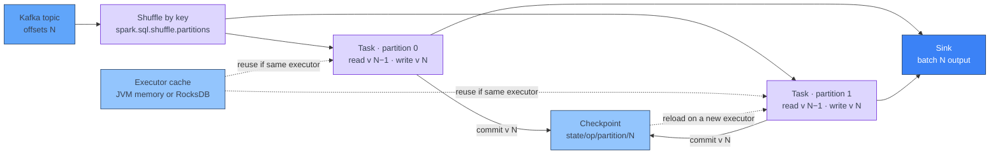

[← Spark Structured Streaming](../index.md)

# Stateful Operations and the State Store

**A stateful operator keeps per-key state across micro-batches in a state
store, which gets a new version with every batch and is saved in the query's
checkpoint — and without a watermark, that state grows forever.** Aggregations,
deduplication, stream–stream joins and custom per-key logic all need to
remember earlier batches. Spark keeps that memory in a state store, partitioned
like a shuffle and owned by executors. Each batch reads the previous version,
applies its updates, and commits the next version to the checkpoint. This page
covers which operations are stateful, how the state store works, how to choose
between the default and RocksDB providers, and how to keep state bounded. All
details are for Apache Spark 3.5.5; items that exist only in Spark 4.x are
marked.

!!! abstract "What you should know after reading this page"
    1. Which operations are **stateless** and which are **stateful**, and why a
       stream–static join is stateless.
    2. How **aggregations**, **`dropDuplicates`**,
       **`dropDuplicatesWithinWatermark`** and **stream–stream joins** keep
       state, and what each needs to keep that state **bounded**.
    3. How **`applyInPandasWithState`** stores custom per-key state, and how
       **timeouts** remove it.
    4. Which operations are **not supported** on streaming DataFrames.
    5. How the **state store** works: partitions, versions, and the
       **HDFS-backed** and **RocksDB** providers — and when to switch.
    6. How to **size and monitor** state from the `stateOperators` section of
       query progress.
    7. Which **query changes** break the state in an existing checkpoint.

---

## Stateless and stateful operations

A **stateless** operation produces its output from the rows of the current
micro-batch alone. A **stateful** operation also needs rows, or results, from
earlier batches.

| Operation | Stateful? | What it remembers |
|---|---|---|
| `select`, `withColumn`, `filter`, `where` | No | Nothing |
| `from_json`, `from_avro`, UDFs | No | Nothing |
| Stream–static join | No | Nothing — the static side is re-read, the stream side is not buffered |
| `groupBy(...).agg(...)`, `groupBy(window(...))` | Yes | The running aggregate per group |
| `dropDuplicates(...)` | Yes | The keys already seen |
| `dropDuplicatesWithinWatermark(...)` | Yes | The keys seen within the watermark delay |
| Stream–stream join | Yes | Buffered rows from **both** inputs |
| `applyInPandasWithState` | Yes | Whatever your function stores per group |

The guide's join support matrix lists every stream–static join type it allows
as "Supported, not stateful". The stream side is joined batch by batch, and
nothing is kept between batches.

Stateless operations are safe on the streaming DataFrame itself: they need no
watermark, work in every output mode, and a replayed batch reads the same
offsets. They can also run inside `foreachBatch`. Keep them there only when you
need a batch-only operation, such as `row_number()` within a batch.

!!! warning "Stateless is replay-safe only if it is deterministic"
    A replay gives the same rows only if each transformation gives the same
    output for the same input.

    | Transformation | Same result on replay? |
    |---|---|
    | `cast`, `where`, `to_json`, `from_avro`, arithmetic | Yes |
    | `current_timestamp()`, `now()` | No, a new time |
    | `uuid()`, `rand()` | No, new values; never use them as keys |
    | A UDF that calls an external service | No, the response may differ |
    | Stream–static join | Only if the static side did not change between the attempts |

    What this means for sinks is in
    [Output Modes, Sinks and Exactly-once](output-modes-and-sinks.md#making-it-idempotent).

!!! info "State is what makes a checkpoint heavy"
    A stateless query's checkpoint holds only offsets and commit markers. A
    stateful query's checkpoint also holds a `state/` folder, with one
    sub-folder per stateful operator and per partition. That folder is what
    grows, what slows down recovery, and what a query change can make
    unreadable. See [Kafka Source and Checkpoints](kafka-source-and-checkpoints.md).

---

## Streaming aggregations

A streaming `groupBy` keeps one state row per group: the group key and the
partial aggregate. Each batch updates the rows for the keys it sees.

```python
from pyspark.sql import functions as F

per_customer = (orders
    .withWatermark("event_time", "10 minutes")
    .groupBy(F.window("event_time", "5 minutes"), "customer_id")
    .agg(F.count("*").alias("orders"), F.sum("amount").alias("amount")))
```

The **watermark** is what lets Spark delete a group. Once the watermark passes
the end of a window, no late row can change it, so its state row is dropped.
That only works in append or update mode, with `withWatermark` on the same
event-time column the aggregation groups by, declared before the aggregation.
The conditions and common mistakes are in
[Event Time and Watermarks](event-time-and-watermarks.md#what-the-watermark-controls).

An aggregation without a time key — `groupBy("customer_id").count()` — keeps
one row per customer for the life of the checkpoint. That is fine for a few
thousand keys; it is unbounded growth for one key per user or device. Windows
and the watermark are explained in
[Event Time and Watermarks](event-time-and-watermarks.md), and the output modes
in [Output Modes, Sinks and Exactly-once](output-modes-and-sinks.md).

---

## Streaming deduplication

### `dropDuplicates`

`dropDuplicates` keeps every key it has seen, so it can drop the next row with
the same key.

```python
# Unbounded: every event_id ever seen stays in state.
events.dropDuplicates(["event_id"])

# Bounded: the event-time column is part of the key, and has a watermark.
(events
    .withWatermark("event_time", "1 hour")
    .dropDuplicates(["event_id", "event_time"]))
```

The second form is bounded because the event-time column is part of the
deduplication key. Once the watermark passes a row's `event_time`, Spark can
remove that key. A watermark on the stream is **not enough on its own**: if
`event_time` is not in the key list, the state still grows forever.

### `dropDuplicatesWithinWatermark` (3.5+)

The bounded form above only works if duplicates carry the **same** event time.
When a producer retries and stamps a new time on each attempt, the duplicates
have different keys and all pass through.

`dropDuplicatesWithinWatermark`, added in Spark 3.5.0, deduplicates on the ID
alone and uses the watermark delay as the time limit:

```python
(events
    .withWatermark("event_time", "1 hour")
    .dropDuplicatesWithinWatermark(["event_id"]))
```

It requires a watermark. Duplicates that arrive within the watermark delay of
each other are dropped. The guide recommends a delay longer than the largest
time difference between duplicates of the same event.

| | `dropDuplicates([id])` | `dropDuplicates([id, event_time])` + watermark | `dropDuplicatesWithinWatermark([id])` + watermark |
|---|---|---|---|
| State bounded | No | Yes | Yes |
| Duplicates with different event times | Dropped | **Not** dropped | Dropped, if within the delay |
| Available in | All versions | All versions | 3.5.0+ |

---

## Stream–stream joins

Any row from one stream may match a row that has not yet arrived on the other.
So Spark buffers **both** inputs in state, and matches each new row against the
buffer of the other side.

To delete buffered rows, Spark needs two things:

1. A **watermark** on the input, so it knows how late rows can be.
2. An **event-time constraint** in the join condition, so it knows when an old
   row can no longer match — a time range
   (`click_time BETWEEN impression_time AND impression_time + INTERVAL 1 HOUR`)
   or a join on equal event-time windows.

```python
from pyspark.sql.functions import expr

impressions_wm = impressions.withWatermark("impression_time", "2 hours")
clicks_wm = clicks.withWatermark("click_time", "3 hours")

joined = impressions_wm.join(
    clicks_wm,
    expr("""
        click_ad_id = impression_ad_id AND
        click_time >= impression_time AND
        click_time <= impression_time + INTERVAL 1 HOUR
    """),
    "leftOuter",
)
```

| Join type | Watermark + time constraint | From the 3.5.5 support matrix |
|---|---|---|
| Inner | Optional | Optionally specify watermark on both sides + time constraints for state cleanup |
| Left outer | **Required** | Must specify watermark on right + time constraints for correct results; optionally on left for all state cleanup |
| Right outer | **Required** | Must specify watermark on left + time constraints; optionally on right for all state cleanup |
| Full outer | **Required** | Must specify watermark on one side + time constraints; optionally on the other side for all state cleanup |
| Left semi | **Required** | Must specify watermark on right + time constraints; optionally on left for all state cleanup |

!!! warning "An inner join without a time bound keeps everything"
    Spark accepts an inner stream–stream join with no watermark and no time
    condition. It runs fine at first, then buffers every row of both streams
    for the life of the checkpoint. Treat "optional" as "optional for
    correctness, required for a job that runs for months".

Outer and semi joins need the bound for **correctness**: Spark can only emit a
`NULL`-padded row once it knows no match can arrive. That has two
consequences:

- Outer results are delayed by the watermark delay plus the time range.
- Watermarks advance only when a micro-batch runs. If one input receives no
  data for a while, outer results can be delayed further.

Stream–stream joins are supported only in **Append** output mode.

---

## Arbitrary stateful processing

When no built-in operator fits — sessions with custom rules, per-key alerting,
"emit once when a condition is first met" — you keep your own state per group.

| API | Language | Spark version |
|---|---|---|
| `mapGroupsWithState`, `flatMapGroupsWithState` | Scala, Java | 2.2+ |
| `applyInPandasWithState` | Python | 3.4+ (experimental) |
| `transformWithState` (Scala, Java), `transformWithStateInPandas` (Python) | — | **Spark 4.0+ only** |

### `applyInPandasWithState`

You call it on grouped data. Spark calls your function once per group that has
new rows in the batch, and once per group whose timeout has expired.

The function receives:

- `key` — the group key, as a tuple.
- `pdfs` — an iterator of pandas DataFrames with the group's new rows.
- `state` — a `GroupState`, holding one tuple that matches `stateStructType`.

It returns an iterator of pandas DataFrames that match `outputStructType`.

```python
import pandas as pd
from pyspark.sql.streaming.state import GroupStateTimeout

def track_session(key, pdfs, state):
    if state.hasTimedOut:
        (count,) = state.get
        state.remove()                      # delete this key's state
        yield pd.DataFrame({"user_id": [key[0]], "events": [count], "closed": [True]})
        return

    count = state.get[0] if state.exists else 0
    for pdf in pdfs:
        count += len(pdf)
    state.update((count,))
    state.setTimeoutDuration(30 * 60 * 1000)  # 30 minutes of inactivity
    yield pd.DataFrame({"user_id": [key[0]], "events": [count], "closed": [False]})

sessions = (events
    .groupBy("user_id")
    .applyInPandasWithState(
        track_session,
        outputStructType="user_id string, events long, closed boolean",
        stateStructType="events long",
        outputMode="Update",
        timeoutConf=GroupStateTimeout.ProcessingTimeTimeout,
    ))
```

### Timeouts

Nothing removes custom state except your own `state.remove()`. A **timeout**
is how your function gets called for a key that has stopped receiving data.

| `timeoutConf` | Set per key with | Fires when |
|---|---|---|
| `GroupStateTimeout.NoTimeout` | — | Never; keys with no new data are never revisited |
| `GroupStateTimeout.ProcessingTimeTimeout` | `state.setTimeoutDuration(ms)` | The given wall-clock duration has passed |
| `GroupStateTimeout.EventTimeTimeout` | `state.setTimeoutTimestamp(ms)` | The **watermark** passes the given timestamp; needs `withWatermark` |

A timeout fires no earlier than it is due, but it can fire later: Spark checks
timeouts only when a micro-batch runs.

!!! warning "`NoTimeout` plus no `remove()` is unbounded state"
    With `NoTimeout`, a key that receives no more data is never seen again by
    your function, so it can never be removed. Use a timeout for any key space
    that keeps growing, and call `state.remove()` when a key is done.

---

## Unsupported operations

These operations fail with an `AnalysisException` on a streaming DataFrame in
Spark 3.5.5:

| Operation | Instead |
|---|---|
| `limit`, taking the first N rows | — |
| `distinct` | `dropDuplicates` with a watermark |
| Sorting, except after an aggregation in **Complete** mode | Sort in the sink, or in `foreachBatch` |
| Some outer joins | See the join support matrix above; stream–static right and full outer joins are not supported |
| Chaining several stateful operations in **Update** or **Complete** mode | Use **Append** mode, or split into several queries with one stateful operation each |
| `mapGroupsWithState` / `flatMapGroupsWithState` followed by another stateful operation, in Append mode | Split into several queries |
| `count()`, `foreach()`, `show()` on the streaming DataFrame | `groupBy().count()`, `writeStream.foreach(...)`, the console sink |

The operations in the last row are actions that would run immediately. On a stream there is no
"end" to count to, so you start a streaming query instead.

---

## How the state store works

The **state store** is a versioned key-value store. Each stateful operator has
its own store, split into partitions.

### Partitions and versions

- State is **partitioned like a shuffle**: rows are hashed by key into
  `spark.sql.shuffle.partitions` partitions. One task per partition owns that
  slice of the state.
- The number of partitions is **fixed by the first run** of the checkpoint.
  Changing `spark.sql.shuffle.partitions` afterwards has no effect on the
  stateful operators; to change it, start with a new checkpoint.
- Each micro-batch commits a **new version** of every partition. Batch *N*
  reads version *N − 1*, applies its updates, and writes version *N*. If a task
  is retried, it reloads the right version and redoes the work.



### Providers

Spark 3.5.5 ships two state store providers. Choose with
`spark.sql.streaming.stateStore.providerClass`.

| | **HDFS-backed** (default) | **RocksDB** (3.2+) |
|---|---|---|
| Class | `HDFSBackedStateStoreProvider` | `org.apache.spark.sql.execution.streaming.state.RocksDBStateStoreProvider` |
| Live state lives in | An in-memory map in the **executor JVM** | **Native memory and local disk**, outside the JVM heap |
| Written to the checkpoint | A **delta file** per version, consolidated into **snapshot files** in the background | RocksDB files (incremental snapshots), or a **changelog** if enabled |
| GC pressure | Grows with state size | Low |
| Good for | Small or moderate state | Millions of keys, large windows, long deduplication delays |

The guide's reason to switch is specific: with millions of keys in state, the
default provider puts so many objects on the JVM heap that **GC pauses** make
micro-batch durations jumpy. RocksDB moves that state off-heap.

```python
spark.conf.set(
    "spark.sql.streaming.stateStore.providerClass",
    "org.apache.spark.sql.execution.streaming.state.RocksDBStateStoreProvider",
)
```

!!! danger "The provider is fixed for the life of a checkpoint"
    The guide lists `spark.sql.streaming.stateStore.providerClass` among the
    settings that cannot change after a query has run. Moving an existing query
    from the default provider to RocksDB means a **new checkpoint** — and
    rebuilding the state from the source. Choose RocksDB at the start for any
    query whose key space can grow.

### RocksDB options worth knowing

| Config | Default | What it does |
|---|---|---|
| `spark.sql.streaming.stateStore.rocksdb.changelogCheckpointing.enabled` | `false` | Uploads only the changes since the last checkpoint, with snapshots taken in the background. Lowers batch latency. |
| `spark.sql.streaming.stateStore.rocksdb.boundedMemoryUsage` | `false` | Caps the total memory of all RocksDB instances on one executor |
| `spark.sql.streaming.stateStore.rocksdb.maxMemoryUsageMB` | `500` | The cap used when bounded memory is on |
| `spark.sql.streaming.stateStore.rocksdb.trackTotalNumberOfRows` | `true` | Keeps `numRowsTotal` accurate, at the cost of an extra lookup per write |

**Changelog checkpointing** appears in the Spark 3.5 guide; it is not in 3.4.
It can be switched on or off for an existing RocksDB checkpoint — the provider
reads both formats — but the change applies only after a restart.

!!! tip "Bound RocksDB memory on Kubernetes"
    RocksDB memory is native memory, not heap. It does not show up in
    `spark.executor.memory`, and if it grows unchecked the container can be
    killed for exceeding its memory limit. Turn on `boundedMemoryUsage`, set
    `maxMemoryUsageMB`, and leave room for it in the executor's memory overhead.

### State store and task locality

A state store partition is cheapest to use on the executor that already has it
loaded. Spark asks the scheduler to run the next batch's task for that
partition on the same executor, but this is a preference, not a rule.

If a task lands on another executor — for example after an executor is lost or
replaced — that executor **loads the state from the checkpoint** first. For
large state, that load can dominate the batch duration. `spark.locality.wait`
controls how long the scheduler waits for the preferred executor. For the
default provider, the custom metrics `loadedMapCacheHitCount` and
`loadedMapCacheMissCount` show how often state was found already loaded.

---

## Sizing and monitoring state

Every progress event (`query.lastProgress`, or a `StreamingQueryListener`) has
a `stateOperators` list with one entry per stateful operator. The same numbers
appear in the **Structured Streaming** tab of the Spark UI.

| Field | Meaning | Watch for |
|---|---|---|
| `operatorName` | Which operator this entry describes | — |
| `numRowsTotal` | Rows currently in state | Steady growth over days: state is not being cleaned up |
| `numRowsUpdated` | Rows written in this batch | Spikes after a restart or a backlog |
| `numRowsRemoved` | Rows deleted in this batch | Always `0` on a long-running query: nothing ever expires |
| `numRowsDroppedByWatermark` | Input rows dropped as too late | Non-zero means late data is being discarded |
| `memoryUsedBytes` | Memory used by the state store | Growth together with batch duration |
| `commitTimeMs` | Time to commit the new version | Commit time rising with state size |
| `numShufflePartitions`, `numStateStoreInstances` | How the state is split | — |
| `customMetrics` | Provider-specific metrics | See below |

With the RocksDB provider, `customMetrics` carries RocksDB internals, for
example `rocksdbSstFileSize`, `rocksdbPinnedBlocksMemoryUsage`,
`rocksdbCommitCheckpointLatency` and `rocksdbGetLatency`.

```python
for op in query.lastProgress["stateOperators"]:
    print(op["operatorName"], op["numRowsTotal"], op["numRowsRemoved"],
          op["memoryUsedBytes"])
```

!!! note "Read the trend, not one batch"
    One batch's `numRowsTotal` says little. A line that only goes up, while
    `numRowsRemoved` stays at zero, says the watermark, the dedup key or the
    timeout is not bounding the state. How to read the rest of the progress
    report is covered in
    [Micro-batch Execution and Triggers](micro-batch-execution-and-triggers.md).

---

## State schema and query changes

State is stored with a schema derived from the operator: the grouping keys and
aggregates, the deduplication columns, the join keys, or your
`stateStructType`. On restart from the same checkpoint, Spark expects that
schema to be unchanged. Changing it, or adding or removing a stateful
operator, is not allowed. Changing the logic inside an arbitrary stateful
function is. The full table of which changes a checkpoint survives, for each
stateful operation and for sources, sinks and projections, is in
[Kafka Source and Checkpoints](kafka-source-and-checkpoints.md#changes-a-checkpoint-survives).

!!! tip "Make custom state evolvable"
    The guide's suggestion for custom state whose shape will change: store it
    as bytes encoded with a format that supports schema evolution, such as
    Avro, and decode it in your function. Spark then only sees a binary column
    that never changes.

!!! info "Reading state for debugging is Spark 4.0+"
    Spark 4.0 adds a state data source, `spark.read.format("statestore")`, to
    read the contents of a checkpoint's state as a DataFrame. It does not exist
    in Spark 3.5.5. On 3.5.5 the only views of state are the progress metrics
    above.

---

## Spark and Flink compared

| | **Spark Structured Streaming 3.5.5** | **Apache Flink** |
|---|---|---|
| Unit of state | State store partition per stateful operator, keyed by the operator's key | Keyed state per key, in key groups |
| Where live state lives | Executor JVM memory (default) or RocksDB | TaskManager heap (HashMap) or RocksDB |
| How state is persisted | A new version per micro-batch, committed to the checkpoint | Asynchronous snapshots triggered by checkpoint barriers |
| Cleaning up built-in operators | **Watermark-based**: windows, time-bounded dedup and joins expire with the watermark | Windows clean up on firing; other operators need **state TTL** (`table.exec.state.ttl`, `StateTtlConfig`) |
| Cleaning up custom state | `GroupState` timeouts and `state.remove()` | Timers and state TTL |
| Rescaling state | Partition count fixed per checkpoint by `spark.sql.shuffle.partitions` | Up to the max parallelism, by key group |
| Planned upgrades | Restart from the **same checkpoint**; no savepoints | **Savepoints**, owned by you, with operator UIDs |
| Query changes | Rules per stateful operation (previous section) | UIDs in DataStream; generated IDs make SQL changes hard |

Two practical differences stand out. A Spark aggregation without a time key has
no TTL to fall back on — the watermark is the only cleanup, so the key design
matters more. And Spark has no savepoint: the checkpoint is both the recovery
log and the upgrade path. The Flink side is in
[State, Checkpoints and Savepoints](../../apache-flink/concepts/state-and-checkpoints.md)
and [Windows and Joins](../../apache-flink/concepts/windows-and-joins.md).

---

## Self-check

Answer these from memory before expanding them. They map to the outcomes listed
at the top of the page.

??? question "1. A query enriches a Kafka stream with a static lookup table using a left join, then writes the result. Does it have state in its checkpoint?"
    No. A stream–static join is stateless: each micro-batch joins its own rows
    against the static side, and nothing is kept between batches. The
    checkpoint holds offsets and commit markers, but no `state/` folder for the
    join.

??? question "2. A query runs `withWatermark(\"event_time\", \"1 hour\").dropDuplicates([\"event_id\"])`. After a month, `numRowsTotal` is still climbing. Why, and what are the two fixes?"
    The event-time column is not part of the deduplication key, so the
    watermark cannot expire any key. Either add it —
    `dropDuplicates(["event_id", "event_time"])`, if duplicates share the same
    event time — or use `dropDuplicatesWithinWatermark(["event_id"])` (3.5+),
    which also handles duplicates with different event times.

??? question "3. You change a stream–stream join from inner to left outer, with no watermark on either side. What happens?"
    The query is rejected. A left outer stream–stream join needs a watermark on
    the right side and an event-time constraint in the join condition, so
    Spark knows when a left row will never match and can emit it with `NULL`s.
    Even with those, changing the join type is not allowed on an existing
    checkpoint — it needs a new one.

??? question "4. An `applyInPandasWithState` function uses `GroupStateTimeout.NoTimeout` and never calls `state.remove()`. What happens to a user who stops sending events?"
    Their state stays forever. With no timeout, the function is only called for
    groups with new rows, so it never sees that user again and never removes
    the state. Use `ProcessingTimeTimeout` or `EventTimeTimeout` and call
    `state.remove()` when the timeout fires.

??? question "5. Micro-batch durations jump between 2 and 20 seconds, executors show long GC pauses, and the query keeps tens of millions of keys. What do you change, and what does it cost?"
    Switch the state store to RocksDB with
    `spark.sql.streaming.stateStore.providerClass`. It keeps state in native
    memory and on local disk instead of the JVM heap. The provider cannot change
    on an existing checkpoint, so the query needs a new checkpoint and its state
    must be rebuilt from the source. Bound RocksDB memory on Kubernetes.

??? question "6. Which fields in `stateOperators` tell you that state is not being cleaned up?"
    `numRowsTotal` that only grows over days, together with `numRowsRemoved`
    that stays at zero. `memoryUsedBytes` and `commitTimeMs` usually grow with
    it, and batch durations follow.

??? question "7. You add `sum(\"discount\")` to an existing streaming aggregation and restart from the same checkpoint. Is that safe?"
    No. Changing the number of aggregates changes the state schema, which is not
    allowed between restarts. The restart can fail or misbehave; plan for a new
    checkpoint and a chosen starting offset.

---

## References

### Apache Spark

- [Structured Streaming Programming Guide (3.5.5)](https://archive.apache.org/dist/spark/docs/3.5.5/structured-streaming-programming-guide.html) — stateful operations, unsupported operations, the state store and recovery after query changes.
- [`GroupedData.applyInPandasWithState` (3.5.5)](https://archive.apache.org/dist/spark/docs/3.5.5/api/python/reference/pyspark.sql/api/pyspark.sql.GroupedData.applyInPandasWithState.html) — arguments, the function contract, `GroupState` and timeouts.

### Related

- [Spark Structured Streaming overview](../index.md) — what each Spark page covers.
- [Micro-batch Execution and Triggers](micro-batch-execution-and-triggers.md) — the batch lifecycle and reading query progress.
- [Kafka Source and Checkpoints](kafka-source-and-checkpoints.md) — the checkpoint folder and which query changes it survives.
- [Event Time and Watermarks](event-time-and-watermarks.md) — windows and the watermark that bounds state.
- [Output Modes, Sinks and Exactly-once](output-modes-and-sinks.md) — which output modes each stateful operation allows.
- [State, Checkpoints and Savepoints (Flink)](../../apache-flink/concepts/state-and-checkpoints.md) — the Flink counterpart of this page.
- [Windows and Joins (Flink)](../../apache-flink/concepts/windows-and-joins.md) — Flink operators that clean up their own state.
