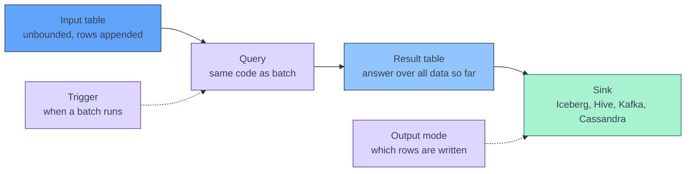

[← Streaming](../index.md)

# Summary: Triggers, Output Modes, Watermarks and Sinks

This page is a one-page recap of streaming configs and a digest of the official
[Structured Streaming Programming Guide](https://spark.apache.org/docs/latest/streaming/index.html).
Each section links to the concept page that covers it in depth.

!!! abstract "What you should know after reading this page"
    1. What the **result table** is, and why Spark never stores it in full.
    2. What each **trigger** does, and how it affects the watermark and the
       sink.
    3. What **append**, **update** and **complete** write at each trigger.
    4. How the **watermark** is computed, what it controls in each output mode,
       how append and update handle **out-of-order** rows, and which queries
       need **no watermark**.
    5. Which output modes a **Hive** table and an **Iceberg** table accept, and
       how to get update-style results into Iceberg.
    6. When to use **`foreachBatch`** instead of a built-in sink.
    7. What else the **official guide** covers: sources, state, query
       management, performance options and settings fixed per checkpoint.

---

## Input table, result table, sink

Structured Streaming treats a stream as an **input table** that keeps growing.
Your query is written as if it ran over that table in batch. The **result
table** is the answer that query would give over **all the data received so
far**. After every trigger, Spark updates the result table with the new input,
and the output mode picks which of its rows go to the sink.



[**The result table is a concept, not a stored table.**](https://spark.apache.org/docs/latest/streaming/getting-started.html#basic-concepts)

[**Exactly-once comes from three parts:**](concepts/output-modes-and-sinks.md#the-three-ingredients) a replayable source with offsets, a
checkpoint whose write-ahead log records each batch's offset range before it
runs, and an idempotent sink.

---

## Triggers: when a batch runs

The trigger is set with `.trigger(...)` on the writer. It decides **when** the
next micro-batch starts, not how much data it reads.

| Trigger | PySpark | Behaviour | Fits |
|---|---|---|---|
| Default | no `.trigger(...)` call | The next batch starts as soon as the previous one commits. | Lowest micro-batch latency |
| Fixed interval | `.trigger(processingTime="1 minute")` | One batch per interval. A batch that overruns is followed straight away by the next. | Most production jobs; controls the commit rate to tables |
| Available-now | `.trigger(availableNow=True)` | Processes all data available at start, in several batches that respect `maxOffsetsPerTrigger`, then stops. | Scheduled incremental runs |
| Once (deprecated) | `.trigger(once=True)` | Same, but in **one** batch, ignoring source limits. | Old code; use available-now |
| Continuous (experimental) | `.trigger(continuous="1 second")` | Long-running tasks, about 1 ms latency. The value is the checkpoint interval. | Not for production: map-like operations only, at-least-once |

How the trigger interacts with the rest of this page:

- **The watermark only moves between batches.** In append mode the trigger
  interval adds to latency, roughly one interval.
- **Available-now runs several batches**, so the watermark moves during the run
  and closed windows are written before it stops.
- **Every batch is one commit to the sink.** A short trigger means many small
  files and, for Iceberg, many snapshots.

Details, overruns and monitoring are in
[Micro-batch Execution and Triggers](concepts/micro-batch-execution-and-triggers.md).

---

## Output modes: which rows are written

| | **Append** (default) | **Update** | **Complete** |
|---|---|---|---|
| Writes at each trigger | Rows **added** since the last trigger. Each row is written **once** and never changed. | Rows **added or changed** since the last trigger | The **whole** result table |
| Windowed aggregation | Only with a watermark; a window is written when the watermark passes its end | Yes; a window is written every time it changes | Yes |
| Aggregation without a watermark | No | Yes (**with endless state)** | Yes |
| Stream–stream join | Yes | No | No |
| Stateless query | Yes | Yes (same as append) | No |
| State cleanup | Watermark | Watermark | **Never** |
| The sink must | Append | **Upsert by key** | Replace its contents |

The full compatibility matrix, including `flatMapGroupsWithState`, is in
[Output Modes, Sinks and Exactly-once](concepts/output-modes-and-sinks.md#which-query-supports-which-mode).

!!! info "Session windows do not support update mode"
    In a streaming query, `session_window` supports append and complete only:
    a session's start and end change as it grows, so update mode would leave
    stale rows. See
    [Session windows](concepts/event-time-and-watermarks.md#session-windows).

---

## Watermarks: when a result is final

```python
orders_wm = orders.withWatermark("created_at", "10 minutes")
# watermark = max(created_at seen so far) − 10 minutes
```

### The rules

- A window is **closed** when `watermark ≥ window end`. Its result is final and
  its state is deleted.
- A row is **late** when its event time is behind the watermark, and its window
  is already closed. Stateful operators ignore it; stateless operators let it
  through.
- A row that is out of order but **ahead of the watermark** is counted like any
  other.

### How Spark computes it

- **One watermark per query.** The driver takes the maximum event time across
  all partitions at the end of a batch, subtracts the delay, and the **next**
  batch uses the result. The watermark lags one batch behind the data.
- **Several inputs** are combined by
  `spark.sql.streaming.multipleWatermarkPolicy`: `min` (default, safe) or
  `max`.
- **It only moves when data arrives.** If every input goes quiet, the last open
  windows stay open. No-data batches
  (`spark.sql.streaming.noDataMicroBatches.enabled`, on by default) apply a
  watermark that has already moved; they do not move it.
- **The guarantee is one-way.** Rows less delayed than the threshold are never
  dropped. Rows more delayed are *not guaranteed* to be dropped.

### What it controls in each mode

| Job | Append | Update | Complete |
|---|---|---|---|
| When a window is written | ✅ After the watermark passes its end | ❌ Every batch it changes | ❌ Every batch |
| When state is deleted | ✅ | ✅ | ❌ Never |
| Which rows are too late | ✅ | ✅ | ❌ |

In update mode the delay **does not add latency**. It only decides how long a
window can still be revised.

### Without a watermark

| Query | Without a watermark |
|---|---|
| Stateless: `select`, `filter`, `map`, join with a static table | Works. Nothing is kept between batches, so there is nothing to clean. |
| Aggregation in append mode | Fails at start: append cannot know when a group is final. |
| Aggregation in update or complete mode | Works, but state grows forever. |
| `dropDuplicates`, stream–stream inner join | Works, but state grows forever. |
| `dropDuplicatesWithinWatermark`, stream–stream outer join | Fails at start. |

A stateless pass-through, such as raw events from Kafka to Cassandra or
Iceberg, needs no watermark.

### Latency in append mode

```text
append latency ≈ (window end − event time) + delay + about one trigger interval + batch duration
```

A row early in a 10-minute window waits for the rest of the window, then for
the delay, then for the batch that applies the new watermark. If the input goes
quiet, it can wait indefinitely.

### Out-of-order rows: append waits, update revises

Window `[12:00, 12:10)`, delay 10 minutes, no-data batches on:

| Batch | New rows | Watermark in effect | Window count | Append writes | Update writes |
|---|---|---|---|---|---|
| 0 | 12:02 | none | 1 | — | `→ 1` |
| 1 | 12:15 | 11:52 | 1 | — | — (only `[12:10, 12:20)`) |
| 2 | **12:07** (out of order) | 12:05 | 2 | — | `→ 2` |
| 3 | 12:24 | 12:05 | 2 | — | — |
| 4 | (no-data batch) | **12:14** | closed | **`→ 2`**, once | — (state deleted) |
| 5 | 12:08 | 12:14 | — | — (too late) | — (too late) |

Both modes count the out-of-order row from batch 2 and end with the same
answer. **Append** writes one final row after the window closes. **Update**
writes a provisional row straight away and a correction later, so the sink must
overwrite by key.

### Choosing the delay

| Delay | Effect |
|---|---|
| Too small | Ordinary producer jitter makes rows late; they are silently ignored. |
| Matched to measured disorder | Rare late rows. In append mode, results appear about *window end + delay + one trigger*. |
| Too large | Large state. In append mode, very late results. |

Base the delay on measured disorder, such as the p99 of processing time minus
event time, and remember that a lagging Kafka partition counts too: the fast
partitions push the watermark forward. Everything else, including time zones
and the Kafka timestamp, is in
[Event Time and Watermarks](concepts/event-time-and-watermarks.md).

---

## Sinks: Hive and Iceberg

!!! note "Hive table or Hive catalog"
    Iceberg tables can be registered in a **Hive catalog**. Those are
    Iceberg tables and follow the Iceberg column below. The Hive column is about
    **plain Hive tables**: Parquet or ORC files in a partitioned directory.

| | **Hive table** (Parquet or ORC) | **Iceberg table** |
|---|---|---|
| Row-level upsert from Spark | ❌ | ✅ `MERGE INTO` |
| Append | ✅ The only streaming mode | ✅ `writeStream` with `outputMode("append")` |
| Complete | Not with the file sink. With `foreachBatch` and an overwrite, but not atomic for readers. | ✅ Replaces the table contents every batch, in one atomic commit; small results only |
| Update | ❌ | Not with `writeStream`. Use update mode with `foreachBatch` and `MERGE INTO`. |
| Out-of-order rows | Append with a watermark: wait, then write once | Wait (append) or revise (update with `MERGE INTO`) |
| Replay after a failure | File sink skips a batch already in `_spark_metadata`. In `foreachBatch`, overwrite whole partitions so a replay replaces them. | `writeStream` commits once per batch. In `foreachBatch`, `MERGE INTO` on a natural key absorbs a replay. |
| Main cost | Small files, and partitions to register in the metastore | One snapshot per batch: compaction and snapshot expiry |

### Hive tables

Spark's file sink, which writes a plain Hive table directly, only appends. A
streaming aggregation into Hive therefore usually uses **append mode with a
watermark**. The trade-off is latency of about *window end + delay*, in return
for rows that never change.

Complete mode is possible through `foreachBatch`. In complete mode `batch_df`
holds the whole result table, so a batch overwrite replaces the table:

```python
def overwrite_counts(batch_df, batch_id):
    batch_df.write.mode("overwrite").insertInto("sales.customer_counts")
```

A replay writes the same result again, so it is safe. But a Hive overwrite
removes the old files before writing the new ones, so a reader at that moment
can see an empty or partial table. Iceberg does the same swap in one atomic
commit.

Things to watch:

- The file sink's `_spark_metadata` log is only honoured by Spark readers.
  Hive and other engines list the directory and can see files from a failed
  attempt. They also only see new partitions once these are registered in the
  metastore.
- For earlier results, recompute the affected partitions in `foreachBatch` and
  overwrite them. This works, but every batch rewrites whole partitions.

### Iceberg tables

Append and complete work with `writeStream` directly. For update-style results,
write the changed rows with `MERGE INTO`:

```python
def merge_counts(batch_df, batch_id):
    batch_df.createOrReplaceTempView("batch_counts")
    batch_df.sparkSession.sql("""
        MERGE INTO lake.sales.order_counts t
        USING batch_counts s
        ON t.window_start = s.window_start AND t.customer_id = s.customer_id
        WHEN MATCHED THEN UPDATE SET *
        WHEN NOT MATCHED THEN INSERT *
    """)

query = (
    counts.writeStream
    .outputMode("update")
    .foreachBatch(merge_counts)
    .option("checkpointLocation", "s3a://checkpoints/order-counts")
    .trigger(processingTime="1 minute")
    .start()
)
```

`foreachBatch` is at-least-once by default. The merge on `window_start` and
`customer_id` makes a replayed batch overwrite the same rows instead of adding
new ones.

**Every micro-batch is one Iceberg commit.** Use a trigger of at least one
minute, and schedule `rewrite_data_files`, `expire_snapshots` and
`rewrite_manifests` as a separate batch job. See
[Output Modes, Sinks and Exactly-once](concepts/output-modes-and-sinks.md#writing-to-iceberg).

---

## foreachBatch

Every query runs as micro-batches, whatever the sink. `foreachBatch` is a
sink: instead of a built-in writer, Spark calls your function with each
micro-batch as a plain DataFrame and its `batch_id`. Inside it, any batch API
works.

| Use `foreachBatch` for | Use a built-in sink for |
|---|---|
| Upserts with `MERGE INTO` (update mode into Iceberg) | Appends to Iceberg: `writeStream.format("iceberg")` |
| Targets written with a batch writer, such as Cassandra or JDBC | Appends to files or Hive: the file sink is exactly-once |
| Several outputs from one query; `persist()` the batch first | Kafka: same at-least-once guarantee, less code |
| Overwrites, such as complete mode into Hive | |
| Operations a streaming DataFrame does not allow, such as `row_number()` within a batch | |

`foreachBatch` is **at-least-once**: a replayed batch calls the function again
with the same `batch_id`, so the write must be idempotent. It does not work
with the continuous trigger. See
[Output Modes, Sinks and Exactly-once](concepts/output-modes-and-sinks.md#foreachbatch).

!!! warning "An aggregation inside foreachBatch is not a streaming aggregation"
    `batch_df.groupBy(...)` inside `foreachBatch` aggregates **that micro-batch
    only**. It has no state store and no watermark, so a window that spans two
    batches gets two partial results. Adding them up in the sink
    (`SET cnt = cnt + s.cnt`) is not idempotent: a replay adds the batch twice.
    For totals across batches, aggregate on the stream and let `foreachBatch`
    only write the result. Per-batch aggregation suits per-batch metrics, or
    keeping the latest row per key before an upsert.

---

## The rest of the official guide

The guide has four pages. **Getting Started** is the programming model, covered
at the top of this page. The other three:

### APIs on DataFrames and Datasets

Windows, watermarks, output modes, sinks and triggers are covered above. The
other sections:

| Section | Key points | In depth |
|---|---|---|
| Input sources | File (files must be moved into the folder atomically; schema required), Kafka, and socket, rate and rate-per-micro-batch for testing only. Only replayable sources are fault-tolerant. | [Kafka Source and Checkpoints](concepts/kafka-source-and-checkpoints.md) |
| Joins | Stream–static joins are stateless. Stream–stream joins buffer both sides and need a watermark plus a time condition: optional for inner joins, required for outer and semi joins. | [Stateful Operations](concepts/stateful-operations-and-state-store.md#streamstream-joins) |
| Deduplication | `dropDuplicates` with the event-time column and a watermark, or `dropDuplicatesWithinWatermark`. | [Stateful Operations](concepts/stateful-operations-and-state-store.md#streaming-deduplication) |
| Custom state | `mapGroupsWithState` and `flatMapGroupsWithState` are legacy. **4.0+:** `transformWithState`. On 3.5.5, Python uses `applyInPandasWithState`. | [Stateful Operations](concepts/stateful-operations-and-state-store.md#arbitrary-stateful-processing) |
| Unsupported operations | `limit`, `distinct`, sorting (except after an aggregation in complete mode), chained stateful operations in update or complete mode, and `count()`, `foreach()`, `show()`. | [Stateful Operations](concepts/stateful-operations-and-state-store.md#unsupported-operations) |
| State store | HDFS-backed by default, RocksDB for large state. Tasks prefer the executor that already holds the state. **4.0+:** a read-only State Data Source. | [Stateful Operations](concepts/stateful-operations-and-state-store.md#how-the-state-store-works) |
| Starting queries | `writeStream` sets the sink, output mode, query name, trigger and checkpoint location. `readStream.table()` and `writeStream.toTable()` exist since 3.1. | — |
| Managing queries | `query.id` stays the same across restarts, `query.runId` changes on every start. `stop()`, `awaitTermination()`, `lastProgress`. `spark.streams.active` and `awaitAnyTermination()` manage several queries. | — |
| Monitoring | `lastProgress` and `status`, `StreamingQueryListener`, and Dropwizard metrics with `spark.sql.streaming.metricsEnabled`. | [Micro-batch Execution and Triggers](concepts/micro-batch-execution-and-triggers.md#monitoring-a-query) |
| Recovery | The checkpoint holds offsets and state. Only some query changes are allowed on an existing checkpoint. | [Kafka Source and Checkpoints](concepts/kafka-source-and-checkpoints.md#changes-a-checkpoint-survives) |

### Performance Tips

- **Asynchronous progress tracking** (`asyncProgressTrackingEnabled=true`)
  writes the offset and commit logs in the background, every
  `asyncProgressTrackingCheckpointIntervalMs` (default 1000), to cut batch
  latency. It works for stateless queries with a Kafka sink only, and gives up
  exactly-once. To turn it off safely, first set the interval to `0` and let
  two batches run.
- **Continuous processing** (experimental): besides the limits in the trigger
  table, it needs one core per input partition and has no task retries, so a
  failure stops the query. Its checkpoints are compatible with micro-batch, so
  a query can switch triggers.

Neither is a good default. For millisecond latency, use
[Apache Flink](../apache-flink/index.md).

### Additional Information

- **Settings fixed once a checkpoint exists**; to change them, start a new
  checkpoint: `spark.sql.shuffle.partitions` (state is hash-partitioned by key;
  use `coalesce` to run fewer stateful tasks),
  `spark.sql.streaming.stateStore.providerClass` and
  `spark.sql.streaming.multipleWatermarkPolicy`.
- **Further reading:** the Kafka Integration Guide, the Spark SQL guide,
  runnable examples, Databricks blog posts and Spark Summit talks.

---

## Choosing a combination

| You need | Output mode | Trigger | Sink |
|---|---|---|---|
| Final windowed aggregates in the lake | Append with a watermark | `processingTime`, minutes | Hive or Iceberg |
| Early aggregates that are revised as data arrives | Update with a watermark | `processingTime`, about 1 minute | Iceberg with `MERGE INTO`, or Cassandra |
| A scheduled catch-up instead of an always-on job | Append | `availableNow` | Hive or Iceberg |
| A small result that is replaced each time | Complete | default or `processingTime` | Small Iceberg table |
| Raw events, no aggregation | Append, no watermark needed | `processingTime` | Hive or Iceberg |
| Latency in milliseconds | — | — | Use Flink; see [Apache Flink](../apache-flink/index.md) |

---

## Flink and Spark compared

| | Spark Structured Streaming | Apache Flink |
|---|---|---|
| Execution | Micro-batches | Records flow through long-running operators |
| Watermark | One per query, computed between batches | Per source partition, sent with the records, minimum across inputs |
| A quiet Kafka partition | Does not hold the watermark back | Holds it back, unless idleness is configured |
| Waiting for disorder and allowing revisions | One delay does both | Out-of-orderness bound and `allowedLateness` are separate |
| Rows that are too late | Ignored | Ignored, or sent to a side output |
| Update-style results | `outputMode("update")` to a keyed sink | Window triggers with `allowedLateness`, or a SQL changelog to an upsert sink |

See [Time and Watermarks](../apache-flink/concepts/time-and-watermarks.md) for
the Flink side.

---

## References

### Apache Spark

- [Getting Started: Programming Model (latest)](https://spark.apache.org/docs/latest/streaming/getting-started.html#programming-model): the input table, result table and output modes.
- [APIs on DataFrames and Datasets (latest)](https://spark.apache.org/docs/latest/streaming/apis-on-dataframes-and-datasets.html): sources, operations, state, starting, monitoring and recovering queries.
- [Performance Tips (latest)](https://spark.apache.org/docs/latest/streaming/performance-tips.html): asynchronous progress tracking and continuous processing.
- [Additional Information (latest)](https://spark.apache.org/docs/latest/streaming/additional-information.html): settings fixed per checkpoint, further reading and talks.
- [Structured Streaming Programming Guide (3.5.5)](https://archive.apache.org/dist/spark/docs/3.5.5/structured-streaming-programming-guide.html): the same guide for the version these pages target.
- [Iceberg: Spark Structured Streaming](https://iceberg.apache.org/docs/latest/spark-structured-streaming/): streaming writes and maintenance for streaming tables.

### Related

- [Spark Structured Streaming overview](index.md)
- [Micro-batch Execution and Triggers](concepts/micro-batch-execution-and-triggers.md): batch lifecycle, triggers and monitoring.
- [Event Time and Watermarks](concepts/event-time-and-watermarks.md): windows, the watermark, several inputs and time zones.
- [Stateful Operations and the State Store](concepts/stateful-operations-and-state-store.md): what state each operator keeps and how it is cleaned.
- [Output Modes, Sinks and Exactly-once](concepts/output-modes-and-sinks.md): output modes, `foreachBatch` and idempotent writes.
