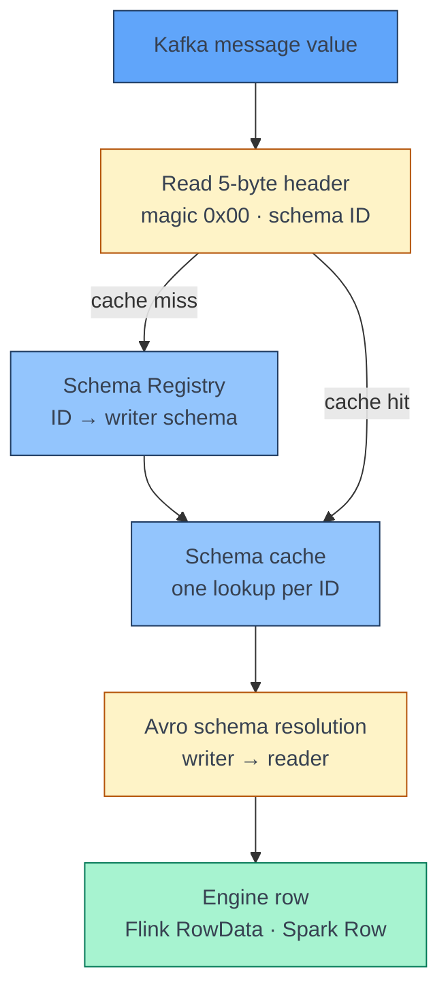

[← Streaming](../index.md)

# Avro and Schema Registry

**A Confluent Avro message on Kafka does not carry its schema — it carries a
5-byte pointer to it.** The producer registers the schema in Schema Registry
and writes only its ID in front of the binary payload. Every consumer has to
read that ID, fetch the schema it points to, and decode the payload with it.
Flink and Spark both consume this format, but they split that work very
differently, and most decoding bugs come from not knowing which part your
engine does for you.

!!! abstract "What you should know after reading this page"
    1. Why the schema lives in **Schema Registry** rather than in each message.
    2. The **wire format**: one magic byte, a 4-byte schema ID, then the Avro
       payload — and why it is 5 bytes, not 4.
    3. How **subjects, versions and schema IDs** relate, and what each
       **compatibility mode** promises.
    4. What **writer and reader schemas** are, and how Avro schema resolution
       makes a compatible change safe at decode time.
    5. What **Flink's `avro-confluent` format** does for you, and the gap in the
       PyFlink DataStream API.
    6. What you must do yourself in **Spark** — strip the header, and handle
       more than one writer schema.
    7. How Avro types, and especially **timestamps**, map to Flink and Spark.
    8. What happens when a message **fails to decode**, and where bad records
       should go.

---

## Why a registry

Avro binary data is compact because it contains **no field names and no
types** — only values, in schema order. Without the exact schema the bytes were
written with, they cannot be read at all.

Embedding the schema in every message would defeat the point; a schema is often
larger than the record. Instead, the producer **registers** the schema once in
Schema Registry, receives an **ID**, and sends that ID with each message.
Consumers look the ID up, usually once, and cache the result.

---

## The wire format

Every message value — and the key, if it is Avro too — starts with a **5-byte
header**:

```text
byte 0      bytes 1–4                 bytes 5 …
┌──────┬──────────────────────────┬──────────────────────────────┐
│ 0x00 │ schema ID  (int32, big   │ Avro binary-encoded record   │
│magic │ endian)                  │ (no Avro container header)   │
└──────┴──────────────────────────┴──────────────────────────────┘
```

| Bytes | Field | Meaning |
|---|---|---|
| 0 | **Magic byte** | Always `0x00` — the Confluent wire-format version. Anything else means the message is not in this format. |
| 1–4 | **Schema ID** | A 32-bit big-endian integer, assigned by Schema Registry. |
| 5 … | **Payload** | The record in Avro binary encoding, *without* the Avro object-container header that `.avro` files have. |

!!! warning "One magic byte, not four"
    The header is often misremembered as "4 magic bytes". It is **1** magic byte
    followed by a **4-byte** schema ID — 5 bytes in total. Strip 4 and every
    record decodes as garbage; strip 5 and it decodes.

---

## Subjects, versions and schema IDs

| Concept | What it is |
|---|---|
| **Subject** | A named history of schemas. With the default naming strategy, a topic's value schema is the subject `<topic>-value`, and its key schema is `<topic>-key`. |
| **Version** | A schema's position in its subject's history: 1, 2, 3 … |
| **Schema ID** | A registry-wide identifier for one exact schema. It is what goes on the wire. The same schema registered under two subjects gets the same ID. |

When a producer registers a new version, the registry checks it against the
subject's **compatibility mode** before accepting it:

| Mode | The new schema must… | Upgrade order |
|---|---|---|
| `BACKWARD` (default) | Read data written with the **previous** version. | Consumers first. |
| `FORWARD` | Produce data the **previous** version can read. | Producers first. |
| `FULL` | Do both. | Either. |
| `*_TRANSITIVE` | Satisfy the rule against **all** earlier versions, not just the last. | — |
| `NONE` | Nothing. | Coordinate by hand. |

`FULL_TRANSITIVE` is the safest choice for shared topics: any consumer, on any
earlier version, can read any message, whichever side upgrades first.

---

## Writer schema and reader schema

Decoding always involves two schemas:

- the **writer schema** — the one the producer used, identified by the ID in
  the header;
- the **reader schema** — the one your consumer expects.

When they differ, Avro **schema resolution** reconciles them at decode time,
matching fields **by name**:

| Difference | Result |
|---|---|
| Field in writer, not in reader | Ignored. |
| Field in reader, not in writer | Filled from the reader field's **default** — an error if it has none. |
| Type widened — `int` → `long`, `float` → `double`, and similar | Promoted. |
| Writer union `["null", T]`, reader plain `T` | Works until a `null` arrives — then decoding fails. |
| Enum symbol unknown to the reader | An error, unless the reader enum has a default. |

This is exactly what a compatibility mode guarantees: that resolution will
succeed between the versions it allows. A topic can therefore hold messages
written with **several schema IDs at once** — old messages are not rewritten
when the schema evolves.



---

## Decoding in Flink

Flink's **`avro-confluent`** format performs the whole flow above for every
message:

```sql
CREATE TABLE orders (
  order_id    STRING,
  amount      DECIMAL(18, 2),
  created_at  TIMESTAMP(3)
) WITH (
  'connector'                    = 'kafka',
  'topic'                        = 'orders.created.v1',
  'properties.bootstrap.servers' = 'broker:9092',
  'value.format'                 = 'avro-confluent',
  'value.avro-confluent.url'     = 'https://schema-registry:8081'
);
```

1. It reads the magic byte and the schema ID.
2. It fetches the writer schema by ID, and **caches** it.
3. It derives the **reader schema from the table's columns**, and resolves the
   writer schema against it.
4. It produces Flink rows.

Because the writer schema is looked up **per message**, a topic that mixes
several schema versions decodes without any extra work. Column **nullability
matters**: a nullable column becomes a `["null", T]` union in the derived reader
schema, while a `NOT NULL` column does not — so declare columns nullable unless
the field genuinely can never be null.

Generating these columns from the registry instead of writing them by hand is
common — see
[Reader Schema from Schema Registry](../apache-flink/reader-schema-from-schema-registry.md)
for how, and for the two ways to do it.

!!! warning "The PyFlink DataStream gap"
    PyFlink's DataStream Avro deserialization schemas read **plain** Avro — they
    do not understand the Confluent header. In PyFlink, either declare the
    source with the Table API `avro-confluent` format and convert the result
    with `to_data_stream`, or read the value as `raw` bytes and decode it
    yourself, as in [Decoding one message by hand](#decoding-one-message-by-hand).

---

## Decoding in Spark

Spark's built-in **`from_avro`** knows nothing about the Confluent header or
Schema Registry. It decodes **plain** Avro bytes with **one schema you pass
in**, which it treats as the writer schema. Two things are therefore left to
you.

**1. Strip the header.** Spark's `substring` is 1-based, so the payload starts
at position 6:

```python
from pyspark.sql.avro.functions import from_avro
from pyspark.sql.functions import expr

decoded = df.select(
    from_avro(expr("substring(value, 6, length(value) - 5)"), writer_schema_json)
    .alias("record")
)
```

**2. Handle more than one writer schema.** Because `from_avro` takes a single
schema, a topic holding several schema IDs must be split by ID, each group
decoded with its own writer schema, and the results combined:

```python
from pyspark.sql.functions import col, conv, hex

with_id = df.withColumn(
    "schema_id", conv(hex(expr("substring(value, 2, 4)")), 16, 10).cast("int")
)
# for each known schema ID: filter on it, decode with that ID's writer schema,
# then union the decoded frames.
# rows whose ID is unknown go to a quarantine table instead.
```

| Option | Effect |
|---|---|
| `avroSchema` | An evolved **reader** schema, compatible with the writer schema — Spark then resolves writer → reader as Avro does. |
| `mode` = `FAILFAST` | The default: a record that fails to decode fails the query. |
| `mode` = `PERMISSIVE` | A record that fails to decode becomes `null`, and the query continues. |

!!! note "Registry-aware variants"
    Some platforms and libraries — Databricks' `from_avro` with a registry
    address, or the ABRiS library for Scala — read the header and Schema
    Registry for you. Plain open-source Spark does not.

---

## Flink and Spark side by side

| Step | Flink `avro-confluent` | Spark `from_avro` |
|---|---|---|
| Read the 5-byte header | Automatic | **You** — `substring(value, 6, …)` |
| Look up the writer schema | Automatic, per message, cached | **You** — fetch from the registry before decoding |
| Several schema IDs on one topic | Handled | **You** — split by ID, decode each, union |
| Reader schema | Derived from the table's columns | The schema you pass, or `avroSchema` |
| Bad record | The task fails | `FAILFAST` fails the query; `PERMISSIVE` returns `null` |

---

## Type mapping

| Avro | Flink SQL | Spark |
|---|---|---|
| `boolean` | `BOOLEAN` | `BooleanType` |
| `int` | `INT` | `IntegerType` |
| `long` | `BIGINT` | `LongType` |
| `float` | `FLOAT` | `FloatType` |
| `double` | `DOUBLE` | `DoubleType` |
| `string` | `STRING` | `StringType` |
| `bytes` | `BYTES` | `BinaryType` |
| `enum` | `STRING` | `StringType` |
| `record` | `ROW<…>` | `StructType` |
| `array` | `ARRAY<…>` | `ArrayType` |
| `map` | `MAP<STRING, …>` | `MapType` (string keys) |
| `["null", T]` | nullable `T` | nullable `T` |
| Other unions | Not supported by the format | `StructType` with `member0`, `member1` … |
| `date` | `DATE` | `DateType` |
| `decimal(p, s)` | `DECIMAL(p, s)` | `DecimalType(p, s)` |
| `uuid` | `STRING` | `StringType` |

!!! warning "Timestamps carry a time-zone meaning"
    Avro has two families of timestamp:

    - **`timestamp-millis` / `timestamp-micros`** — an **instant**: epoch time
      in UTC.
    - **`local-timestamp-millis` / `local-timestamp-micros`** — a **wall-clock
      time** with no zone.

    Each engine maps them to a timestamp type with or without zone semantics —
    Flink `TIMESTAMP_LTZ` versus `TIMESTAMP`, Spark `TimestampType` versus
    `TimestampNTZType` — and the exact default depends on the engine version.
    What you then *see* is shaped by the session time zone:
    `table.local-time-zone` in Flink, `spark.sql.session.timeZone` in Spark.
    Check the mapping in your version's documentation, and set the session time
    zone explicitly, before comparing timestamps across systems.

---

## When decoding fails

| Symptom | Likely cause |
|---|---|
| Magic byte is not `0x00` | The message was not written with the Confluent serializer — plain JSON, plain Avro, or a different format. |
| "Schema not found" for an ID | The message came from another registry, or the schema was deleted. |
| Resolution error after a deploy | An incompatible change slipped past the registry — usually because compatibility was `NONE`, or the producer registered under another subject. |
| Decoding fails on some records only | A writer field is `["null", T]`, but the reader field is plain `T`, and a `null` arrived. |
| Every record decodes as garbage | The header was stripped wrongly — 4 bytes instead of 5. |

In Flink, a record that fails to decode fails the task; the job restarts and
meets the same record again, so one bad message can stop a pipeline. In Spark
with `FAILFAST`, the query fails the same way.

To survive bad records, **decode in code you control**: read the value as raw
bytes, decode it in a function that catches failures, and route the failures —
with their topic, partition and offset — to a **dead-letter** topic or table
for inspection, instead of failing or silently dropping them.

---

## Decoding one message by hand

The whole format fits in a few lines of Python, which is useful when debugging a
single message:

```python
import io
import json
import struct

import fastavro
from confluent_kafka.schema_registry import SchemaRegistryClient

registry = SchemaRegistryClient({"url": "https://schema-registry:8081"})
_schemas: dict[int, dict] = {}


def decode(value: bytes, reader_schema: dict | None = None) -> dict:
    magic, schema_id = struct.unpack(">bI", value[:5])
    if magic != 0:
        raise ValueError(f"not Confluent Avro: magic byte {magic}")

    if schema_id not in _schemas:  # one registry call per schema ID
        schema_str = registry.get_schema(schema_id).schema_str
        _schemas[schema_id] = fastavro.parse_schema(json.loads(schema_str))

    return fastavro.schemaless_reader(
        io.BytesIO(value[5:]),
        _schemas[schema_id],  # writer schema
        reader_schema,        # optional: resolve to the schema you expect
    )
```

`struct.unpack(">bI", …)` reads one signed byte and one big-endian unsigned
32-bit integer — the magic byte and the schema ID.

---

## Self-check

Answer these from memory before expanding them. They map to the outcomes listed
at the top of the page.

??? question "1. You strip the first 4 bytes of a message and decode the rest with the right schema. The output is nonsense. Why?"
    The header is **5** bytes: one magic byte and a 4-byte schema ID. Stripping
    4 leaves the last byte of the ID at the front of the payload, so every field
    is read from the wrong offset.

??? question "2. A producer adds a field with a default. Does a consumer still using the old reader schema break?"
    No. A field that exists in the writer schema but not in the reader schema is
    **ignored** during resolution. The default matters the other way round —
    when a *reader* has a field the *writer* lacks.

??? question "3. Your Spark job decoded a topic fine for months, then started failing after a producer release. The new schema is compatible. What went wrong?"
    `from_avro` decodes with **one** writer schema. Messages written with the new
    schema ID are being decoded with the old schema. Split the rows by schema ID
    and decode each group with its own writer schema. Switching to only the new
    schema works only once no messages written with the old one remain.

??? question "4. Why does the same topic decode without any extra work in Flink?"
    Flink's `avro-confluent` format reads the schema ID from **every** message,
    fetches and caches the matching writer schema, and resolves it against the
    reader schema derived from the table. Mixed schema versions are handled per
    message.

??? question "5. A Flink job restarts in a loop, failing on the same offset each time. What is happening, and how do you stop it recurring?"
    One record cannot be decoded, and every restart reads it again. Stop it
    recurring by reading the value as **raw bytes**, decoding in code that
    catches failures, and routing bad records to a **dead-letter** topic or
    table with their topic, partition and offset.

??? question "6. Two systems show different times for the same `timestamp-millis` field. Is one of them wrong?"
    Probably not. `timestamp-millis` is an **instant**; what each system
    displays depends on its type mapping and its **session time zone**. Check
    both, and set the session time zone explicitly before comparing.

---

## References

### Confluent

- [Wire format](https://docs.confluent.io/platform/current/schema-registry/fundamentals/serdes-develop/index.html#wire-format) — the magic byte and schema ID header.
- [Schema evolution and compatibility](https://docs.confluent.io/platform/current/schema-registry/fundamentals/schema-evolution.html) — compatibility modes and upgrade order.

### Apache Avro

- [Schema resolution](https://avro.apache.org/docs/1.11.1/specification/#schema-resolution) — how a writer schema is reconciled with a reader schema.

### Engines

- [Flink: Confluent Avro format](https://nightlies.apache.org/flink/flink-docs-release-1.20/docs/connectors/table/formats/avro-confluent/) — the `avro-confluent` format options.
- [Flink: Avro format](https://nightlies.apache.org/flink/flink-docs-release-1.20/docs/connectors/table/formats/avro/) — Avro to Flink SQL type mapping.
- [Spark: Avro data source](https://spark.apache.org/docs/latest/sql-data-sources-avro.html) — `from_avro`, its options, and type mapping.

### Related

- [Apache Flink: Development and Deployment](../apache-flink/development-and-deployment.md) — building and running the PyFlink jobs that consume these topics.
- [Reader Schema from Schema Registry](../apache-flink/reader-schema-from-schema-registry.md) — turning a registry schema into table columns, and so into the reader schema.
